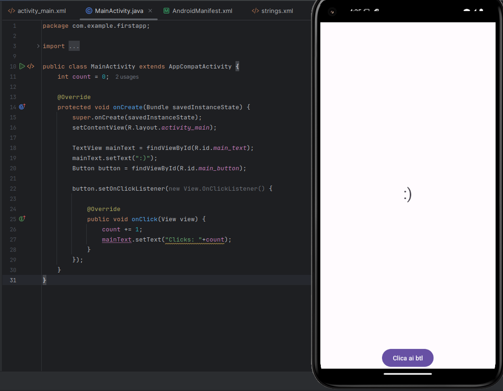
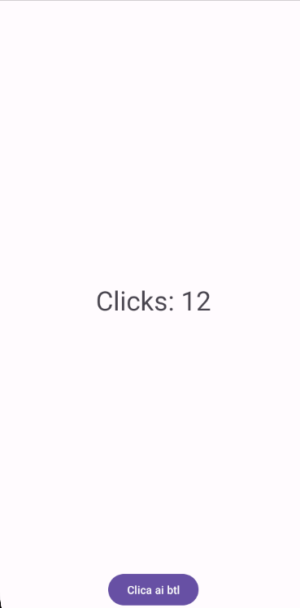
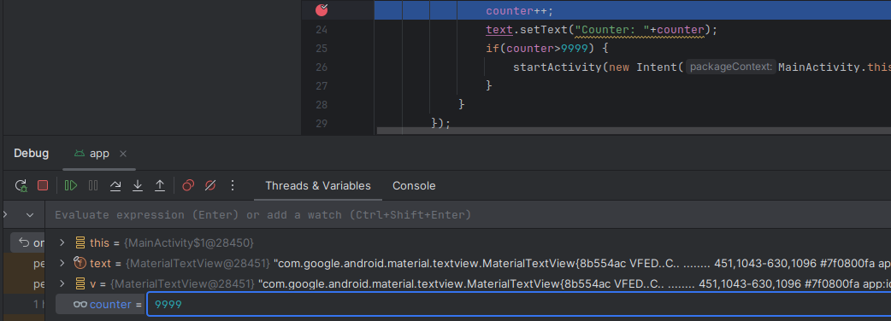

+++
title = 'Your First Android App'
date = 2024-08-27T19:50:22-03:00
draft = false
weight = 1
+++

This course is designed to give us an introduction to Android application development. The idea here is not to become a dev, but being able to develop simple proof of concept apps that interact with the system and other applications. This knowledge is important in order to be a good Android pentester because it also allows us to see a little of the developer's perspective.

The official [Android Developer documentation](https://developer.android.com/guide/) is a great place to learn more advanced topics.

To start, it's necessary to download [Android Studio](https://developer.android.com/studio), set up a new emulated device and start a new project. This is all covered in the course.


## The application layout

The `MainActivity` class is the entry point of our app, and it's layout is the first interface that gets presented to the user when they click the app's icon.

This behavior is defined in the `AndroidManifest.xml` file.


This way, when a user launches the app, android looks at the AndroidManifest file and knows that the first class to be launched is the MainActivity one.

The `onCreate()` method is called right after the activity is launched. The main point here is at line 17, where it's calling the `setContentView()` function with a resource ID as a parameter.


We can navigate through the project's file structure and find the layout file. In android applications, UIs are defined in the `res/layout/` directory.


Besides that raw format, Android Studio also allows us to edit the layout in a graphic way. We can alternate between the views in the upper navigation bar.


### Displaying text on the screen

Here we can assign an id to the TextView element on the layout, so we can reference it in our code.


Now we can call the `findViewById` function with the ID we just assigned, storing a reference to the text element in a variable. Then, we can change the text value of the element using the `setText()` method.


  
The `R` class in Android is a dynamically generated class, which allows us to reference various resources. The `main_text` element of `R.id` was initialized because we assigned an ID to the TextView element in the `activity_main` layout.



It seemed weird to me that `TextView` is being used as a data type, but I figured out later that this syntax is normal in this Java/Android context, as you have the primitive data types (such as `int`, `float` and `char`) and reference data types, which is the case of the `TextView` class. In this case, `mainText` is being declared as an instance of the `TextView` class.


## Handling button clicks

We can add a button element in our `activity_main` layout.

You have to kinda mess with the constraints in order to position the button where you want, but it's not that hard to figure it out using the graphical layout editing interface.

```xml
<?xml version="1.0" encoding="utf-8"?>
<androidx.constraintlayout.widget.ConstraintLayout xmlns:android="http://schemas.android.com/apk/res/android"
    xmlns:app="http://schemas.android.com/apk/res-auto"
    xmlns:tools="http://schemas.android.com/tools"
    android:id="@+id/main"
    android:layout_width="match_parent"
    android:layout_height="match_parent"
    tools:context=".MainActivity">

    <TextView
        android:id="@+id/main_text"
        android:layout_width="251dp"
        android:layout_height="57dp"
        android:text="Hello World!"
        android:textAlignment="center"
        android:textSize="34sp"
        app:layout_constraintBottom_toBottomOf="parent"
        app:layout_constraintEnd_toEndOf="parent"
        app:layout_constraintStart_toStartOf="parent"
        app:layout_constraintTop_toTopOf="parent" />

    <Button
        android:id="@+id/main_button"
        android:layout_width="wrap_content"
        android:layout_height="wrap_content"
        android:text="Clica ai btl"
        app:layout_constraintBottom_toBottomOf="parent"
        app:layout_constraintEnd_toEndOf="parent"
        app:layout_constraintStart_toStartOf="parent"
        app:layout_constraintTop_toBottomOf="@+id/main_text"
        app:layout_constraintVertical_bias="1.0" />

</androidx.constraintlayout.widget.ConstraintLayout>
```


Now, we can create a reference to that button in order to do something when the user clicks it. We do that in line 20 here. Then, we create a click listener, which will basically increment the value of a global variable we declared and exibit it on the screen.






### Logging stuff in the console

Using `Log.i()` we can log messages to the console. We need to pass a tag and a message to it. Then, we can read the messages using logcat in Android Studio.


 
`%d` is used to format signed integers into the string.



### String resources

Although there's nothing wrong with our current code, Android Studio still displays these anoying warnings in some lines.


When we hover on it, we see that it's complaining about hard-coding a string. To solve that, it suggests us to "extract this hard-coded string into a resource lookup". In order to know how to do that, we can check [the official documentation](https://developer.android.com/guide/topics/resources/string-resource##String).

There's a section there that explains exactly how we can do that, which is not a strictly necessary action for our simple PoC applications, but is considered best practice for more advanced android app development.

We can simply add the string to the `strings.xml` file, then we can reference it in different ways accross the project.


```xml
<!-- syntax for layout files -->
<TextView
    android:layout_width="fill_parent"
    android:layout_height="wrap_content"
    android:text="@string/hello" />
```

```java
// syntax for code
String string = getString(R.string.hello);
```

The reason we do that is so we can easilly distribute our strings accross different languages and screen orientations. Supposing we are creating a production-grade app, if we don't add a string to the string resources file, we would need to write the string two times, as we would have a layout for landscape and other for portrait.

String resources also allow us to localize the app with the creation of locale-specific files. For example, we could have a `res/values-pt/strings.xml` for Portuguese, `res/values-ja/strings.xml` for Japanese, etc.

When pentesting mobile applications, the `strings.xml` file is also a cool place to look. Sometimes developers will put sensitive information there, thinking that it's secure just because it isn't hard-coded. 


## Sending Intents

In order to start a new Activity in our code, we can use the `startActivity()` function passing an [`Intent`](https://developer.android.com/reference/android/content/Intent) as a parameter.

Intents are things that request Android to perform an operation. In this case, when the user clicks the button for the 10th time, we are telling Android to **view** a resource identified as an HTTPS URI. Then, Android goes through all the applications in the device and tries to find one that is capable of accessing resources over HTTPS, and it finds Chrome, opening it.


Chrome tells android that it wants to be used to access HTTPS resources in [it's `AndroidManifest.xml`](https://chromium.googlesource.com/chromium/src/+/b71e98cdf14f18cb967a73857826f6e8c568cea0/chrome/android/java/AndroidManifest.xml) file, on the snippet bellow. When the system starts searching for files to load the resource specified in the intent and finds Chrome, it sees that Chrome's manifest file has an intent filter that is telling Android like "hey, send intents of this kind to me". Android then starts Chrome's activity and hands it the `Intent` object, which contains the data we sent. It's then up to Chrome to handle that data.


```xml
<intent-filter>
    <action android:name="android.intent.action.VIEW" />
    <category android:name="android.intent.category.DEFAULT" />
    <category android:name="android.intent.category.BROWSABLE" />
    <data android:scheme="googlechrome" />
    <data android:scheme="http" />
    <data android:scheme="https" />
    <data android:scheme="about" />
    <data android:scheme="javascript" />
</intent-filter>
```


## Receiving Intents

In order to receive an intent, we can add an intent filter to a new activity in the `AndroidManifest.xml` file.

For this activity to be accessible by other apps, we need to specify `exported=true`.

```xml
<activity
    android:name=".SecretActivity"
    android:exported="true" >
    <intent-filter>
        <action android:name="android.intent.action.SEND" />
        <category android:name="android.intent.category.DEFAULT" />
        <data android:mimeType="text/plain" />
    </intent-filter>
</activity>
```

Elements in the intent filter:

- `<action>`: Tells Android that we want to handle intents that perform the `SEND` action, which is used for simple data.

- `<category>`: Filters for intents that use the default category. This is required in order to receive [implicit intents](https://developer.android.com/reference/android/content/Intent##intent-resolution).

- `<data>`: Makes so only intents with extras containing data of the specified MIME type are received.

In the activity's layout, I've added a `TextView` element with the `debug_text` id, so we can reference it later in the code.

```xml
<?xml version="1.0" encoding="utf-8"?>
<androidx.constraintlayout.widget.ConstraintLayout xmlns:android="http://schemas.android.com/apk/res/android"
    xmlns:app="http://schemas.android.com/apk/res-auto"
    xmlns:tools="http://schemas.android.com/tools"
    android:id="@+id/main"
    android:layout_width="match_parent"
    android:layout_height="match_parent"
    tools:context=".SecretActivity">

    <TextView
        android:id="@+id/debug_text"
        android:layout_width="wrap_content"
        android:layout_height="wrap_content"
        android:text="foo"
        android:textSize="24sp"
        app:layout_constraintBottom_toBottomOf="parent"
        app:layout_constraintEnd_toEndOf="parent"
        app:layout_constraintStart_toStartOf="parent"
        app:layout_constraintTop_toTopOf="parent" />
</androidx.constraintlayout.widget.ConstraintLayout>
```

Then we can use the `getIntent()` function to store the intent object that lauched the activity.

```java
public class SecretActivity extends AppCompatActivity {

    @Override
    protected void onCreate(Bundle savedInstanceState) {
        super.onCreate(savedInstanceState);
        setContentView(R.layout.activity_secret);

        Intent receivedIntent = getIntent();
        String extraText = receivedIntent.getStringExtra(Intent.EXTRA_TEXT);

        if (extraText != null) {
            TextView debugText = findViewById(R.id.debug_text);
            debugText.setText("Shared: " + extraText);
        }
    }
}
```

We use the `getStringExtra()` method from the intent to store the text sent with the intent. Then, we check if the value is not null and replace the content of the `debug_text` element with it.

Now, when selecting a text anywhere in the phone and clicking `Share` from the context menu, Android sees by our `AndroidManifest` that we accept receiving that intent, and then presents our app to the user as an option in the Android Sharesheet.


When sharing, the text gets placed in the layout.


Notice that activities that receive data from outside are always potential attack surfaces. When reverse engineering Android apps, it's important to always analyze how the application handles intent data and think if we can maybe send an intent containing malicious data that could affect the user in some way.


## Debugging

Debugging is an important knowledge, as it alows us to analyze the current state of the application in specific points. To do so, we can click at a line number to set a breakpoint and click the debug button in the top bar. This will start the application in debug mode and open the debug tab. Then, when the code reaches our breakpoint, the tab is filled with information about the app that might be useful to solve bugs.


## Challenge

We can start by looking at the `AndroidManifest.xml` file, where we see that there are two activities besides the main one. 


Those two are, however, not exported. This means that they're not accessible from outside of the app and can only be launched by other activities within the app itself.

In the `MainActivity` code, we can see that it handles launching `ChallengeActivity`.

```java
public class MainActivity extends AppCompatActivity {
    int counter = 0;
    @Override
    protected void onCreate(Bundle savedInstanceState) {
        super.onCreate(savedInstanceState);
        setContentView(R.layout.activity_main);

        // this is the main activity... how to get to the challenge?
        TextView text = findViewById(R.id.main_text);
        text.setOnClickListener(new View.OnClickListener() {
            @Override
            public void onClick(View v) {
                counter++;
                text.setText("Counter: "+counter);
                if(counter>9999) {
                    startActivity(new Intent(MainActivity.this, ChallengeActivity.class));
                }
            }
        });

    }
}
```

We can see that the TextView element behaves like a button, and when it reaches a count over `9999`, `ChallengeActivity` is launched.


As it's not practical to click that many times manually, we can either change the code or launch the app in debug mode to change the variable's value during execution. I chose the second option here.



We are presented with the following screen:


From the activity code, we can see that most of the buttons call a `failHandler` function, which basically sends us back to `MainActivity`. The only one that does something else is `button9`.

```java
public class ChallengeActivity extends AppCompatActivity {
    @Override
    protected void onCreate(Bundle savedInstanceState) {
        super.onCreate(savedInstanceState);
        setContentView(R.layout.activity_challenge);

        // which button should you press?
        View.OnClickListener failHandler = new View.OnClickListener() {
            @Override
            public void onClick(View v) {
                startActivity(new Intent(ChallengeActivity.this, MainActivity.class));
            }
        };

        findViewById(R.id.button1).setOnClickListener(failHandler);
        findViewById(R.id.button2).setOnClickListener(failHandler);
        findViewById(R.id.button3).setOnClickListener(failHandler);
        findViewById(R.id.button4).setOnClickListener(failHandler);
        findViewById(R.id.button5).setOnClickListener(failHandler);
        findViewById(R.id.button6).setOnClickListener(failHandler);
        findViewById(R.id.button7).setOnClickListener(failHandler);
        findViewById(R.id.button8).setOnClickListener(failHandler);
        findViewById(R.id.button9).setOnClickListener(new View.OnClickListener() {
            @Override
            public void onClick(View v) {
                startActivity(new Intent(ChallengeActivity.this, FlagActivity.class));
            }
        });
        findViewById(R.id.button10).setOnClickListener(failHandler);
    }
}
```
Button 9 launches `FlagActivity`, which contains only this weird slider.


It only manipulates a percentage on the screen, which starts at 50, and tells us to read the code.


By looking at the activity's code, we see a `onStopTrackingTouch()` method that calls the `decryptFlag()` method when we release the slider at the `42` percentage.

```java
protected void onCreate(Bundle savedInstanceState) {
    super.onCreate(savedInstanceState);
    setContentView(R.layout.activity_flag);

    // how to reveal the flag now?
    TextView text = findViewById(R.id.flag_text);
    SeekBar bar = findViewById(R.id.seek_bar);
    bar.setOnSeekBarChangeListener(new SeekBar.OnSeekBarChangeListener() {
        @Override
        public void onProgressChanged(SeekBar seekBar, int progress, boolean fromUser) {
            text.setText("Read the code: "+progress+"%");
            progressTracking = progress;
        }

        @Override
        public void onStartTrackingTouch(SeekBar seekBar) {
        }

        @Override
        public void onStopTrackingTouch(SeekBar seekBar) {
            // Success!!! Show the flag now!
            if(progressTracking==42) {
                text.setText(decryptFlag());
            }
        }
    });
}
```

That gives us the flag.

