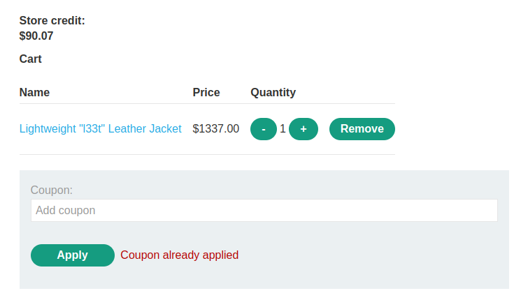
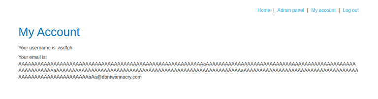
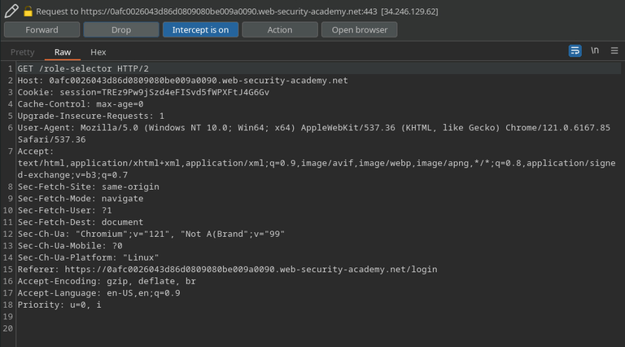

+++
title = 'Business Logic'
date = 2024-08-19T11:37:44-03:00
draft = false
weight = 3
+++

Business logic vulnerabilities are those that arise from the flawed assumption of the user’s behavior, failing to include the appropriate security mechanisms in the application’s logic and allowing attackers to take advantage of it.

There's yet one lab from this topic that I didn't complete: [Authentication bypass via encryption oracle](https://portswigger.net/web-security/logic-flaws/examples/lab-logic-flaws-authentication-bypass-via-encryption-oracle).

I intend on doing this lab soon and publishing the solution here.

## Labs

### Excessive trust in client-side controls

The following shopping application checks for the product’s value based on information included in the client side of the application, allowing attackers to craft and edit requests before they are sent do the server, and consequently purchasing products with arbitrary prices.

Original add to cart request:

```http
POST /cart HTTP/2
Host: 0aee00ab0420f09280afcb6f00450037.web-security-academy.net
Cookie: session=6ftRjffxKFYAX6oK6N1CJYwKcqNggNI4
Content-Length: 49
Cache-Control: max-age=0
Sec-Ch-Ua: 
Sec-Ch-Ua-Mobile: ?0
Sec-Ch-Ua-Platform: ""
Upgrade-Insecure-Requests: 1
Origin: https://0aee00ab0420f09280afcb6f00450037.web-security-academy.net
Content-Type: application/x-www-form-urlencoded
Accept-Encoding: gzip, deflate
Accept-Language: en-US,en;q=0.9

productId=1&redir=PRODUCT&quantity=1&price=133700
```


Edited request with product’s price set to $00.01

```http
POST /cart HTTP/2
Host: 0aee00ab0420f09280afcb6f00450037.web-security-academy.net
Cookie: session=6ftRjffxKFYAX6oK6N1CJYwKcqNggNI4
Content-Length: 49
Cache-Control: max-age=0
Sec-Ch-Ua: 
Sec-Ch-Ua-Mobile: ?0
Sec-Ch-Ua-Platform: ""
Upgrade-Insecure-Requests: 1
Origin: https://0aee00ab0420f09280afcb6f00450037.web-security-academy.net
Content-Type: application/x-www-form-urlencoded
Accept-Encoding: gzip, deflate
Accept-Language: en-US,en;q=0.9

productId=1&redir=PRODUCT&quantity=1&price=0001
```


The application also doesn’t perform any actions in the checkout action in order to check if the product’s price is correct.

---

### High-level logic vulnerability

The shopping application below performs the following POST request when a user removes an item from their cart:

```http
POST /cart HTTP/2
Host: 0ade003a0376404b8243e26b006f00e3.web-security-academy.net
Cookie: session=qmmsLBX0Zre7Fr39IsSjfedj32wpBgUg
Content-Length: 34
Cache-Control: max-age=0
Sec-Ch-Ua: 
Sec-Ch-Ua-Mobile: ?0
Sec-Ch-Ua-Platform: ""
Upgrade-Insecure-Requests: 1
Origin: https://0ade003a0376404b8243e26b006f00e3.web-security-academy.net
Content-Type: application/x-www-form-urlencoded
User-Agent: Mozilla/5.0 (Windows NT 10.0; Win64; x64) AppleWebKit/537.36 (KHTML, like Gecko) Chrome/114.0.5735.199 Safari/537.36
Accept: text/html,application/xhtml+xml,application/xml;q=0.9,image/avif,image/webp,image/apng,*/*;q=0.8,application/signed-exchange;v=b3;q=0.7
Sec-Fetch-Site: same-origin
Sec-Fetch-Mode: navigate
Sec-Fetch-User: ?1
Sec-Fetch-Dest: document
Referer: https://0ade003a0376404b8243e26b006f00e3.web-security-academy.net/cart
Accept-Encoding: gzip, deflate
Accept-Language: en-US,en;q=0.9

productId=1&quantity=-1&redir=CART
```

It follows the same logic from the request used to add one item to the user’s cart, but with a negative value, subtracting the item.

This may seem okay, as the button that removes the item from the cart is not present when the cart is empty, but this doesn’t stop the client to send that same request again, but with the empty cart, resulting in the application to ad `-x` items to the user, and consequently, also a negative value relative to the amount of items added.

```http
POST /cart HTTP/2
Host: 0ade003a0376404b8243e26b006f00e3.web-security-academy.net
Cookie: session=qmmsLBX0Zre7Fr39IsSjfedj32wpBgUg
Content-Length: 36
Cache-Control: max-age=0
Sec-Ch-Ua: 
Sec-Ch-Ua-Mobile: ?0
Sec-Ch-Ua-Platform: ""
Upgrade-Insecure-Requests: 1
Origin: https://0ade003a0376404b8243e26b006f00e3.web-security-academy.net
Content-Type: application/x-www-form-urlencoded
Accept-Encoding: gzip, deflate
Accept-Language: en-US,en;q=0.9

productId=2&quantity=-229&redir=CART
```

However, it does check the value of the cart before checkout, so we still don’t get infinite money. We can instead add an item with a high value that covers the negative we now have on the cart, allowing us to purchase that new item for an extremely lower price.

```http
POST /cart HTTP/2
Host: 0ade003a0376404b8243e26b006f00e3.web-security-academy.net
Cookie: session=qmmsLBX0Zre7Fr39IsSjfedj32wpBgUg
Content-Length: 36
Cache-Control: max-age=0
Sec-Ch-Ua: 
Sec-Ch-Ua-Mobile: ?0
Sec-Ch-Ua-Platform: ""
Upgrade-Insecure-Requests: 1
Origin: https://0ade003a0376404b8243e26b006f00e3.web-security-academy.net
Content-Type: application/x-www-form-urlencoded
Accept-Encoding: gzip, deflate
Accept-Language: en-US,en;q=0.9

productId=1&quantity=1&redir=CART
```


---

### Inconsistent security controls

Sometimes, the security controls for specific functionalities are implemented with a flawed logic. On the case below, the application allow users with a specific e-mail domain to access an admin panel on the website. Although the application sends a confirmation link to the e-mail provided in registration, it doesn’t check it when the user changes their e-mail for an existing account.


It also contains an information disclosure right on the register page, making the exploitation much easier.


---

### Flawed enforcement of business rules

In this case, the application has made two coupons available: `NEWCUST5` and `SIGNUP30`.

It does check if the coupon that the user is trying to apply is already applied, but fails to do it if the user alternates between the two coupons. The reason for this behavior is that the application is probably checking for the last applied coupon, instead of running through the set of applied ones and verifying if the one being attempted is already there, which would be more appropriate.




---

### Low-level logic flaw

By the time I did this lab, the only thing I'd wrote about it was "integer overflow", followed by the screenshot below.


As I don't want to just drop it here without explanation, I'll attempt to summarize the concept.

Basically, some programming languages have a limit for the value that a signed integer variable can store. This is due to the fact that the maximum size of that integer variable is defined by a certain amount of bytes.

In this case, from what I've seen in the lab's solution, that limit would be of either `2,147,483,647` or `-2,147,483,648`. These are the maximum and minimum possible values for a 16 bit signed integer. If the type was of an unsigned integer, it would be able to hold up until `4,294,967,295`, but no negative values.

In this lab, the idea was that when you reached a certain amount of products of a specific value, the total value of the cart would reach the mentioned limit of `2,147,483,647`, and after reaching it (or getting close to it), the next product added to the cart would cause an overflow, making the cart's total value loop back to `-2,147,483,648`. Then, it would be necessary to keep adding products until that value reached a little more than zero, so we could buy everything basically for free.

What I believe that happened to me while doing this lab is that I got tired of trying to use that concept in my favor, to a point where I just kept intruder running and adding products until the cart's value got close to zero, and then added a few more products manually to make it get to the value that I wanted.

I regret not writing the most accurate solution here, but I would advise the reader to go check the original solution, or even exploring this concept further. It is really interesting, and before that lab I thought it would only be applied in binary exploitation situations for desktop programs in low-level languages.

Here's [the link to the lab](https://portswigger.net/web-security/logic-flaws/examples/lab-logic-flaws-low-level), and here's a [WikiPedia page](https://portswigger.net/web-security/logic-flaws/examples/lab-logic-flaws-low-level) that I found to be a very interesting reading.

---

### Inconsistent handling of user input

In this one, the application also gives higher privileges to users under the e-mail `@dontwannacry.com`.

However, it strips the user's e-mail to 255 characters after signing up

It strips the user’s e-mail to 255 characters after registering though, which allows the attacker who can create subdomains in their e-mail client to craft such payload:

```
username=banana&email=AAAAAAAAAAAAAAAAAAAAAAAAAAAAAAAAAAAAAAAAAAAAAAAAAAAAAAAAAAaAAAAAAAAAAAAAAAAAAAAAAAAAAAAAAAAAAAAAAAAAAAAAAAAAAAAAAAAAAaAAAAAAAAAAAAAAAAAAAAAAAAAAAAAAAAAAAAAAAAAAAAAAAAAAAAAAAAAAaAAAAAAAAAAAAAAAAAAAAAAAAAAAAAAAAAAAAAAAAAAAAAAAAAAAAAAAAAAaaa%40dontwannacry.com.exploit-0a3300950473acc2813a062c01030059.exploit-server.net&password=banana
```

The e-mail’s length reaches 255 characters before the actual e-mail domain starts, so after checking for the user’s e-mail, it will grant the high privileges to the user.



This behavior could occur on implementations using old databases or programming languages that had the first byte of a string value being the representation of the number of characters in that string. Therefore, as the highest integer that can be represented in a single byte is 256, a 256-byte-long string would only contain 255 characters in it’s value, because the first byte would be `11111111`, indicating a string with the maximum length.

---

### Weak isolation on dual-use endpoint

On this example, the application performs a POST request in order to change a given user’s password.


Although it the application checks for the current password, this parameter isn’t actually required, so we can just repeat the request without it, changing the password of an arbitrary user.


---

### Insufficient workflow validation

On this lab, we can simply add the desired item to our cart and then hit the order confirmation endpoint, which doesn’t perform any validation about our balance, allowing us to purchase any items we want.


---

### Authentication bypass via flawed state machine

After sending the login credentials, the application redirects us to `/role-selector` upon success.


If we use intercept to go through the login steps, we are able to drop the `GET /role-selector` request, making so it’s never sent.



This way, when we go back to the application, we have received the default role, which is admin.


---

### Infinite money logic flaw

In this case, the application gives us a coupon that gives us 30% OFF over anything we buy if we sign up to the store’s newsletter. However, we can also buy a 10$ gift card. This is a logic flaw, as a malicious user could repeatedly buy a lot of gift cards and submit the coupon on checkout, thus generating infinite money.


