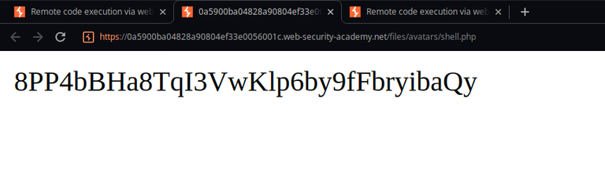
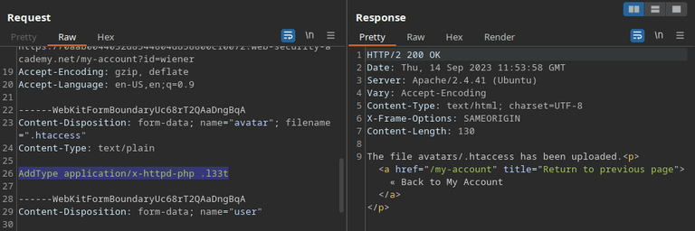

+++
title = 'File Upload'
date = 2024-08-19T11:37:34-03:00
draft = false
weight = 4
+++

File upload vulnerabilities arise when a website allows users to upload files to the server without properly validating it's content.

## Exploiting

#### Lab: Remote code execution via web shell upload

On the example below, the web application doesn’t have any restrictions for files uploaded as user profile pictures. This makes us able to send a PHP file, containing `<?php echo file_get_contents('/home/carlos/secret'); ?>`, which returns the content of the secret file stored in the server when we make a request to the uploaded file.




---

### Bypassing MIME type filter

#### Lab: Web shell upload via Content-Type restriction bypass

Some applications may try to check if the MIME type of the file being sent is the expected by looking at the value of the `Content-Type` header on the request. The problem with that is that users can easily change the value of that header to the one that the server is expecting to receive.


---

### Bypassing unavailable execution on uploads directory

#### Lab: Web shell upload via path traversal

Some applications may try to prevent RCE by file upload by configuring the web server to not execute files located in the directory where the users uploads their files. However, if the website also contains a path traversal vulnerability in the upload request, an attacker could try to upload the image to a higher directory within the hierarchy and then execute it.


URL-encoded traversal sequence, file uploaded to /files/shell.php
Executed the code

---

### Insufficient Blacklisting

Blacklisting is a tricky practice for defensive mechanisms, as it is difficult for the developer to predict every single dangerous file extension. Some less known file extensions, but yet malicious, can be used in order to bypass blacklisting.

### Bypassing blacklisting by uploading .htaccess file

In some cases, the application fails to prevent users from uploading a configuration file. In the Apache server, there is a method for setting directory-specific configuration, which is through the `.htaccess` file. By manipulating this file, we can map a custom arbitrary file extension to the file type that we are trying to execute.

#### Lab: Web shell upload via extension blacklist bypass

In the example below, we are able to upload a `.htaccess` file in order to set this kind of configuration.

What we are doing is basically telling Apache that every file with the `l337` extension must be treated as a php file.




---

### Bypassing blacklisting with filename obfuscation

Another method that could be used to bypass the extension blacklisting would be to include certain characters in the filename to trick the server into trusting the file sent as the expected one.

**Some useful techniques are:**

- Multiple extensions: by providing something like `filename.php.jpg` the server could interpret the file as either an image or a PHP file.

- Adding trailing characters: some mechanisms might stripe trailing characters, such as dots, whitespaces and slashes after going through the filter, which would allow the file to still be executed, Example: `filename.php.`. This payload could still be executed if the mechanism for checking extensions considers `hp.` as the file extension, in the case it checks only the last three characters.

- Adding uppercase characters: if the server’s filter is case-sensitive, but the part of it that maps file extensions isn’t, you could also try providing a filename like `filename.pHp`.

- URL encoding: URL encoding (or double URL encoding) the dots could also be useful. Example: `filename%2Ephp`.

- Nested extension: if the website strips the `.php` extension non-recursively, it could be possible to enter `filename.p.phphp`. It would strip the inner extension, but the outer one would stay and work normally.

**Copied from PortSwigger:**

- Try using multibyte unicode characters, which may be converted to null bytes and dots after unicode conversion or normalization. Sequences like `xC0 x2E`, `xC4 xAE` or `xC0 xAE` may be translated to `x2E` if the filename parsed as a UTF-8 string, but then converted to ASCII characters before being used in a path.

- Ending the filename: you could try tricking the server into ignoring the rest of the filename by using a semicolon or a URL encoded null byte (`%00`). The full filename would be parsed to the filter, but the last part would be striped afterwords.

#### Lab: Web shell upload via obfuscated file extension

Null byte technique


---

### Bypassing content checking

A more effective way of preventing against malicious files is to try checking a file’s content for attributes inherent to images. In this case, an attacker could still try to insert malicious code within an image’s metadata using a tool such as ExifTool.

```
exiftool -Comment="<?php echo 'START ' .file_get_contents('/home/carlos/secret') . ' END'; ?>" <YOUR-INPUT-IMAGE>.jpg -o polyglot.php
# START and END will be useful in order to facilitate the content's visualization.
# The image will be saved as "polyglot.php"
```

The command above edits an image and inserts a PHP code as the “Comment” value of the image's metadata. When we access the file, that part of it will be replaced with the contents of the file fetched in the PHP code.

#### Lab: Remote code execution via polyglot web shell upload


---

### Bypassing checks via race condition

#### Lab: Web shell upload via race condition

On this lab, there are many restrictions on file upload, but we can bypass them by sending the request that uploads the file and the one that accesses it at the same time.

As we can see in the lab’s hint, the PHP script responsible for the file upload function moves the file to the uploads directory before actually validating it’s content.

```php
<?php
$target_dir = "avatars/";
$target_file = $target_dir . $_FILES["avatar"]["name"];

// temporary move
move_uploaded_file($_FILES["avatar"]["tmp_name"], $target_file);

if (checkViruses($target_file) && checkFileType($target_file)) {
    echo "The file ". htmlspecialchars( $target_file). " has been uploaded.";
} else {
    unlink($target_file);
    echo "Sorry, there was an error uploading your file.";
    http_response_code(403);
}

function checkViruses($fileName) {
    // checking for viruses
    ...
}

function checkFileType($fileName) {
    $imageFileType = strtolower(pathinfo($fileName,PATHINFO_EXTENSION));
    if($imageFileType != "jpg" && $imageFileType != "png") {
        echo "Sorry, only JPG & PNG files are allowed\n";
        return false;
    } else {
        return true;
    }
}
?>
```

We can use burp repeater to send both requests in a single packet.


Sometimes, it’ll not execute the file at first, but we can keep trying the attack in order to eventually have the second request hitting the server before the validation happens, while the file is still in the uploads directory.


