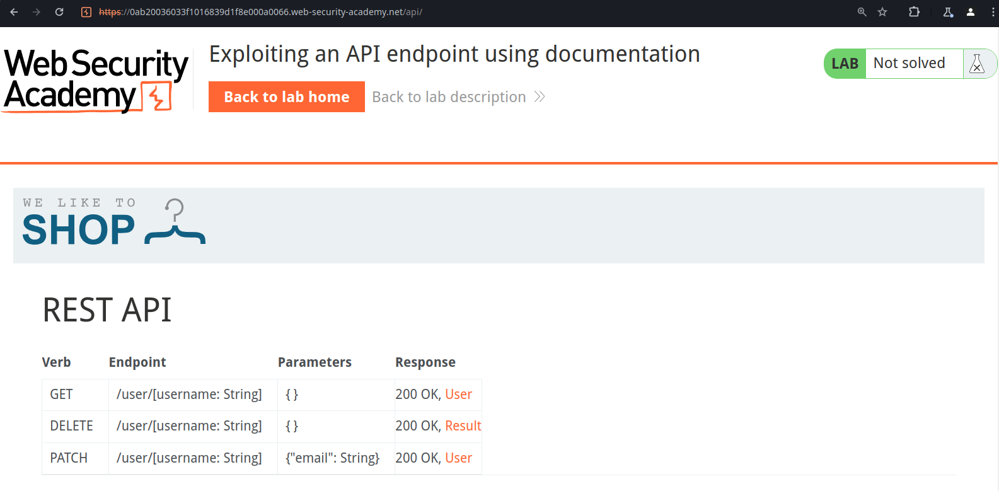
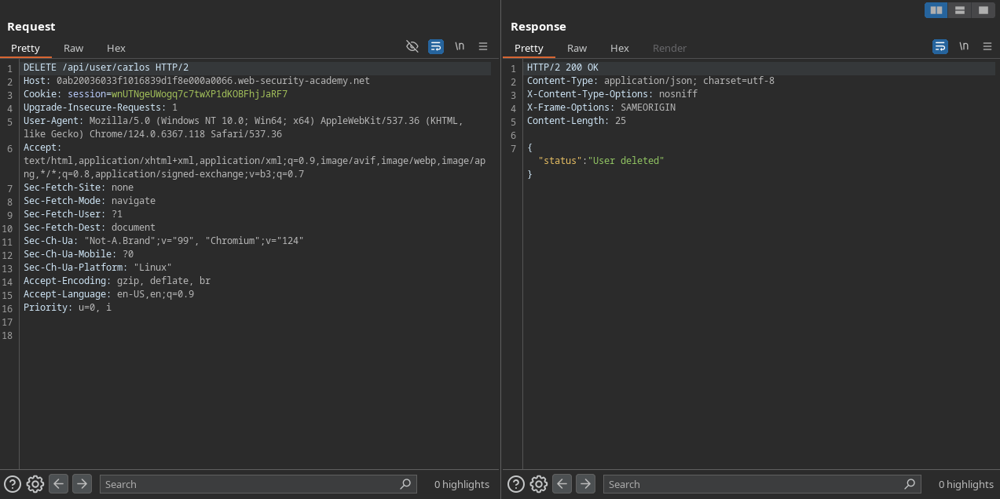

# API testing (1/5)

**Table of contents**

1. [Labs](#labs)
    1. [Exploiting an API endpoint using documentation](#exploiting-an-api-endpoint-using-documentation)

## Labs

### Exploiting an API endpoint using documentation

We can find an API endpoint through fuzzing that retrieves the API’s documentation.

Deleting Carlos’ account.

