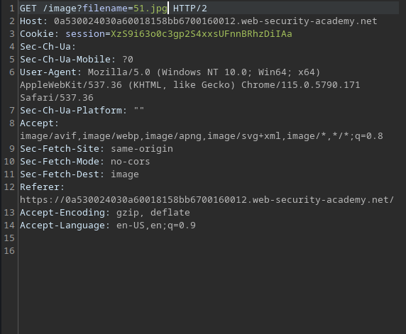
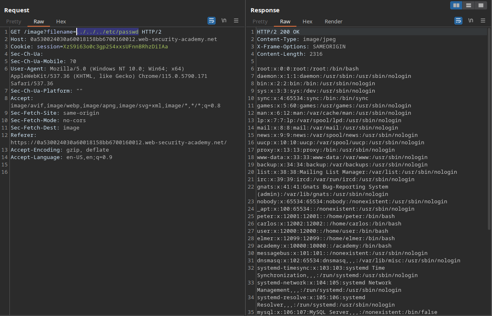

# Directory traversal (6/6)

Directory traversal, also known as path traversal, vulnerabilities occur when a website utilizes a particular API endpoint to retrieve files from the server. If the query parameters associated with this endpoint are both accessible to the client and can be manipulated within the URL of an HTTP request, a potential security risk emerges. If not properly addressed, this scenario can render the website susceptible to path traversal attacks, where the attacker is able to navigate through directories and load arbitrary files by predicting their path on the server.

# Example



Here, the URL in the first line indicates that this website is using an API in order to load images by using the following HTML:

```html

```

If an attacker repeats that request replacing “51.jpg” with `../../../etc/passwd` , supposing the website is hosted on a Linux machine, they’re able to navigate back three directories from the one where images are loaded from and retrieve the content of the “passwd” file.



# Common obstacles and their bypasses

- If the application blocks traversal sequences like “../”, the attacker might still be able to access arbitrary files by providing it’s absolute path directly, e.g. `/etc/passwd` .
- If the application non-recursively removes path traversal sequences, the attacker might be able to use nested sequences, like `....//....//....//`, so only the inner sequences will be striped and the outer will still be parsed to the query.
- If a superfluous filter is used, attackers could try URL encoding the sequences, resulting in `%2e%2e%2f`, where ‘2e’ represents the dot and “2f” represents the slash on the ASCII table, or even double URL encoding, which would look like `%252e%252e%252f` , where ‘25’ is the encoding for ‘%’.
- If the application requires that the path to the file starts with the expected sequence, like `/var/www/images/` , the attacker could try to bypass that by providing the traversal sequences after the expected part, like `/var/www/images/../../../etc/passwd` .
- If the application requires that the path to the file ends with a specific extension, such as ‘.jpg’, a bypass would be inputting `../../../etc/passwd%00.jpg` , so the path to the file would be terminated before the crafted extension.

# Prevention (by PortSwigger)

The most effective way to prevent file path traversal 
vulnerabilities is to avoid passing user-supplied input to filesystem 
APIs altogether. Many application functions that do this can be 
rewritten to deliver the same behavior in a safer way.

If it is considered unavoidable to pass user-supplied input 
to filesystem APIs, then two layers of defense should be used together 
to prevent attacks:

- The application should validate the user input before
processing it. Ideally, the validation should compare against a
whitelist of permitted values. If that isn't possible for the required
functionality, then the validation should verify that the input contains only permitted content, such as purely alphanumeric characters.
- After validating the supplied input, the application
should append the input to the base directory and use a platform
filesystem API to canonicalize the path. It should verify that the
canonicalized path starts with the expected base directory.

Below is an example of some simple Java code to validate the canonical path of a file based on user input:

```java
File file = new File(BASE_DIRECTORY, userInput);
if (file.getCanonicalPath().startsWith(BASE_DIRECTORY)) {
    // process file
}
```

### Windows:

`../../../../../../../../windows/system32/drivers/etc/hosts`