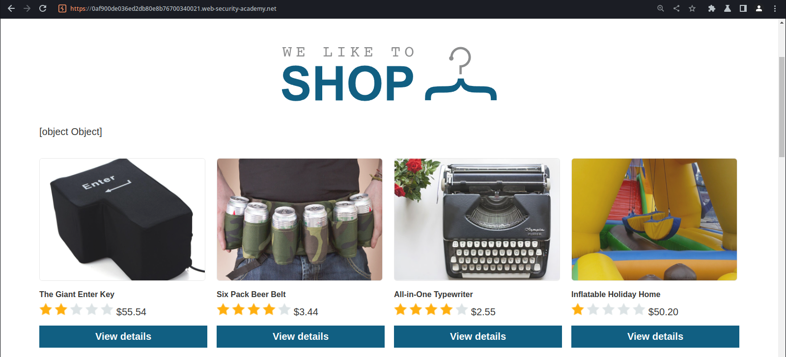
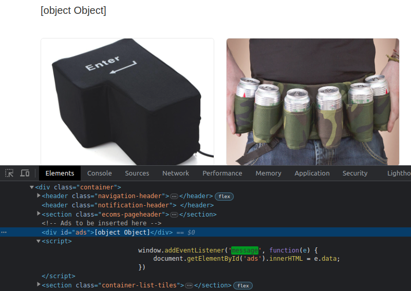
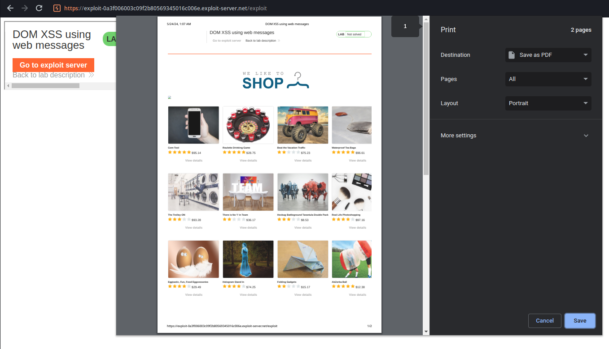

# DOM-based vulnerabilities (1/7)

## Labs

### **DOM XSS using web messages**

Web messages are a way in which a website can send messages to other, being the recipient loaded by an iframe or a popup, for example.

They are intended to be secure, but vulnerabilities can arise depending on how the website deals with the received message.

On the first look, the thing that calls the attention the most is that `[object Object]` thing, indicating that there’s some JavaScript object being reflected in the page.



By looking at the page’s source, we notice that there’s a script that populates that div with the contents of a `message` event. It insecurely passes the message content to the `innerHtml` of that weird div.



By noticing that, we can build a page that contains an iframe, having the vulnerable website as source. On the frame’s load, we call the `postMessage()` function, containing our XSS payload as the message data.

```html
<iframe src="https://0aab001e03bf9f64806e946600a9000d.web-security-academy.net" onload="this.contentWindow.postMessage('','*')"></iframe>
```


