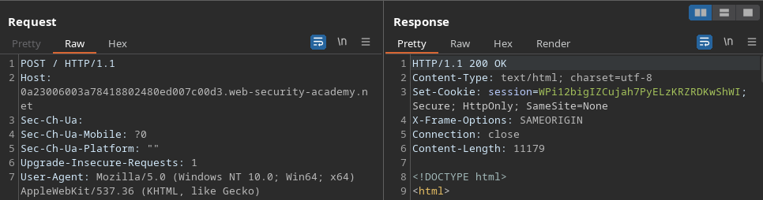
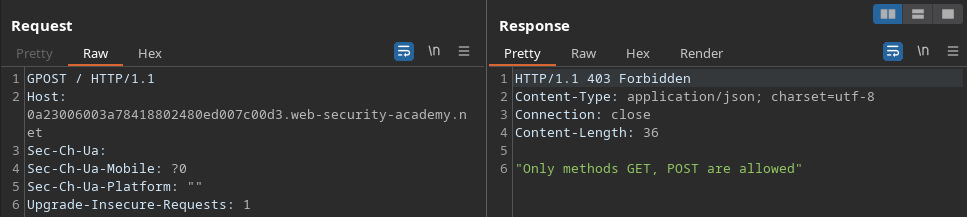
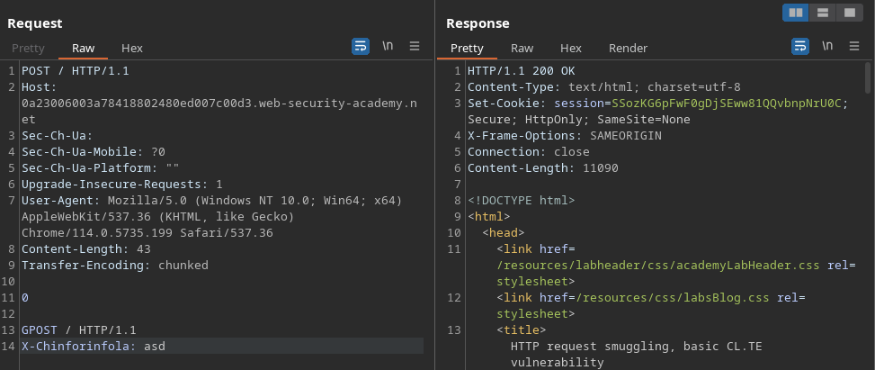
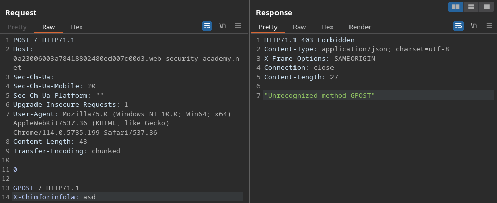
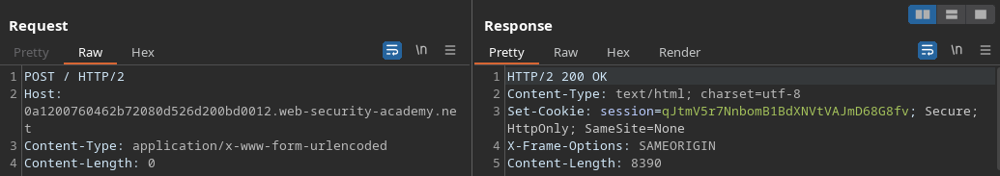
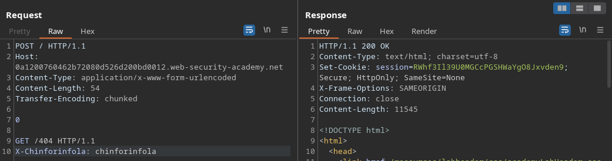
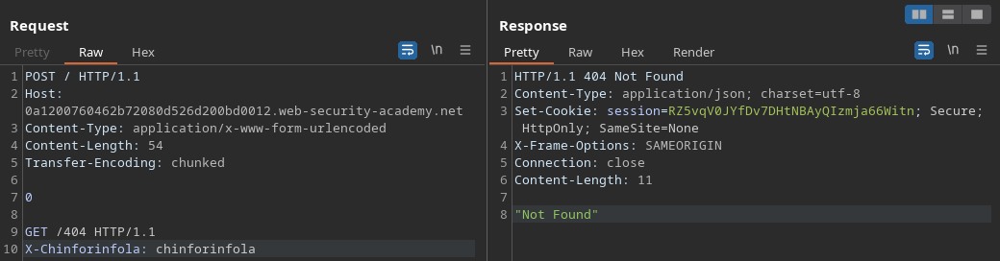

## Labs

### Basic CL.TE vulnerability

On this lab, we start by noticing that the request to `/` also accepts the POST method, as well as `HTTP/1.1`.

Our goal is to make a request that uses the method `GPOST`.
On the natural flow of the application, that wouldn't be possible, since the front-end server responds with the following error to weird methods: 

With the request below, as the front-end server is using the Content-Length header to determine where the requests end, it will interpret the whole thing as being one single request, up until line 14. 

However, the back-end server is thinking that the `POST` request ended at the `0` character on line 11, since it's using the Transfer-Encoding header to limit the requests. This way, it thinks that line 13 is the start of a new request that is using the `GPOST` method.

When we try to repeat that same request, this time the server responds with the message that indicates an unrecognized method, because it thinks that our new request, starting at line 1, is the rest of that smuggled `GPOST` request.

The point of this attack, which PortSwigger kinda fails in explaining clearly, is that we could use HTTP request smuggling to bypass a restriction that is being implemented only in the front-end server. In this case, the restriction bypass is sending a request with a "restricted" protocol, getting a response different than the usual error, thus confirming the vulnerability.

### Confirming a CL.TE vulnerability via differential responses

Starting off with attempting to switch the request method of the `/` request, we see that it also accepts `POST`.

That way, we can attempt inserting the start of a new request to /404 as the body of the POST request, also including the Transfer-Encoding header.

In this case, the front-end server looks at the Content-Length header to determine where the request ends, but the back-end server interprets the Transfer-Encoding header, and treats the request as using chunked encoding. This behavior will make the back-end server think that the POST request ended at the `0` character, and the next lines are actually the beginning of a new GET request to /404.

When we repeat that request, as seen below, although it is a POST request to `/`, the back-end server will think that it is the rest of that previous GET /404 request, thus responding with the 404 error from /404.

