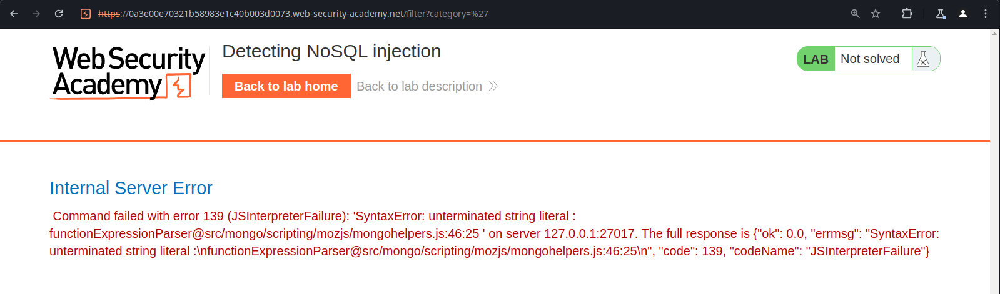
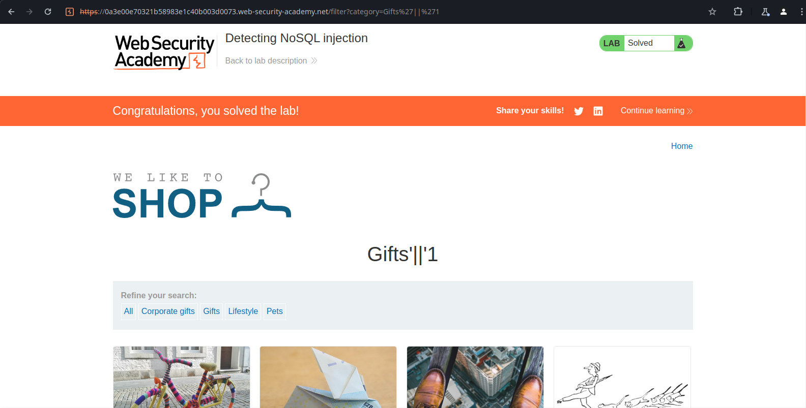
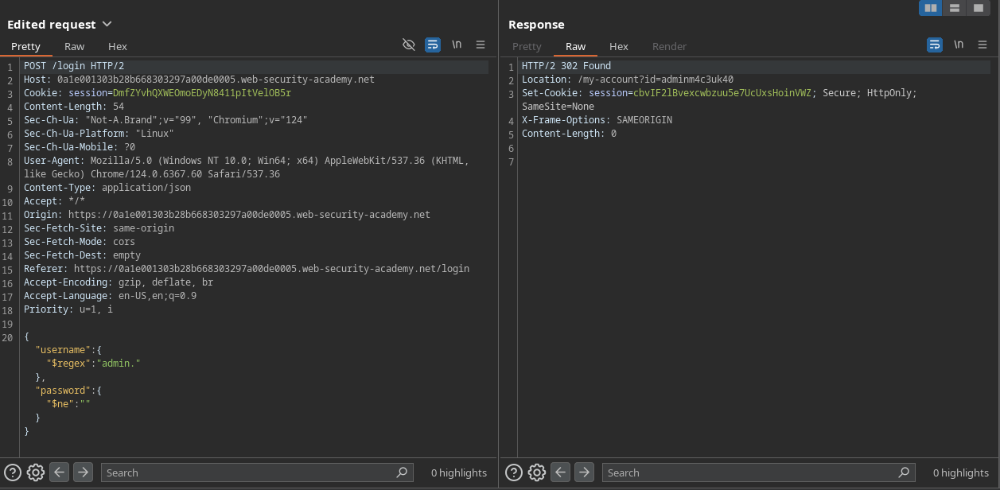
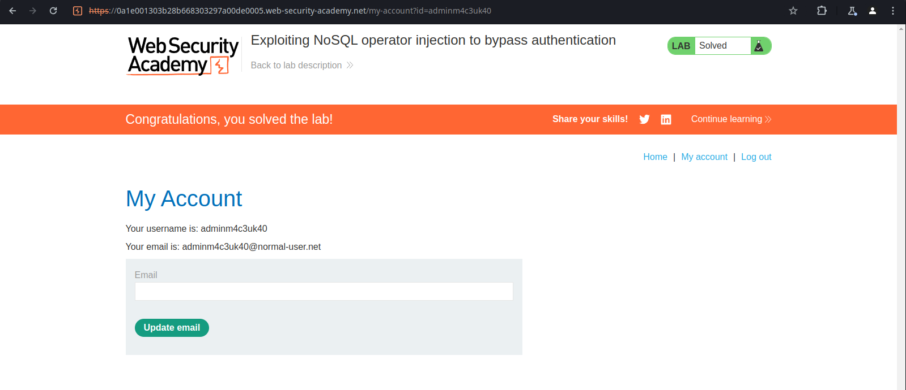

# NoSQL Injection (2/4)

NoSQL stands for Not only SQL. NoSQL databases are usually the ones that can use a wide range of query languages and data structures. They usually don’t have the same relational constraints and don’t use such a standard query syntax as SQL.

There are two types of NoSQL Injection by the definition of PortSwigger:

- Syntax Injection - where an attacker is able to manipulate the query directly and insert his own payload, similar to SQL Injection.
- Operator injection - where an attacker is able to manipulate the query by manipulating it’s operators.

## Labs

### **Detecting NoSQL injection**

When attempting to submit a single quote as the value of the category parameter in the lab’s shopping application, it returns a JavaScript syntax error as the response, indicating that we might’ve broken a query to the MongoDB database that we already knew existed.

When we submit the reflected payload, it starts to evaluate the value as boolean. This way, it will return every table where `true`, regarding if the categories are public or not.

The final evaluation will be something like this: `this.category == ‘Gifts’ || ‘1’`

### **Exploiting NoSQL operator injection to bypass authentication**

In this case, we were able to perform an operator injection attack in order to log into an account that matches the regex “admin.”. This is helpful, since we don’t actually know the administrator’s username.

On the password field, we inserted the `$ne` operator, which will make it check only if the password doesn’t match an empty string.

