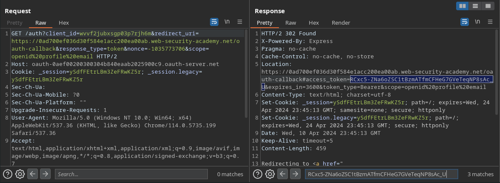
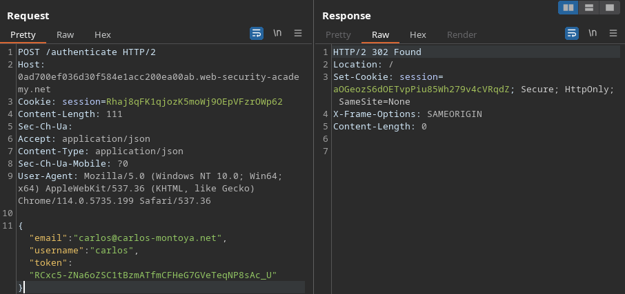
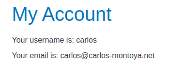

# OAuth authentication (1/6)

## Labs

### Authentication bypass via OAuth implicit flow

This lab presents us with an application that uses OAuth for social login. At a specific point, by trying to log into a legitimate account, we get an access token that will be used in a future request.

The vulnerability arises when we are able to use that same token to access any other account, simply by repeating the request to the /authenticate endpoint, with the username and e-mail of the account we are trying to access.

