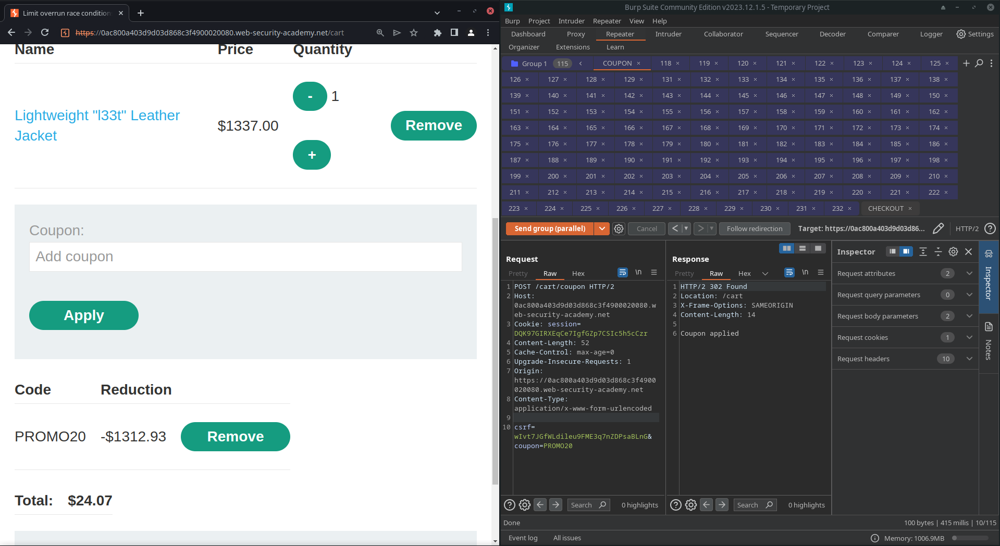

# Race conditions (1/6)

## Labs

### Limit overrun race conditions

On this scenario, we have a shopping application that lets us apply a coupon to get 20% discount in our purchase. We can try sending the apply coupon request multiple times in order to exploit the race window where the application is checking many coupons at the same time, therefore, validating more than one coupon and providing us with a cumulative discount using the same code.

This may not be the best possible way, but it was the only one that worked for me, flooding repeater with many requests

This may not be the best possible way, but it was the only one that worked for me, flooding repeater with many requests