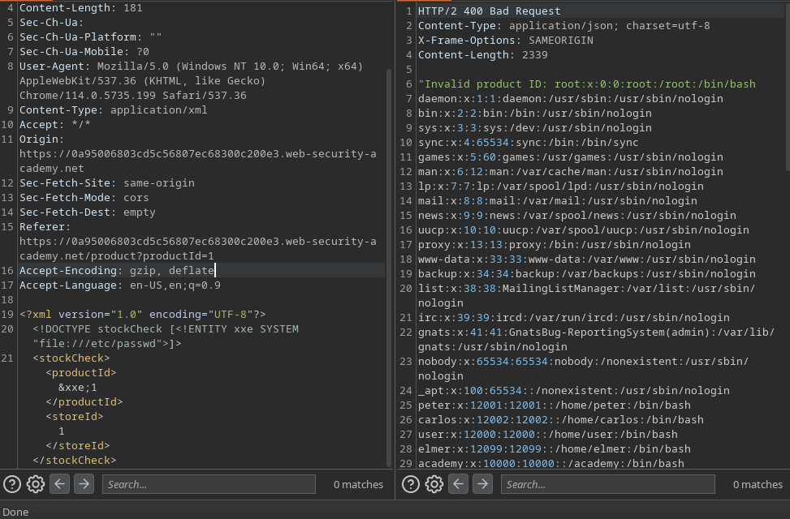
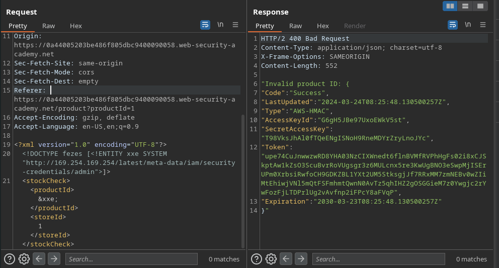
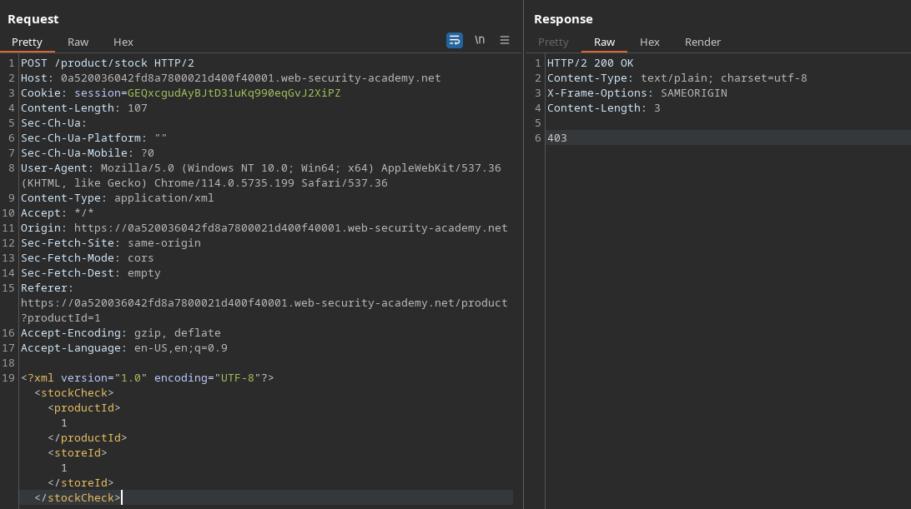
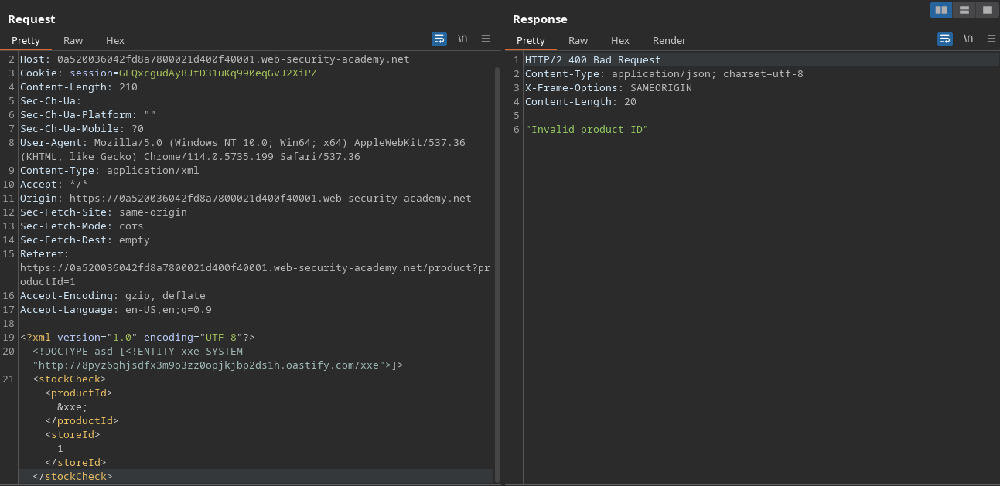

# XXE Injection (2/9)

XML, a data exchange format commonly used before JSON, is still implemented in some web applications. Vulnerabilities arise from the injection of Entities that may retrieve data in a way that is unexpected by the application. Examples of common entities are `&lt;` and `&gt;`. Those are built-in entities that represent the `<` and `>` characters, respectively.

## Labs

### Exploiting XXE using external entities to retrieve files

On this case, the `/product/stock` endpoint uses an XML to query data from the store’s stock. 

We can use the `DOCTYPE` element to declare an external entity that will have the contents of the `/etc/passwd` file and call it in the `productId` tag. This works because the `productId` will, in this case, be reflected in the response in case it’s not valid, so we can actually get the file’s content back, as it will be interpreted as a product ID.

### Exploiting XXE to perform SSRF attacks

This lab gives us the information that there’s an [EC2](https://aws.amazon.com/ec2/faqs/) server running on `[http://169.254.169.254/](http://169.254.169.254/)` and asks us to perform an SSRF attack using XXE injection to retrieve an access key. Even if information about the sensitive data endpoint was not available online, I would be able to follow the path, since it has directory listening. So until I reached the endpoint, the response was always “Invalid product ID: `<dirnames>`”.

Here, as the previous lab used the `file://` pseudo-protocol, I guessed that http would also be possible.

### Blind XXE with out-of-band interaction

This lab’s attack vector is also in the stock check functionality. The page, however, doesn’t reflect the invalid `productId` in the response.

This way, in order to validate our SSRF, we need to submit a payload that will make the server perform an out-of-band interaction to our Burp Collaborator server.

